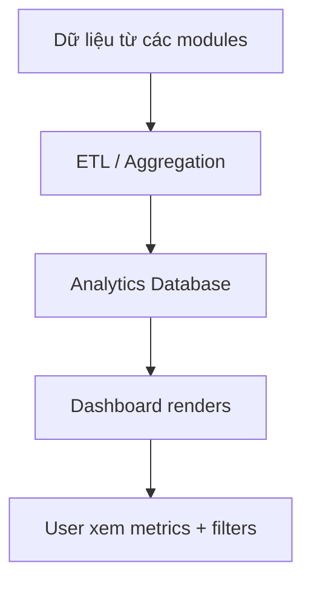

# FRD — Analytics & BI

## 1. Tổng quan chức năng

Module Analytics & BI cung cấp dashboards và metrics cho việc ra quyết định kinh doanh: delivery volume, eBDN turnaround time, barge utilization, và fuel type breakdown. Ưu tiên: Could — triển khai sau các module core.

---

## 2. Chân dung người dùng (Personas)

| Persona | Vai trò | Mục tiêu chính |
|---------|---------|----------------|
| **Supplier Admin / Management** | Xem dashboards | Ra quyết định dựa trên data |

---

## 3. Danh sách tính năng

| ID | Tính năng | Mô tả | Độ ưu tiên |
|----|-----------|--------|-------------|
| F-ANA-01 | Delivery Volume Dashboard | Tổng lượng giao hàng theo period | Could |
| F-ANA-02 | eBDN Turnaround Metrics | Thời gian từ delivery complete → eBDN fully signed | Could |
| F-ANA-03 | Barge Utilization | % thời gian barge active vs idle | Could |
| F-ANA-04 | Fuel Type Breakdown | Phân bổ volume theo loại nhiên liệu | Could |

---

## 4. Luồng nghiệp vụ (Workflow)

---

## 5. Yêu cầu dữ liệu

Dữ liệu aggregate từ: deliveries, eBDNs, schedules, nominations. Không tạo entity riêng — query trực tiếp hoặc materialized views.

---

## 6. Quy tắc nghiệp vụ

| ID | Quy tắc | Mô tả |
|----|---------|--------|
| BR-ANA-001 | Data freshness | Dashboard data refresh hàng giờ (configurable) |
| BR-ANA-002 | Period filter | Hỗ trợ: daily, weekly, monthly, custom range |

---

## 7. Điểm tích hợp

| Module | Hướng | Mô tả |
|--------|-------|--------|
| **Tất cả modules** | Inbound query | Aggregate data từ deliveries, eBDNs, schedules |

---

## 8. Tiêu chí chấp nhận

### F-ANA-01: Delivery Volume Dashboard
- [ ] Hiển thị total MT delivered per period (day/week/month)
- [ ] Chart: bar/line theo thời gian
- [ ] Filter: date range, port, fuel type

### F-ANA-02: eBDN Turnaround Metrics
- [ ] Avg time: delivery complete → barge sign → vessel sign
- [ ] Highlight eBDNs exceeding 2h SLA

### F-ANA-03: Barge Utilization
- [ ] Per barge: % scheduled time vs total available time
- [ ] Identify underutilized barges

### F-ANA-04: Fuel Type Breakdown
- [ ] Pie/bar chart: volume by fuel type
- [ ] Trend: fuel type mix over time
