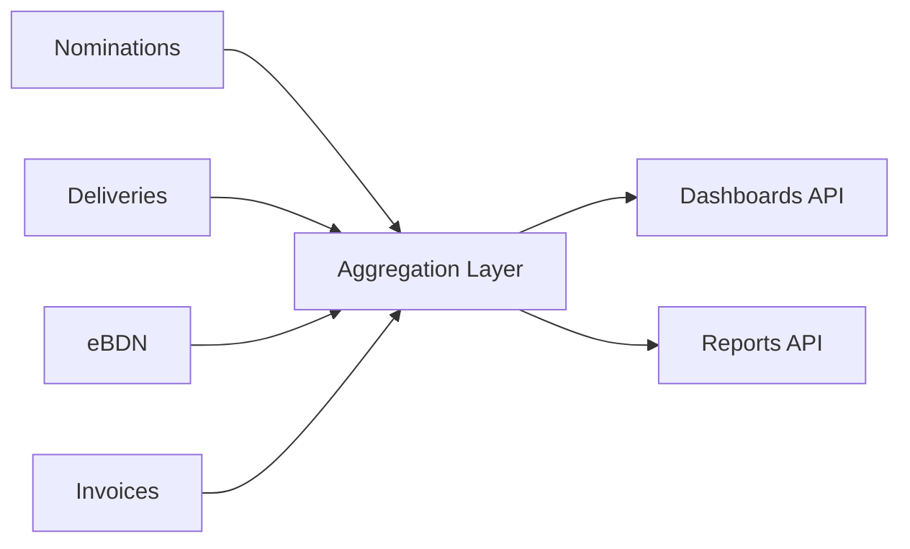

# SRS — Analytics & Business Intelligence

**Version:** 1.0  
**Module:** analytics  
**Ngày:** 2026-05-28  
**Priority:** Could

---

## §1 Mục đích & Phạm vi

Module Analytics cung cấp dashboards và reports từ dữ liệu operations. Read-only module — không có write operations ngoại trừ user preferences.

**Shared Rules:** PLAT-005 (Workspace scoping), CRUD-001 (List defaults), AUTHN-001 (JWT Auth)

## §2 Mô tả tổng thể

Không có state machine. Module này aggregate data từ các modules khác qua scheduled jobs hoặc event-driven materialized views.



## §3 Yêu cầu chức năng

### FR-ANA-001: Delivery Volume Dashboard

**Mô tả:** Dashboard volumes theo period, fuel type, vessel, barge.

**Metrics:**
- Total deliveries (count) by period
- Total quantity (MT) by period
- Breakdown by fuel type (pie/bar)
- Top vessels by volume
- Top barges by utilization

**API:** `GET /api/v1/analytics/volumes?from={date}&to={date}&group_by={dimension}`

**Response:**
```json
{
  "period": { "from": "2026-01-01", "to": "2026-05-28" },
  "total_deliveries": 1245,
  "total_quantity_mt": 625000.500,
  "by_fuel_type": [
    { "code": "VLSFO380", "count": 820, "quantity_mt": 410000.0 },
    { "code": "MGO", "count": 300, "quantity_mt": 150000.0 }
  ],
  "by_period": [
    { "period": "2026-01", "count": 250, "quantity_mt": 125000.0 }
  ]
}
```

### FR-ANA-002: eBDN Turnaround Metrics

**Mô tả:** Track time from delivery complete → eBDN fully signed (KPI G3).

**API:** `GET /api/v1/analytics/ebdn-turnaround?from={date}&to={date}`

**Response:**
```json
{
  "avg_minutes": 22,
  "median_minutes": 18,
  "p95_minutes": 45,
  "within_target_percent": 92.5,
  "target_minutes": 30,
  "trend": [
    { "period": "2026-W20", "avg_minutes": 25 },
    { "period": "2026-W21", "avg_minutes": 20 }
  ]
}
```

### FR-ANA-003: Barge Utilization

**API:** `GET /api/v1/analytics/barge-utilization?from={date}&to={date}`

**Metrics:** Hours delivering / total available hours per barge.

## §4 Data Model

### Materialized Views (refreshed by scheduled jobs)

```sql
CREATE MATERIALIZED VIEW mv_daily_delivery_stats AS
SELECT
    workspace_id,
    DATE(completed_at) AS delivery_date,
    fuel_type_code,
    barge_id,
    COUNT(*) AS delivery_count,
    SUM(quantity_delivered_mt) AS total_quantity_mt,
    AVG(EXTRACT(EPOCH FROM (completed_at - started_at))/60) AS avg_duration_minutes
FROM deliveries
WHERE status = 'DELIVERY_COMPLETE' AND deleted_at IS NULL
GROUP BY workspace_id, DATE(completed_at), fuel_type_code, barge_id;

CREATE MATERIALIZED VIEW mv_ebdn_turnaround AS
SELECT
    workspace_id,
    DATE(e.created_at) AS ebdn_date,
    EXTRACT(EPOCH FROM (e.signed_by_vessel_at - e.created_at))/60 AS turnaround_minutes
FROM bunker_delivery_notes e
WHERE e.status IN ('FULLY_SIGNED','SUBMITTED','ACKNOWLEDGED')
  AND e.signed_by_vessel_at IS NOT NULL;

-- Refresh daily at 01:00 UTC
-- Schedule: cron 0 1 * * *
```

### Indexes
```sql
CREATE INDEX idx_mv_daily_stats_workspace ON mv_daily_delivery_stats(workspace_id, delivery_date DESC);
CREATE INDEX idx_mv_turnaround_workspace ON mv_ebdn_turnaround(workspace_id, ebdn_date DESC);
```

## §5 NFR

| ID | Requirement |
|----|-------------|
| NFR-ANA-01 | Dashboard load < 2 seconds (NFR-02 from backbone) |
| NFR-ANA-02 | Materialized views refresh < 5 minutes |
| NFR-ANA-03 | Data delay: max 1 hour from event to dashboard |

## §6 Business Rules

| ID | Rule |
|----|------|
| BR-ANA-001 | Analytics are READ-ONLY — no mutations to source data |
| BR-ANA-002 | Aggregate by workspace (tenant isolation) |
| BR-ANA-003 | Materialized views refreshed by scheduled job (ShedLock for distributed lock) |
