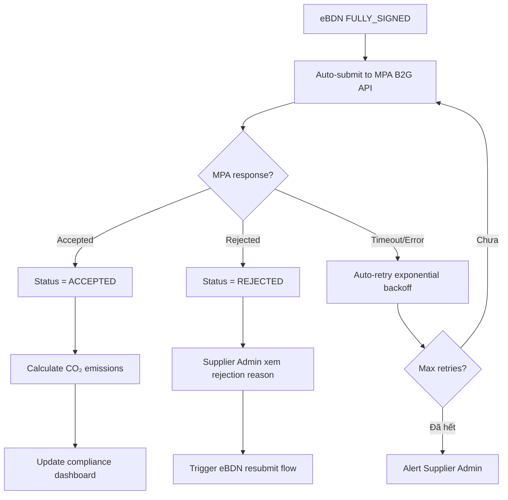

# FRD — B2G Compliance Reporting

## 1. Tổng quan chức năng

Module B2G (Business-to-Government) Compliance Reporting tự động nộp eBDN cho MPA (Maritime and Port Authority of Singapore), theo dõi trạng thái submission, giám sát deadline, tính toán phát thải CO₂, và cung cấp compliance dashboard. Module đảm bảo supplier tuân thủ quy định nộp báo cáo đúng hạn.

---

## 2. Chân dung người dùng (Personas)

| Persona | Vai trò | Mục tiêu chính |
|---------|---------|----------------|
| **Supplier Admin** | Giám sát compliance, xử lý rejection | Đảm bảo 100% eBDN nộp đúng hạn |
| **System** | Auto-submit, retry, calculate emissions | Automation compliance |

---

## 3. Danh sách tính năng

| ID | Tính năng | Mô tả | Độ ưu tiên |
|----|-----------|--------|-------------|
| F-B2G-01 | Auto-submit to MPA | Tự động nộp eBDN khi FULLY_SIGNED | Must |
| F-B2G-02 | Track Submission Status | Theo dõi trạng thái: submitted, accepted, rejected | Must |
| F-B2G-03 | Deadline Monitoring | Cảnh báo khi sắp hết hạn nộp | Must |
| F-B2G-04 | Emissions Calculator | Tính CO₂ = quantity × emission factor | Should |
| F-B2G-05 | Compliance Dashboard | Tổng quan compliance status | Should |

---

## 4. Luồng nghiệp vụ (Workflow)

### 4.1 Submission Flow

---

## 5. Yêu cầu dữ liệu

### 5.1 Entity: B2GSubmission

| Field | Type | Constraints | Mô tả |
|-------|------|-------------|--------|
| id | UUID | PK | Mã submission |
| ebdn_id | UUID | FK, NOT NULL | eBDN liên kết |
| submission_reference | String(50) | nullable | MPA reference number |
| status | Enum | NOT NULL | PENDING, SUBMITTED, ACCEPTED, REJECTED, FAILED |
| submitted_at | DateTime | nullable | Thời gian nộp |
| response_at | DateTime | nullable | Thời gian MPA phản hồi |
| rejection_reason | Text | nullable | Lý do từ chối |
| retry_count | Integer | default 0 | Số lần retry |
| deadline | DateTime | NOT NULL | Hạn chót nộp |
| co2_tonnes | Decimal(10,3) | nullable | CO₂ emissions (tonnes) |

---

## 6. Quy tắc nghiệp vụ

| ID | Quy tắc | Mô tả |
|----|---------|--------|
| BR-B2G-001 | Submission deadline | Nộp trong timeframe MPA yêu cầu sau delivery |
| BR-B2G-002 | Data match eBDN | Data submission PHẢI match eBDN chính xác — không chỉnh sửa |
| BR-B2G-003 | Auto-retry | Failed submission → auto-retry với exponential backoff (1m, 5m, 15m, 60m) |
| BR-B2G-004 | CO₂ calculation | CO₂ (tonnes) = quantity_mt × emission_factor per fuel type |
| BR-B2G-005 | Deadline alert | Cảnh báo khi còn < threshold thời gian (configurable, default 4h) trước deadline |

---

## 7. Điểm tích hợp

| Module | Hướng | Mô tả |
|--------|-------|--------|
| **ebdn** | Inbound event | Nhận event eBDN FULLY_SIGNED → trigger submission |
| **MPA B2G API** | Outbound call | Gửi data đến MPA external API |
| **fuel-grades** | Inbound query | Lấy emission factor per fuel type |

---

## 8. Tiêu chí chấp nhận

### F-B2G-01: Auto-submit to MPA
- [ ] Tự động submit khi eBDN FULLY_SIGNED
- [ ] Data gửi match eBDN exactly
- [ ] Auto-retry on failure với exponential backoff

### F-B2G-02: Track Submission Status
- [ ] Hiển thị status: PENDING, SUBMITTED, ACCEPTED, REJECTED, FAILED
- [ ] Lưu MPA response reference
- [ ] Hiển thị rejection reason khi bị reject

### F-B2G-03: Deadline Monitoring
- [ ] Alert khi còn < 4h trước deadline (configurable)
- [ ] Dashboard highlight overdue submissions
- [ ] Notification gửi Supplier Admin

### F-B2G-04: Emissions Calculator
- [ ] CO₂ = quantity × emission factor (per fuel type from fuel-grades)
- [ ] Hiển thị trên submission record
- [ ] Aggregate cho reporting

### F-B2G-05: Compliance Dashboard
- [ ] Tổng quan: total submissions, accepted rate, pending count, overdue count
- [ ] Filter theo period, status
- [ ] Trend chart theo tháng
