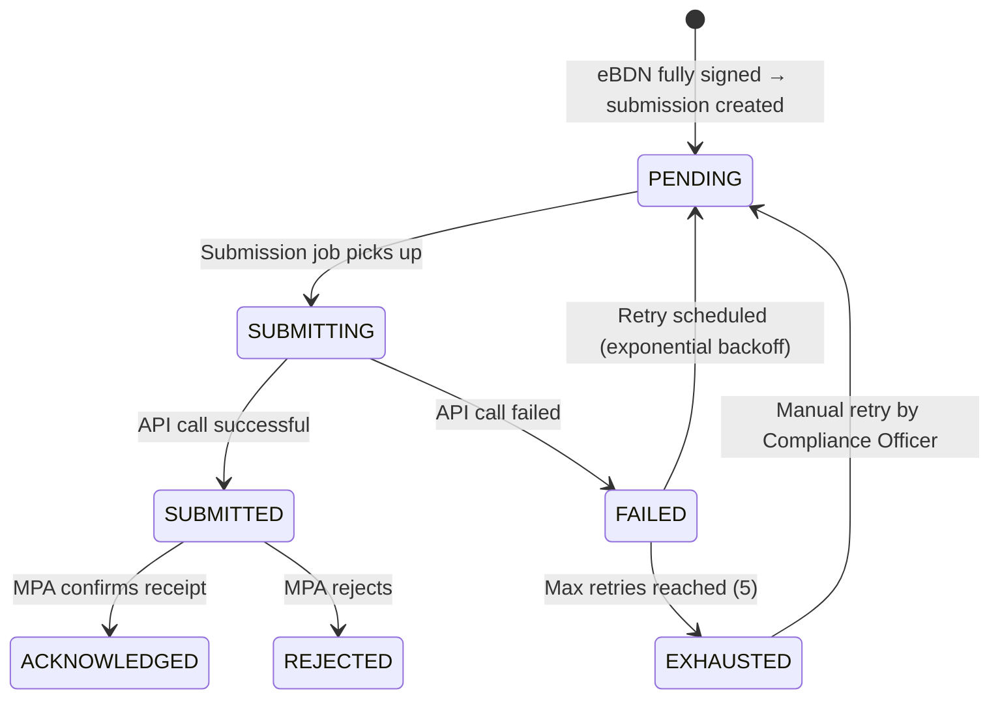

# SRS — B2G Compliance & Emissions

**Version:** 1.0  
**Module:** b2g-compliance  
**Ngày:** 2026-05-27

---

## §1 Mục đích & Phạm vi

### 1.1 Mục đích

Module B2G Compliance quản lý việc nộp eBDN đã ký cho MPA (Maritime and Port Authority) Singapore qua kênh B2G (Business-to-Government), theo dõi trạng thái submission, giám sát deadlines, tính toán emissions per delivery, và cảnh báo compliance risks.

### 1.2 Phạm vi

- Submit eBDN đã ký cho MPA B2G platform
- Track submission status (acknowledged/rejected)
- Retry logic khi submission fail
- Deadline monitoring + alerting
- Per-delivery CO₂ emissions calculation
- Compliance dashboard data

### 1.3 Actors

| Actor | Vai trò | Quyền |
|-------|---------|-------|
| System | Auto-submit khi eBDN FULLY_SIGNED | SUBMIT |
| Compliance Officer | Monitor, handle failures | VIEW, MANAGE alerts |
| Supplier Admin | View dashboard | VIEW |

### 1.4 Dependencies

| Module | Quan hệ | Mô tả |
|--------|---------|--------|
| ebdn | Inbound event | `EBDNFullySigned` → trigger submission |
| fuel-grades | Query | Get emission_factor for fuel code |

---

## §2 Mô tả tổng thể

### 2.1 State Machine (Submission)



### 2.2 Retry Policy

| Attempt | Delay | Total Elapsed |
|---------|-------|---------------|
| 1 | 1 min | 1 min |
| 2 | 5 min | 6 min |
| 3 | 15 min | 21 min |
| 4 | 1 hour | 1h 21min |
| 5 | 1 hour | 2h 21min |
| > 5 | Manual | — |

---

## §3 Yêu cầu chức năng chi tiết

### FR-B2G-001: Submit Signed eBDN to MPA

**Mô tả:** Automatically submit eBDN to MPA B2G platform within required timeframe.

**Preconditions:**
- eBDN status = FULLY_SIGNED
- B2GSubmission record created

**Postconditions:**
- Submission status updated (SUBMITTED or FAILED)
- MPA reference number stored (if successful)
- Retry scheduled (if failed)

**MPA B2G Integration (Adapter Pattern):**
```
Interface: B2GSubmissionAdapter
  - submit(ebdn: EBDNPayload): SubmissionResult
  - checkStatus(mpa_reference: String): StatusResult

Implementation: MPA_SG_Adapter (actual MPA API - schema TBD)
Implementation: Mock_Adapter (for testing)
```

---

### FR-B2G-002: Track Submission Status

**Mô tả:** Monitor and track submission acknowledgement from MPA.

**Status Polling:** Background job polls MPA status every 30 minutes for SUBMITTED entries.

---

### FR-B2G-003: Deadline Monitoring

**Mô tả:** Scheduled job checks approaching submission deadlines.

**Schedule:** Every 30 minutes

**Logic:**
```
FOR each eBDN WHERE status = FULLY_SIGNED AND no B2GSubmission:
  IF (NOW() - ebdn.signed_by_vessel_at) > 12 hours:
    raise CRITICAL alert
  ELIF (NOW() - ebdn.signed_by_vessel_at) > 6 hours:
    raise WARNING alert
```

---

### FR-B2G-004: Emissions Calculation

**Mô tả:** Calculate per-delivery CO₂ emissions.

**Formula:**
```
CO₂_tonnes = quantity_mt × emission_factor[fuel_type_code]
```

**Emission Factors (from fuel-grades module):**

| Fuel Code | Factor (t CO₂ / t fuel) |
|-----------|------------------------|
| HSFO380 | 3.1140 |
| VLSFO380 | 3.1140 |
| MGO | 3.2060 |
| LSMGO | 3.2060 |
| LNG | 2.7500 |
| MMA (Methanol) | 1.3750 |
| BIO-VLSFO380 | 2.1800 (biogenic offset) |
| AMM-GREEN | 0.0000 |

---

## §4 Use Case Specifications

### UC-B2G-01: Auto-Submit eBDN

**Actor:** System  
**Goal:** Submit eBDN to MPA immediately after signing

**Main Success Scenario:**

1. eBDN reaches FULLY_SIGNED status
2. System creates B2GSubmission record (PENDING)
3. Submission job picks up record
4. System prepares MPA payload (adapter transforms eBDN data)
5. System calls MPA B2G API
6. MPA returns success + reference number
7. Status → SUBMITTED, store mpa_reference
8. Background job polls MPA for acknowledgement
9. MPA acknowledges → Status → ACKNOWLEDGED

**Exception Flows:**

- **5a.** API timeout → Status = FAILED, schedule retry (1 min)
- **5b.** API 4xx error → Status = FAILED, alert Compliance Officer (may need manual fix)
- **5c.** API 5xx error → Status = FAILED, schedule retry (exponential backoff)
- **8a.** MPA rejects → Status = REJECTED, notify Compliance Officer + Supplier Admin

---

## §5 Data Model

### 5.1 Entity: B2GSubmission

```sql
CREATE TABLE b2g_submissions (
    id              UUID PRIMARY KEY DEFAULT gen_random_uuid(),
    workspace_id    UUID NOT NULL REFERENCES workspaces(id),
    ebdn_id         UUID NOT NULL REFERENCES bunker_delivery_notes(id),
    submission_type VARCHAR(20) NOT NULL DEFAULT 'INITIAL',  -- INITIAL, RESUBMISSION
    status          VARCHAR(20) NOT NULL DEFAULT 'PENDING',
    mpa_reference   VARCHAR(50),
    submitted_at    TIMESTAMPTZ,
    acknowledged_at TIMESTAMPTZ,
    rejected_at     TIMESTAMPTZ,
    rejection_reason TEXT,
    retry_count     INTEGER NOT NULL DEFAULT 0,
    max_retries     INTEGER NOT NULL DEFAULT 5,
    next_retry_at   TIMESTAMPTZ,
    last_error      TEXT,
    error_details   JSONB,
    created_at      TIMESTAMPTZ NOT NULL DEFAULT NOW(),
    updated_at      TIMESTAMPTZ NOT NULL DEFAULT NOW(),

    CONSTRAINT chk_b2g_status CHECK (status IN ('PENDING','SUBMITTING','SUBMITTED','ACKNOWLEDGED','REJECTED','FAILED','EXHAUSTED'))
);
```

### 5.2 Entity: EmissionsRecord

```sql
CREATE TABLE emissions_records (
    id              UUID PRIMARY KEY DEFAULT gen_random_uuid(),
    workspace_id    UUID NOT NULL REFERENCES workspaces(id),
    delivery_id     UUID NOT NULL REFERENCES deliveries(id),
    ebdn_id         UUID REFERENCES bunker_delivery_notes(id),
    fuel_type_code  VARCHAR(20) NOT NULL,
    quantity_mt     DECIMAL(10,3) NOT NULL,
    emission_factor DECIMAL(6,4) NOT NULL,
    co2_tonnes      DECIMAL(10,4) NOT NULL,
    calculation_date DATE NOT NULL DEFAULT CURRENT_DATE,
    created_at      TIMESTAMPTZ NOT NULL DEFAULT NOW()
);
```

### 5.3 Entity: ComplianceAlert

```sql
CREATE TABLE compliance_alerts (
    id              UUID PRIMARY KEY DEFAULT gen_random_uuid(),
    workspace_id    UUID NOT NULL REFERENCES workspaces(id),
    alert_type      VARCHAR(30) NOT NULL,  -- DEADLINE_WARNING, DEADLINE_CRITICAL, SUBMISSION_FAILED, SUBMISSION_REJECTED, RETRY_EXHAUSTED
    severity        VARCHAR(10) NOT NULL,  -- INFO, WARNING, CRITICAL
    reference_type  VARCHAR(20) NOT NULL,  -- EBDN, SUBMISSION
    reference_id    UUID NOT NULL,
    title           VARCHAR(255) NOT NULL,
    message         TEXT NOT NULL,
    acknowledged    BOOLEAN NOT NULL DEFAULT FALSE,
    acknowledged_by UUID REFERENCES users(id),
    acknowledged_at TIMESTAMPTZ,
    created_at      TIMESTAMPTZ NOT NULL DEFAULT NOW()
);
```

### 5.4 Indexes

```sql
CREATE INDEX idx_b2g_submissions_workspace_status ON b2g_submissions(workspace_id, status);
CREATE INDEX idx_b2g_submissions_ebdn ON b2g_submissions(ebdn_id);
CREATE INDEX idx_b2g_submissions_retry ON b2g_submissions(status, next_retry_at) WHERE status IN ('PENDING', 'FAILED');
CREATE INDEX idx_emissions_workspace_date ON emissions_records(workspace_id, calculation_date);
CREATE INDEX idx_compliance_alerts_workspace ON compliance_alerts(workspace_id, acknowledged, created_at DESC);
```

---

## §6 API Specifications

### 6.1 POST /api/v1/b2g/submissions

**Mô tả:** Trigger submission (manual — usually auto-triggered)  
**Auth:** Bearer JWT, role = COMPLIANCE_OFFICER | SUPPLIER_ADMIN

**Request Body:**
```json
{
  "ebdn_id": "..."
}
```

**Response (201):** `B2GSubmissionDto`

---

### 6.2 GET /api/v1/b2g/submissions

**Mô tả:** List submissions  
**Auth:** Bearer JWT  
**Query Params:** page, size, status, from_date, to_date

**Response (200):** `PaginatedResponse<B2GSubmissionDto>`

---

### 6.3 GET /api/v1/b2g/submissions/{id}

**Mô tả:** Get submission detail  
**Auth:** Bearer JWT

**Response (200):** `B2GSubmissionDto` (includes retry history)

---

### 6.4 POST /api/v1/b2g/submissions/{id}/retry

**Mô tả:** Manual retry (for EXHAUSTED submissions)  
**Auth:** Bearer JWT, role = COMPLIANCE_OFFICER

**Response (200):** Updated `B2GSubmissionDto` with status reset to PENDING

---

### 6.5 GET /api/v1/b2g/dashboard

**Mô tả:** Compliance dashboard stats  
**Auth:** Bearer JWT

**Response (200):**
```json
{
  "pending_submissions": 3,
  "submitted_awaiting_ack": 12,
  "acknowledged_today": 8,
  "rejected_unresolved": 1,
  "failed_retrying": 2,
  "approaching_deadline": 1,
  "total_co2_mtd": 4523.45,
  "total_co2_ytd": 45234.50,
  "compliance_rate_percent": 99.2
}
```

---

### 6.6 GET /api/v1/b2g/emissions

**Mô tả:** List emissions records  
**Auth:** Bearer JWT  
**Query Params:** page, size, from_date, to_date, fuel_type_code

**Response (200):** `PaginatedResponse<EmissionsRecordDto>`

---

## §7 Yêu cầu phi chức năng

| ID | Category | Requirement |
|----|----------|-------------|
| NFR-B2G-01 | Reliability | Submission retry must complete within 3 hours |
| NFR-B2G-02 | Monitoring | Alert within 5 min of submission failure |
| NFR-B2G-03 | Compliance | Zero late submissions (G2 metric) |
| NFR-B2G-04 | Security | MPA API credentials encrypted at rest |
| NFR-B2G-05 | Audit | Every submission attempt logged with request/response |

---

## §8 Quy tắc nghiệp vụ

| ID | Quy tắc | Implementation Notes |
|----|---------|---------------------|
| BR-B2G-001 | Auto-submit on FULLY_SIGNED | Event listener: consume `EBDNFullySigned` → create B2GSubmission(PENDING). |
| BR-B2G-002 | Exponential backoff retry | Retry delays: [1m, 5m, 15m, 1h, 1h]. After 5 → EXHAUSTED. Scheduled job processes PENDING/FAILED with `next_retry_at <= NOW()`. |
| BR-B2G-003 | Deadline monitoring | Scheduled job (cron: `*/30 * * * *`). Distributed lock: ShedLock key `b2g-deadline-monitor`. |
| BR-B2G-004 | Emissions calculation | Triggered on delivery completion. Query fuel-grades for emission_factor. Store result. |
| BR-B2G-005 | Adapter pattern for MPA | Interface abstraction. Swap implementations without changing business logic. Mock adapter for dev/test. |
