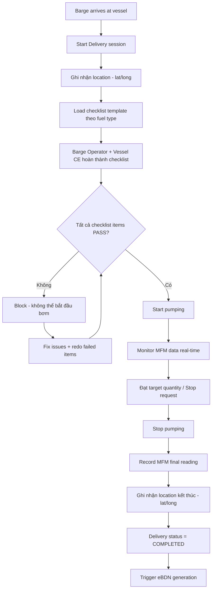
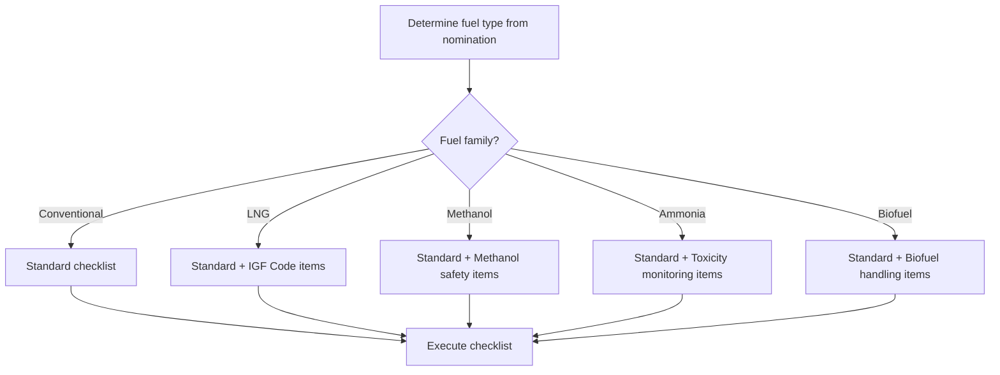

# FRD — Delivery Operations & Safety Checklists

## 1. Tổng quan chức năng

Module Delivery Operations quản lý toàn bộ quy trình bunkering thực tế — từ khi barge đến nơi đến khi giao hàng hoàn tất. Bao gồm pre-delivery safety checklist (khác nhau theo loại nhiên liệu), giám sát bơm nhiên liệu, ghi nhận MFM reading cuối cùng, và enforcement phương thức giao hàng theo SS 648/600.

Module hỗ trợ multi-fuel với checklist templates khác nhau cho: conventional fuels, LNG, methanol, ammonia, và biofuel.

---

## 2. Chân dung người dùng (Personas)

| Persona | Vai trò | Mục tiêu chính |
|---------|---------|----------------|
| **Barge Operator** | Thực hiện giao nhiên liệu, hoàn thành checklist | Giao hàng an toàn, đúng quy trình |
| **Vessel Chief Engineer** | Giám sát nhận nhiên liệu, ký xác nhận | Nhận đủ nhiên liệu đúng chất lượng |

---

## 3. Danh sách tính năng

| ID | Tính năng | Mô tả | Độ ưu tiên |
|----|-----------|--------|-------------|
| F-DEL-01 | Start Delivery | Khởi tạo phiên giao hàng khi barge đến | Must |
| F-DEL-02 | Pre-delivery Checklist | Hoàn thành safety checklist theo fuel type | Must |
| F-DEL-03 | Monitor Pumping | Theo dõi tiến trình bơm (real-time MFM data) | Must |
| F-DEL-04 | Complete Delivery | Dừng bơm, ghi nhận MFM final reading | Must |
| F-DEL-05 | Delivery Method Enforcement | Enforce phương thức ship-to-ship theo SS 648/600 | Must |
| F-DEL-06 | Multi-fuel Checklist Templates | Checklist khác nhau theo fuel family | Must |

---

## 4. Luồng nghiệp vụ (Workflow)

### 4.1 Luồng chính — Delivery Operation

### 4.2 Checklist flow theo fuel type

---

## 5. Yêu cầu dữ liệu

### 5.1 Entity: Delivery

| Field | Type | Constraints | Mô tả |
|-------|------|-------------|--------|
| id | UUID | PK | Mã delivery |
| schedule_id | UUID | FK, NOT NULL | Liên kết schedule |
| nomination_id | UUID | FK, NOT NULL | Liên kết nomination |
| barge_id | UUID | FK, NOT NULL | Barge thực hiện |
| vessel_imo | String(7) | NOT NULL | IMO vessel nhận |
| fuel_type_code | String(20) | NOT NULL | Mã nhiên liệu SS 709 |
| delivery_method | Enum | NOT NULL | SHIP_TO_SHIP, TRUCK_TO_SHIP, PIPELINE |
| status | Enum | NOT NULL | INITIATED, CHECKLIST_IN_PROGRESS, PUMPING, COMPLETED, ABORTED |
| start_location_lat | Decimal | nullable | Tọa độ bắt đầu |
| start_location_long | Decimal | nullable | Tọa độ bắt đầu |
| end_location_lat | Decimal | nullable | Tọa độ kết thúc |
| end_location_long | Decimal | nullable | Tọa độ kết thúc |
| mfm_start_reading | Decimal | nullable | MFM reading khi bắt đầu bơm |
| mfm_final_reading | Decimal | nullable | MFM reading khi kết thúc |
| quantity_delivered_mt | Decimal | nullable | Số lượng thực giao (MFM) |
| started_at | DateTime | nullable | Thời gian bắt đầu bơm |
| completed_at | DateTime | nullable | Thời gian hoàn tất |
| created_at | DateTime | NOT NULL | Ngày tạo record |

### 5.2 Entity: ChecklistTemplate

| Field | Type | Constraints | Mô tả |
|-------|------|-------------|--------|
| id | UUID | PK | Mã template |
| fuel_family | Enum | NOT NULL | CONVENTIONAL, LNG, METHANOL, AMMONIA, BIOFUEL |
| name | String(255) | NOT NULL | Tên checklist |
| items | JSON Array | NOT NULL | Danh sách checklist items |
| version | Integer | NOT NULL | Phiên bản |
| is_active | Boolean | NOT NULL | Template đang active |

### 5.3 Entity: ChecklistResponse

| Field | Type | Constraints | Mô tả |
|-------|------|-------------|--------|
| id | UUID | PK | Mã response |
| delivery_id | UUID | FK, NOT NULL | Liên kết delivery |
| template_id | UUID | FK, NOT NULL | Template được dùng |
| responses | JSON Array | NOT NULL | Câu trả lời cho từng item |
| all_passed | Boolean | NOT NULL | Tất cả items pass |
| completed_by | UUID | FK | Người hoàn thành |
| completed_at | DateTime | nullable | Thời gian hoàn thành |

---

## 6. Quy tắc nghiệp vụ

| ID | Quy tắc | Mô tả |
|----|---------|--------|
| BR-DEL-001 | Checklist bắt buộc pass | TẤT CẢ checklist items PHẢI pass trước khi bơm được bắt đầu |
| BR-DEL-002 | Delivery method SS 648/600 | Delivery method = SHIP_TO_SHIP khi SS 648/600 applicable |
| BR-DEL-003 | LNG — IGF Code | Deliveries LNG PHẢI có thêm IGF Code checklist items (ngoài standard) |
| BR-DEL-004 | Ammonia — Toxicity | Deliveries ammonia PHẢI có thêm toxicity monitoring checklist |
| BR-DEL-005 | MFM final bắt buộc | Delivery KHÔNG THỂ complete nếu chưa có MFM final reading |
| BR-DEL-006 | Location tracking | Location (lat/long) PHẢI được ghi nhận tại thời điểm start và end |

---

## 7. Điểm tích hợp

| Module | Hướng | Mô tả |
|--------|-------|--------|
| **scheduling** | Inbound event | Nhận event BARGE_ARRIVED → initiate delivery |
| **mfm-integration** | Inbound data | Nhận MFM reading real-time trong suốt quá trình bơm |
| **ebdn** | Outbound event | Khi delivery COMPLETED → trigger eBDN generation |
| **fuel-grades** | Query | Xác định fuel family để load đúng checklist template |
| **sampling-quality** | Outbound | Record sample reference khi delivery |

---

## 8. Tiêu chí chấp nhận

### F-DEL-01: Start Delivery
- [ ] Delivery session khởi tạo khi barge arrives
- [ ] Ghi nhận GPS location (lat/long) tại thời điểm start
- [ ] Status = INITIATED

### F-DEL-02: Pre-delivery Checklist
- [ ] Checklist template tự động load theo fuel type/family
- [ ] Barge Operator và Vessel CE phải hoàn thành tất cả items
- [ ] Items fail → không cho bắt đầu bơm
- [ ] Cho phép redo failed items sau khi fix

### F-DEL-03: Monitor Pumping
- [ ] Hiển thị MFM data real-time (flow rate, totalizer)
- [ ] Hiển thị progress so với target quantity
- [ ] Cảnh báo khi gần đạt target

### F-DEL-04: Complete Delivery
- [ ] Ghi nhận MFM final reading bắt buộc
- [ ] Tính quantity_delivered = MFM final - MFM start
- [ ] Ghi nhận GPS location kết thúc
- [ ] Status = COMPLETED
- [ ] Trigger eBDN generation

### F-DEL-05: Delivery Method Enforcement
- [ ] Hệ thống enforce SHIP_TO_SHIP khi SS 648/600 applicable
- [ ] Hiển thị rõ delivery method trên UI

### F-DEL-06: Multi-fuel Checklist Templates
- [ ] Conventional fuel → standard checklist
- [ ] LNG → standard + IGF Code items
- [ ] Ammonia → standard + toxicity monitoring
- [ ] Methanol → standard + methanol safety
- [ ] Biofuel → standard + biofuel handling
