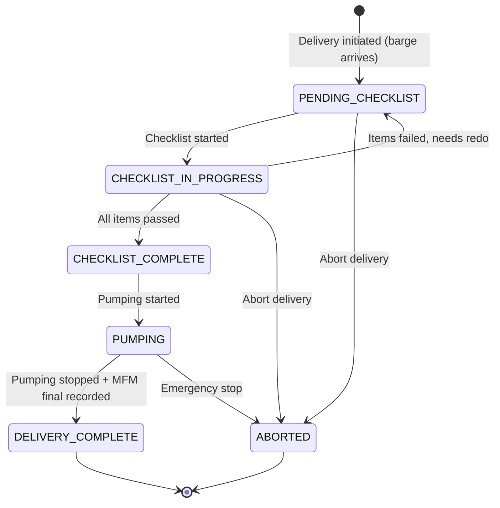

# SRS — Delivery Operations & Safety Checklists

**Version:** 1.0  
**Module:** delivery-ops  
**Ngày:** 2026-05-27

---

## §1 Mục đích & Phạm vi

### 1.1 Mục đích

Module Delivery Operations quản lý toàn bộ quy trình bunkering thực tế — từ khi barge đến vessel đến khi giao hàng hoàn tất. Bao gồm pre-delivery safety checklist (khác nhau theo loại nhiên liệu), giám sát bơm, ghi nhận MFM reading cuối, và enforcement phương thức giao hàng theo SS 648/600.

### 1.2 Phạm vi

- Khởi tạo delivery session khi barge arrives
- Pre-delivery safety checklist (multi-fuel templates)
- Monitor pumping progress (real-time MFM data display)
- Complete delivery (record final reading)
- Delivery method enforcement (SS 648/600)
- Location tracking (GPS lat/long)

### 1.3 Actors

| Actor | Vai trò | Quyền |
|-------|---------|-------|
| Barge Operator | Thực hiện delivery, complete checklist | START, COMPLETE delivery |
| Vessel Chief Engineer | Confirm checklist, monitor delivery | SIGN checklist items |

### 1.4 Dependencies

| Module | Quan hệ | Mô tả |
|--------|---------|--------|
| scheduling | Inbound event | `BargeArrived` → initiate delivery |
| mfm-integration | Inbound data | Real-time MFM readings during pumping |
| ebdn | Outbound event | `DeliveryCompleted` → trigger eBDN generation |
| fuel-grades | Query | Determine fuel family for checklist template |
| sampling-quality | Outbound | Record sample reference |

---

## §2 Mô tả tổng thể

### 2.1 State Machine



### 2.2 Actors & Dependencies

Xem §1.3 và §1.4.

---

## §3 Yêu cầu chức năng chi tiết

### FR-DEL-001: Start Delivery / Initiate Session

**Mô tả:** Barge operator khởi tạo phiên giao hàng khi barge đến vessel.

**Preconditions:**
- Schedule status = ARRIVED (barge confirmed arrival)
- Barge Operator authenticated

**Postconditions:**
- Delivery record created (status = PENDING_CHECKLIST)
- Start location (lat/long) recorded
- DeliveryEvent: INITIATED logged
- Appropriate checklist template loaded based on fuel type

**Input Specification:**

| Field | Type | Required | Validation | Description |
|-------|------|----------|------------|-------------|
| schedule_id | UUID | Yes | Must exist, status=ARRIVED | Schedule liên kết |
| start_location_lat | Decimal | Yes | -90 to 90 | GPS latitude |
| start_location_long | Decimal | Yes | -180 to 180 | GPS longitude |

**Error Cases:**

| HTTP | Code | Condition |
|------|------|-----------|
| 404 | NOT_FOUND | Schedule không tồn tại |
| 409 | INVALID_STATE | Schedule status ≠ ARRIVED |
| 409 | DELIVERY_ALREADY_EXISTS | Delivery đã tồn tại cho schedule này |

---

### FR-DEL-002: Pre-delivery Checklist

**Mô tả:** Tất cả checklist items phải pass trước khi pumping bắt đầu.

**Checklist Templates by Fuel Family:**

| Fuel Family | Template | Additional Items |
|-------------|----------|-----------------|
| CONVENTIONAL | Standard safety (15 items) | — |
| LNG | Standard + IGF Code (25 items) | Gas detection, emergency shutdown, cryogenic PPE |
| METHANOL | Standard + Methanol safety (22 items) | Toxic vapor detection, enclosed space checks |
| AMMONIA | Standard + Toxicity (28 items) | NH₃ detector, ventilation, medical readiness |
| BIOFUEL | Standard + Biofuel handling (18 items) | Compatibility check, temperature monitoring |

**Preconditions:**
- Delivery status = PENDING_CHECKLIST hoặc CHECKLIST_IN_PROGRESS

**Postconditions:**
- ChecklistResponse record created
- If all pass → Delivery status = CHECKLIST_COMPLETE
- If any fail → status remains CHECKLIST_IN_PROGRESS, failed items flagged

**Input Specification:**

| Field | Type | Required | Validation | Description |
|-------|------|----------|------------|-------------|
| delivery_id | UUID | Yes | Must exist | Delivery liên kết |
| responses | Array | Yes | Must cover all template items | Checklist answers |
| responses[].item_id | String | Yes | Must match template | ID of checklist item |
| responses[].passed | Boolean | Yes | — | Pass/fail |
| responses[].comment | String | No | max 500 chars | Comment for failed items |
| responses[].photo_url | String | No | Valid URL | Evidence photo |

**Error Cases:**

| HTTP | Code | Condition |
|------|------|-----------|
| 400 | INCOMPLETE_CHECKLIST | Không cover hết tất cả items |
| 409 | INVALID_STATE | Delivery status không cho phép submit checklist |
| 422 | CHECKLIST_ITEMS_FAILED | Có items fail → cannot proceed to pumping |

---

### FR-DEL-003: Delivery Method Enforcement

**Mô tả:** Enforce delivery method = SHIP_TO_SHIP khi SS 648/600 applicable.

**Logic:**
```
IF nomination.standard IN ('SS_648', 'SS_600')
  THEN delivery_method MUST = 'SHIP_TO_SHIP'
  AND delivery MUST be alongside (barge-to-vessel)
```

**Enforcement:** Application-level check at delivery initiation. Cannot override without Supplier Admin approval + audit log.

---

## §4 Use Case Specifications

### UC-DEL-01: Execute Full Delivery

**Actor:** Barge Operator  
**Goal:** Hoàn tất giao nhiên liệu an toàn

**Main Success Scenario:**

1. Barge arrives at vessel → Operator opens app
2. Operator taps "Start Delivery"
3. App captures GPS location automatically
4. System creates delivery session (PENDING_CHECKLIST)
5. System loads checklist template based on fuel type
6. Operator + Vessel CE complete checklist items one by one
7. All items pass → System marks CHECKLIST_COMPLETE
8. Operator taps "Start Pumping"
9. System connects to MFM real-time data feed
10. Dashboard shows: flow rate, totalizer, temperature, progress %
11. Target quantity reached → Operator taps "Stop Pumping"
12. System records MFM final reading
13. App captures GPS end location
14. System marks DELIVERY_COMPLETE
15. System triggers eBDN generation

**Alternative Flows:**

- **6a.** Item fails → Operator fixes issue → re-checks item → mark pass
- **6b.** Multiple items fail → All must be resolved before pumping
- **11a.** Emergency → Operator taps "Emergency Stop" → status = ABORTED

---

## §5 Data Model

### 5.1 Entity: Delivery

```sql
CREATE TABLE deliveries (
    id                  UUID PRIMARY KEY DEFAULT gen_random_uuid(),
    workspace_id        UUID NOT NULL REFERENCES workspaces(id),
    schedule_id         UUID NOT NULL REFERENCES schedules(id),
    nomination_id       UUID NOT NULL REFERENCES nominations(id),
    barge_id            UUID NOT NULL REFERENCES barges(id),
    vessel_imo          VARCHAR(7) NOT NULL,
    fuel_type_code      VARCHAR(20) NOT NULL,
    delivery_method     VARCHAR(20) NOT NULL DEFAULT 'SHIP_TO_SHIP',
    status              VARCHAR(30) NOT NULL DEFAULT 'PENDING_CHECKLIST',
    start_location_lat  DECIMAL(9,6),
    start_location_long DECIMAL(9,6),
    end_location_lat    DECIMAL(9,6),
    end_location_long   DECIMAL(9,6),
    mfm_session_id      UUID,
    mfm_start_reading   DECIMAL(12,3),
    mfm_final_reading   DECIMAL(12,3),
    quantity_delivered_mt DECIMAL(10,3),
    started_at          TIMESTAMPTZ,    -- Pumping start
    completed_at        TIMESTAMPTZ,    -- Pumping end
    created_at          TIMESTAMPTZ NOT NULL DEFAULT NOW(),
    updated_at          TIMESTAMPTZ NOT NULL DEFAULT NOW(),
    deleted_at          TIMESTAMPTZ,

    CONSTRAINT chk_delivery_method CHECK (delivery_method IN ('SHIP_TO_SHIP','TRUCK_TO_SHIP','PIPELINE')),
    CONSTRAINT chk_delivery_status CHECK (status IN ('PENDING_CHECKLIST','CHECKLIST_IN_PROGRESS','CHECKLIST_COMPLETE','PUMPING','DELIVERY_COMPLETE','ABORTED'))
);
```

### 5.2 Entity: ChecklistTemplate

```sql
CREATE TABLE checklist_templates (
    id              UUID PRIMARY KEY DEFAULT gen_random_uuid(),
    workspace_id    UUID REFERENCES workspaces(id),  -- NULL = system template
    fuel_family     VARCHAR(20) NOT NULL,
    name            VARCHAR(255) NOT NULL,
    description     TEXT,
    items           JSONB NOT NULL,  -- Array of {id, text, category, required, order}
    version         INTEGER NOT NULL DEFAULT 1,
    is_active       BOOLEAN NOT NULL DEFAULT TRUE,
    is_system       BOOLEAN NOT NULL DEFAULT FALSE,
    created_at      TIMESTAMPTZ NOT NULL DEFAULT NOW(),
    updated_at      TIMESTAMPTZ NOT NULL DEFAULT NOW(),

    CONSTRAINT chk_fuel_family CHECK (fuel_family IN ('CONVENTIONAL','LNG','METHANOL','AMMONIA','BIOFUEL'))
);
```

### 5.3 Entity: ChecklistResponse

```sql
CREATE TABLE checklist_responses (
    id              UUID PRIMARY KEY DEFAULT gen_random_uuid(),
    delivery_id     UUID NOT NULL REFERENCES deliveries(id),
    template_id     UUID NOT NULL REFERENCES checklist_templates(id),
    responses       JSONB NOT NULL,  -- Array of {item_id, passed, comment, photo_url, responded_by, responded_at}
    all_passed      BOOLEAN NOT NULL DEFAULT FALSE,
    completed_by    UUID REFERENCES users(id),
    completed_at    TIMESTAMPTZ,
    created_at      TIMESTAMPTZ NOT NULL DEFAULT NOW()
);
```

### 5.4 Entity: DeliveryEvent

```sql
CREATE TABLE delivery_events (
    id              UUID PRIMARY KEY DEFAULT gen_random_uuid(),
    delivery_id     UUID NOT NULL REFERENCES deliveries(id),
    event_type      VARCHAR(30) NOT NULL,  -- INITIATED, CHECKLIST_STARTED, CHECKLIST_COMPLETED, PUMPING_STARTED, PUMPING_STOPPED, COMPLETED, ABORTED
    actor_id        UUID NOT NULL REFERENCES users(id),
    event_data      JSONB,
    location_lat    DECIMAL(9,6),
    location_long   DECIMAL(9,6),
    occurred_at     TIMESTAMPTZ NOT NULL DEFAULT NOW()
);
```

### 5.5 Indexes

```sql
CREATE INDEX idx_deliveries_workspace_status ON deliveries(workspace_id, status) WHERE deleted_at IS NULL;
CREATE INDEX idx_deliveries_schedule ON deliveries(schedule_id) WHERE deleted_at IS NULL;
CREATE INDEX idx_deliveries_barge ON deliveries(barge_id, created_at DESC) WHERE deleted_at IS NULL;
CREATE INDEX idx_checklist_responses_delivery ON checklist_responses(delivery_id);
CREATE INDEX idx_delivery_events_delivery ON delivery_events(delivery_id, occurred_at);
```

---

## §6 API Specifications

### 6.1 POST /api/v1/deliveries/start

**Mô tả:** Initiate delivery session  
**Auth:** Bearer JWT, role = BARGE_OPERATOR

**Request Body:**
```json
{
  "schedule_id": "...",
  "start_location_lat": 1.2644,
  "start_location_long": 103.8200
}
```

**Response (201):** `DeliveryDto`

---

### 6.2 POST /api/v1/deliveries/{id}/checklist

**Mô tả:** Submit checklist responses  
**Auth:** Bearer JWT, role = BARGE_OPERATOR | VESSEL_CE

**Request Body:**
```json
{
  "responses": [
    { "item_id": "SAFETY_001", "passed": true },
    { "item_id": "SAFETY_002", "passed": true },
    { "item_id": "SAFETY_003", "passed": false, "comment": "Hose condition needs inspection", "photo_url": "..." }
  ]
}
```

**Response (200):** `ChecklistResponseDto` with `all_passed` field

---

### 6.3 POST /api/v1/deliveries/{id}/start-pumping

**Mô tả:** Start pumping (requires checklist complete)  
**Auth:** Bearer JWT, role = BARGE_OPERATOR

**Precondition:** Delivery status = CHECKLIST_COMPLETE

**Response (200):** Updated `DeliveryDto` with status = PUMPING

**Error:** 409 if checklist incomplete

---

### 6.4 POST /api/v1/deliveries/{id}/complete

**Mô tả:** Complete delivery (stop pumping + record final)  
**Auth:** Bearer JWT, role = BARGE_OPERATOR

**Request Body:**
```json
{
  "end_location_lat": 1.2644,
  "end_location_long": 103.8201,
  "mfm_final_reading": 15234.567
}
```

**Response (200):** Updated `DeliveryDto` with status = DELIVERY_COMPLETE, quantity_delivered_mt calculated

---

### 6.5 GET /api/v1/deliveries/{id}/events

**Mô tả:** Delivery event timeline  
**Auth:** Bearer JWT

**Response (200):**
```json
{
  "events": [
    { "event_type": "INITIATED", "actor_name": "...", "occurred_at": "...", "location_lat": 1.2644 },
    { "event_type": "CHECKLIST_COMPLETED", "actor_name": "...", "occurred_at": "..." },
    { "event_type": "PUMPING_STARTED", "actor_name": "...", "occurred_at": "..." }
  ]
}
```

---

### 6.6 GET /api/v1/checklist-templates

**Mô tả:** List available checklist templates  
**Auth:** Bearer JWT  
**Query Params:** fuel_family, is_active

**Response (200):** `PaginatedResponse<ChecklistTemplateDto>`

---

## §7 Yêu cầu phi chức năng

| ID | Category | Requirement |
|----|----------|-------------|
| NFR-DEL-01 | Mobile | Tất cả delivery operations phải usable trên 4G (200ms latency) |
| NFR-DEL-02 | Offline | Checklist submission phải work offline, sync khi có connection |
| NFR-DEL-03 | Performance | Delivery initiation < 500ms |
| NFR-DEL-04 | Security | Only assigned Barge Operator can operate their delivery |
| NFR-DEL-05 | Data Integrity | MFM final reading cannot be manually overridden |
| NFR-DEL-06 | Audit | Every delivery event logged with timestamp + GPS + actor |

---

## §8 Quy tắc nghiệp vụ

| ID | Quy tắc | Implementation Notes |
|----|---------|---------------------|
| BR-DEL-001 | Checklist bắt buộc pass trước pumping | Application guard: status transition CHECKLIST_COMPLETE → PUMPING chỉ allowed khi `all_passed = true` |
| BR-DEL-002 | Delivery method SS 648/600 | Check nomination.applicable_standard. If SS_648/600 → enforce SHIP_TO_SHIP. Override requires SUPPLIER_ADMIN approval + audit. |
| BR-DEL-003 | LNG — IGF Code | Template selection: if fuel_family = LNG → load LNG template (includes IGF Code items) |
| BR-DEL-004 | MFM final bắt buộc | Delivery CANNOT transition to COMPLETE without `mfm_final_reading`. Field required in /complete endpoint. |
| BR-DEL-005 | Location tracking | GPS captured at: delivery start, pumping start, delivery complete. Stored in DeliveryEvent. |
| BR-DEL-006 | Quantity calculation | `quantity_delivered_mt = mfm_final_reading - mfm_start_reading`. Calculated server-side, immutable. |
