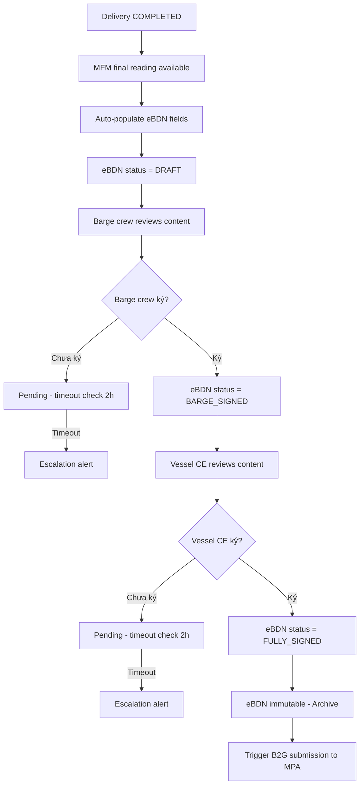
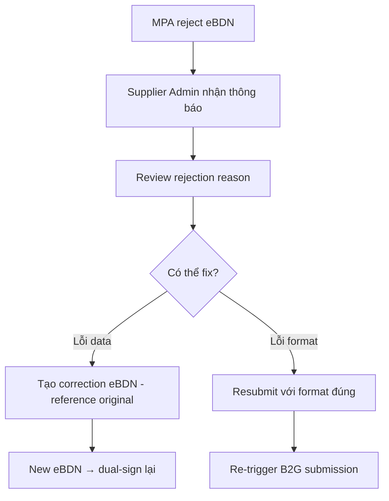

# FRD — eBDN Generation & Signing

## 1. Tổng quan chức năng

Module eBDN (electronic Bunker Delivery Note) tự động tạo BDN điện tử từ dữ liệu MFM, hỗ trợ dual-party signing (barge crew + vessel Chief Engineer), lưu trữ bất biến (immutable) sau khi ký, và trigger nộp B2G cho MPA. eBDN là tài liệu pháp lý ghi nhận giao dịch bunkering.

---

## 2. Chân dung người dùng (Personas)

| Persona | Vai trò | Mục tiêu chính |
|---------|---------|----------------|
| **Barge Operator** | Khởi tạo eBDN, review, ký | Hoàn tất giấy tờ giao hàng nhanh chóng |
| **Vessel Chief Engineer** | Review nội dung, ký xác nhận | Xác nhận số liệu nhận chính xác |
| **Supplier Admin** | Giám sát, xem history | Đảm bảo eBDN hoàn tất đúng hạn |

---

## 3. Danh sách tính năng

| ID | Tính năng | Mô tả | Độ ưu tiên |
|----|-----------|--------|-------------|
| F-EBDN-01 | Auto-generate eBDN | Tạo eBDN từ MFM data khi delivery complete | Must |
| F-EBDN-02 | Review Content | Xem nội dung eBDN trước khi ký | Must |
| F-EBDN-03 | Sign — Barge | Barge crew ký eBDN | Must |
| F-EBDN-04 | Sign — Vessel | Vessel CE ký eBDN | Must |
| F-EBDN-05 | Archive | Lưu trữ immutable sau dual-sign | Must |
| F-EBDN-06 | View History | Xem danh sách eBDN đã tạo | Should |
| F-EBDN-07 | Resubmit | Nộp lại nếu MPA reject | Should |

---

## 4. Luồng nghiệp vụ (Workflow)

### 4.1 Luồng chính — eBDN Generation & Signing

### 4.2 Luồng Resubmit

---

## 5. Yêu cầu dữ liệu

### 5.1 Entity: BunkerDeliveryNote

| Field | Type | Constraints | Mô tả |
|-------|------|-------------|--------|
| id | UUID | PK | Mã eBDN |
| ebdn_reference | String(30) | UNIQUE, NOT NULL | Mã tham chiếu (auto-generated, sequential per supplier) |
| delivery_id | UUID | FK, NOT NULL | Liên kết delivery |
| vessel_name | String(255) | NOT NULL | Tên vessel |
| vessel_imo | String(7) | NOT NULL | IMO vessel |
| barge_name | String(255) | NOT NULL | Tên barge |
| barge_imo | String(7) | NOT NULL | IMO barge |
| supplier_licence | String(50) | NOT NULL | Giấy phép supplier |
| delivery_date | Date | NOT NULL | Ngày giao hàng |
| delivery_time_start | DateTime | NOT NULL | Giờ bắt đầu |
| delivery_time_end | DateTime | NOT NULL | Giờ kết thúc |
| location_lat | Decimal | NOT NULL | Tọa độ |
| location_long | Decimal | NOT NULL | Tọa độ |
| fuel_type_code | String(20) | NOT NULL | Mã nhiên liệu SS 709 |
| quantity_mt | Decimal(10,3) | NOT NULL | Số lượng (từ MFM) |
| mfm_serial | String(50) | NOT NULL | Serial meter |
| mfm_start_reading | Decimal(12,3) | NOT NULL | MFM totalizer start |
| mfm_end_reading | Decimal(12,3) | NOT NULL | MFM totalizer end |
| sample_reference | String(50) | nullable | Mã mẫu MARPOL |
| status | Enum | NOT NULL | DRAFT, BARGE_SIGNED, FULLY_SIGNED, SUBMITTED, REJECTED |
| created_at | DateTime | NOT NULL | Ngày tạo |

### 5.2 Entity: Signature

| Field | Type | Constraints | Mô tả |
|-------|------|-------------|--------|
| id | UUID | PK | Mã chữ ký |
| ebdn_id | UUID | FK, NOT NULL | eBDN liên kết |
| signer_role | Enum | NOT NULL | BARGE_CREW, VESSEL_CE |
| signer_name | String(255) | NOT NULL | Tên người ký |
| signer_id | UUID | FK, NOT NULL | User ID |
| signed_at | DateTime | NOT NULL | Thời gian ký |
| signature_data | Text | NOT NULL | Digital signature payload |

---

## 6. Quy tắc nghiệp vụ

| ID | Quy tắc | Mô tả |
|----|---------|--------|
| BR-EBDN-001 | MFM-only quantity | eBDN quantity PHẢI lấy từ MFM data — KHÔNG cho phép nhập tay |
| BR-EBDN-002 | Required fields | Bắt buộc: vessel name/IMO, barge name/IMO, supplier licence, date/time, location, fuel code SS 709, quantity MT, MFM serial/reading, eBDN reference |
| BR-EBDN-003 | Dual-sign before departure | Cả hai bên PHẢI ký trước khi barge rời đi |
| BR-EBDN-004 | Signing timeout | Nếu chưa ký sau 2 giờ → escalation alert gửi đến Supplier Admin |
| BR-EBDN-005 | Reference auto-generated | eBDN reference number tự động tạo (unique, sequential per supplier) |
| BR-EBDN-006 | Immutable after signing | Sau khi FULLY_SIGNED, eBDN KHÔNG THỂ chỉnh sửa |
| BR-EBDN-007 | MARPOL sample link | MARPOL sample reference PHẢI được liên kết với eBDN |

---

## 7. Điểm tích hợp

| Module | Hướng | Mô tả |
|--------|-------|--------|
| **mfm-integration** | Inbound query | Lấy MFM final reading để populate eBDN |
| **fuel-grades** | Inbound query | Validate fuel type code consistency |
| **b2g-compliance** | Outbound event | Trigger submission khi FULLY_SIGNED |
| **sampling-quality** | Inbound query | Lấy MARPOL sample reference |
| **delivery-ops** | Inbound event | Trigger eBDN generation khi delivery COMPLETED |

---

## 8. Tiêu chí chấp nhận

### F-EBDN-01: Auto-generate eBDN
- [ ] eBDN tự động tạo khi delivery COMPLETED
- [ ] Tất cả fields populate từ delivery data + MFM data
- [ ] Quantity lấy từ MFM — không có field nhập tay
- [ ] eBDN reference auto-generated unique

### F-EBDN-02: Review Content
- [ ] Barge crew và Vessel CE xem được toàn bộ nội dung eBDN
- [ ] Hiển thị rõ ràng: vessel info, barge info, fuel, quantity, timestamps

### F-EBDN-03: Sign — Barge
- [ ] Barge crew ký eBDN (digital signature)
- [ ] Status chuyển DRAFT → BARGE_SIGNED
- [ ] Signature record lưu: signer name, time, signature data

### F-EBDN-04: Sign — Vessel
- [ ] Vessel CE ký eBDN sau barge crew
- [ ] Status chuyển BARGE_SIGNED → FULLY_SIGNED
- [ ] Escalation alert nếu chưa ký sau 2 giờ

### F-EBDN-05: Archive
- [ ] eBDN FULLY_SIGNED trở thành immutable
- [ ] Không cho phép edit bất kỳ field nào
- [ ] Trigger B2G submission

### F-EBDN-06: View History
- [ ] Danh sách eBDN với filter: status, date range, vessel, supplier
- [ ] Pagination, sort by date DESC

### F-EBDN-07: Resubmit
- [ ] Khi MPA reject, Supplier Admin có thể tạo correction eBDN
- [ ] Correction reference original eBDN
- [ ] Dual-sign lại trước khi resubmit
