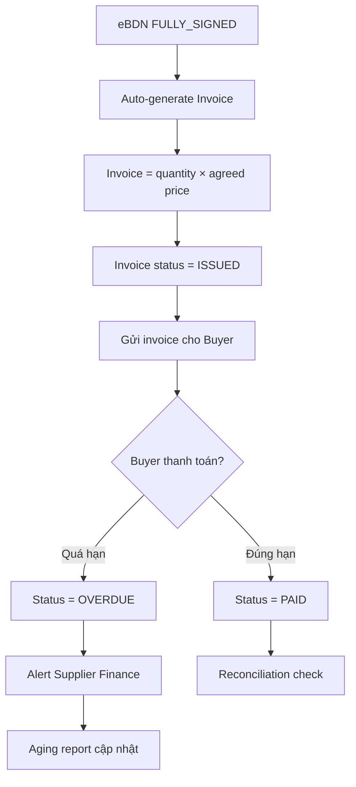

# FRD — Finance & Settlements

## 1. Tổng quan chức năng

Module Finance & Settlements quản lý hóa đơn (invoice) từ eBDN, theo dõi thanh toán, báo cáo công nợ (aging), và đối soát (reconciliation). Invoice tự động tạo từ eBDN quantity × agreed price sau khi eBDN fully signed.

---

## 2. Chân dung người dùng (Personas)

| Persona | Vai trò | Mục tiêu chính |
|---------|---------|----------------|
| **Supplier Admin (Finance)** | Tạo/quản lý invoice, theo dõi payment | Thu tiền đúng hạn |
| **Buyer (Finance)** | Xem invoice, xác nhận thanh toán | Thanh toán chính xác, đúng hạn |

---

## 3. Danh sách tính năng

| ID | Tính năng | Mô tả | Độ ưu tiên |
|----|-----------|--------|-------------|
| F-FIN-01 | Generate Invoice | Tạo invoice từ eBDN data | Must |
| F-FIN-02 | Payment Tracking | Theo dõi trạng thái thanh toán | Must |
| F-FIN-03 | Aging Reports | Báo cáo công nợ theo tuổi nợ | Should |
| F-FIN-04 | Reconciliation | Đối soát invoice vs payment | Should |

---

## 4. Luồng nghiệp vụ (Workflow)

---

## 5. Yêu cầu dữ liệu

### 5.1 Entity: Invoice

| Field | Type | Constraints | Mô tả |
|-------|------|-------------|--------|
| id | UUID | PK | Mã invoice |
| invoice_number | String(30) | UNIQUE, NOT NULL | Số hóa đơn |
| ebdn_id | UUID | FK, NOT NULL | eBDN liên kết |
| buyer_id | UUID | FK, NOT NULL | Buyer |
| supplier_id | UUID | FK, NOT NULL | Supplier |
| quantity_mt | Decimal(10,3) | NOT NULL | Số lượng từ eBDN |
| unit_price | Decimal(12,4) | NOT NULL | Đơn giá thỏa thuận |
| currency | String(3) | NOT NULL | Tiền tệ (USD, SGD) |
| total_amount | Decimal(14,2) | NOT NULL | Tổng tiền |
| status | Enum | NOT NULL | DRAFT, ISSUED, PAID, OVERDUE, CANCELLED |
| issued_at | DateTime | nullable | Ngày phát hành |
| due_date | Date | NOT NULL | Hạn thanh toán |
| paid_at | DateTime | nullable | Ngày thanh toán |
| payment_reference | String(100) | nullable | Mã thanh toán |

---

## 6. Quy tắc nghiệp vụ

| ID | Quy tắc | Mô tả |
|----|---------|--------|
| BR-FIN-001 | Invoice = eBDN qty × price | Invoice amount = eBDN quantity (MT) × agreed unit price |
| BR-FIN-002 | Auto-generate | Invoice tự động tạo sau khi eBDN fully signed |
| BR-FIN-003 | Payment terms per customer | Due date tính theo payment terms đã thỏa thuận per buyer (e.g., Net 30, Net 60) |
| BR-FIN-004 | Overdue alert | Alert khi invoice quá hạn thanh toán |

---

## 7. Điểm tích hợp

| Module | Hướng | Mô tả |
|--------|-------|--------|
| **ebdn** | Inbound event | eBDN FULLY_SIGNED → trigger invoice generation |

---

## 8. Tiêu chí chấp nhận

### F-FIN-01: Generate Invoice
- [ ] Auto-generate khi eBDN fully signed
- [ ] Amount = quantity × unit price
- [ ] Due date = issued_at + payment terms (per buyer config)

### F-FIN-02: Payment Tracking
- [ ] Record payment khi nhận (reference, amount, date)
- [ ] Status transition: ISSUED → PAID
- [ ] Partial payment tracking (if applicable)

### F-FIN-03: Aging Reports
- [ ] Phân loại: Current, 1-30 days, 31-60 days, 61-90 days, 90+ days
- [ ] Filter theo buyer, period
- [ ] Export CSV/PDF

### F-FIN-04: Reconciliation
- [ ] Match invoice vs payment received
- [ ] Flag discrepancies (over/under payment)
- [ ] Monthly reconciliation report
