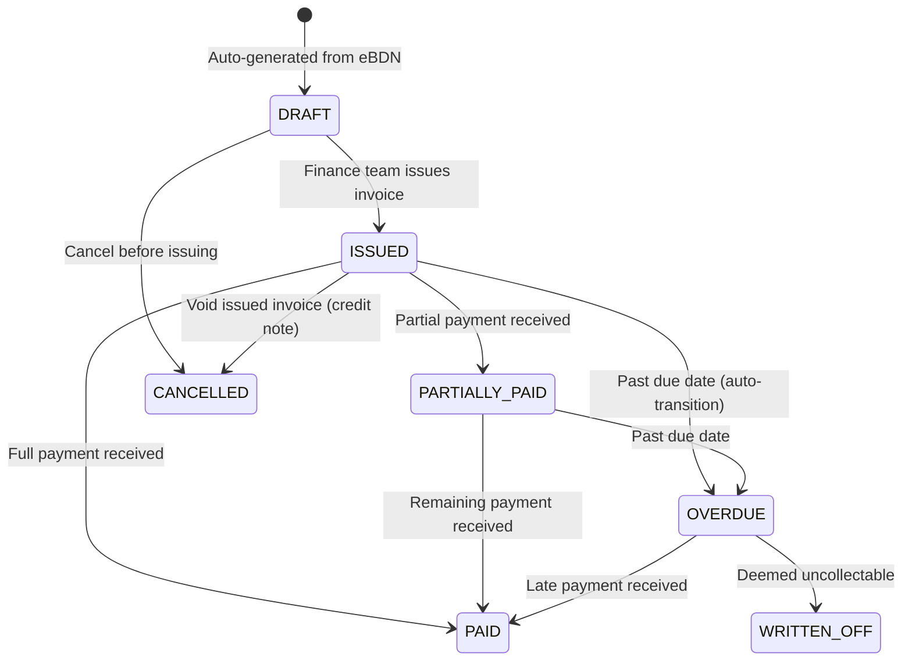

# SRS — Finance & Invoicing

**Version:** 1.0  
**Module:** finance  
**Ngày:** 2026-05-27

---

## §1 Mục đích & Phạm vi

### 1.1 Mục đích

Module Finance quản lý quy trình tài chính downstream: tự động tạo invoice từ eBDN đã ký, theo dõi payment status, settlement reconciliation giữa eBDN quantity và invoice amount, và aging reports.

### 1.2 Phạm vi

- Auto-generate invoice draft khi eBDN FULLY_SIGNED
- Invoice lifecycle management (issue, payment tracking, overdue)
- Payment recording (manual + bank webhook)
- Settlement reconciliation (eBDN qty vs invoice qty)
- Aging report (30/60/90 days)

### 1.3 Actors

| Actor | Vai trò | Quyền |
|-------|---------|-------|
| Finance Team | Manage invoices, record payments | MANAGE |
| Supplier Admin | View finance overview | VIEW |
| System | Auto-generate invoices | CREATE (triggered by event) |

### 1.4 Dependencies

| Module | Quan hệ | Mô tả |
|--------|---------|--------|
| ebdn | Inbound event | `EBDNFullySigned` → auto-create invoice draft |
| nomination | Query | Get agreed price per MT |

---

## §2 Mô tả tổng thể

### 2.1 State Machine (Invoice)



### 2.2 Auto-Generation Flow

```
Event: EBDNFullySigned
  → Query nomination for agreed_price_per_mt
  → Calculate: quantity_mt × agreed_price_per_mt = invoice_amount
  → Create Invoice (DRAFT)
  → Notify Finance Team
```

---

## §3 Yêu cầu chức năng chi tiết

### FR-FIN-001: Generate Invoice from eBDN

**Mô tả:** Auto-create invoice draft khi eBDN fully signed.

**Preconditions:**
- eBDN status = FULLY_SIGNED
- Nomination has `agreed_price_per_mt` populated

**Postconditions:**
- Invoice record created (status = DRAFT)
- invoice_amount = quantity_mt × agreed_price_per_mt
- Invoice reference auto-generated
- Finance Team notified

**Calculation:**
```
invoice_amount = ebdn.quantity_mt × nomination.agreed_price_per_mt
currency = nomination.agreed_currency (default: USD)
tax = 0 (bunkering typically GST-exempt in Singapore)
total = invoice_amount + tax
```

**Error Cases:**

| HTTP | Code | Condition |
|------|------|-----------|
| 422 | PRICE_NOT_SET | nomination.agreed_price_per_mt is null |
| 409 | INVOICE_ALREADY_EXISTS | Invoice already generated for this eBDN |

---

### FR-FIN-002: Track Payment Status

**Mô tả:** Track payment progress per invoice.

**Payment Recording Methods:**
1. **Manual:** Finance Team records payment received
2. **Bank Webhook:** Auto-record from bank notification (future integration)

**Payment States:**
- `amount_paid` tracks cumulative payments
- Status transitions based on: `amount_paid` vs `total_amount`

---

### FR-FIN-003: Settlement Reconciliation

**Mô tả:** Reconcile eBDN quantity vs invoice quantity vs payment amount.

**Reconciliation Check:**
```
FOR each invoice:
  ebdn_qty = ebdn.quantity_mt
  invoice_qty = invoice.quantity_mt
  invoice_amount = invoice.total_amount
  paid_amount = SUM(payments.amount WHERE invoice_id = ?)
  
  qty_match = (ebdn_qty == invoice_qty)
  payment_match = (paid_amount >= invoice_amount)
  
  IF qty_match AND payment_match → RECONCILED
  ELIF !qty_match → QTY_MISMATCH (investigate)
  ELIF paid_amount < invoice_amount → UNDERPAID
  ELIF paid_amount > invoice_amount → OVERPAID (credit)
```

---

## §4 Use Case Specifications

### UC-FIN-01: Auto-Generate Invoice

**Actor:** System  
**Goal:** Create invoice from eBDN data

**Main Success Scenario:**

1. eBDN reaches FULLY_SIGNED
2. System receives `EBDNFullySigned` event
3. System queries nomination for price info
4. System calculates invoice amount
5. System generates invoice reference (INV-{YEAR}-{SEQ})
6. System creates Invoice (DRAFT)
7. Finance Team receives notification

---

### UC-FIN-02: Record Payment

**Actor:** Finance Team  
**Goal:** Record payment received

**Main Success Scenario:**

1. Finance opens invoice detail
2. Finance clicks "Record Payment"
3. Finance enters: amount, date, payment method, reference
4. System validates: amount ≤ remaining balance
5. System creates Payment record
6. System updates invoice.amount_paid
7. If amount_paid ≥ total_amount → status = PAID
8. Else → status = PARTIALLY_PAID

---

## §5 Data Model

### 5.1 Entity: Invoice

```sql
CREATE TABLE invoices (
    id                  UUID PRIMARY KEY DEFAULT gen_random_uuid(),
    workspace_id        UUID NOT NULL REFERENCES workspaces(id),
    invoice_reference   VARCHAR(30) NOT NULL UNIQUE,
    ebdn_id             UUID NOT NULL REFERENCES bunker_delivery_notes(id),
    nomination_id       UUID NOT NULL REFERENCES nominations(id),
    
    -- Buyer info
    buyer_id            UUID NOT NULL,
    buyer_name          VARCHAR(255) NOT NULL,
    
    -- Line item
    fuel_type_code      VARCHAR(20) NOT NULL,
    quantity_mt         DECIMAL(10,3) NOT NULL,
    price_per_mt        DECIMAL(12,4) NOT NULL,
    currency            VARCHAR(3) NOT NULL DEFAULT 'USD',
    
    -- Amounts
    subtotal            DECIMAL(14,2) NOT NULL,  -- quantity × price
    tax_amount          DECIMAL(14,2) NOT NULL DEFAULT 0,
    total_amount        DECIMAL(14,2) NOT NULL,  -- subtotal + tax
    amount_paid         DECIMAL(14,2) NOT NULL DEFAULT 0,
    balance_due         DECIMAL(14,2) NOT NULL,  -- total - paid
    
    -- Dates
    issued_date         DATE,
    due_date            DATE,
    paid_date           DATE,
    
    -- Status
    status              VARCHAR(20) NOT NULL DEFAULT 'DRAFT',
    overdue_days        INTEGER DEFAULT 0,
    
    -- Notes
    notes               TEXT,
    created_at          TIMESTAMPTZ NOT NULL DEFAULT NOW(),
    updated_at          TIMESTAMPTZ NOT NULL DEFAULT NOW(),
    deleted_at          TIMESTAMPTZ,

    CONSTRAINT chk_invoice_status CHECK (status IN ('DRAFT','ISSUED','PARTIALLY_PAID','PAID','OVERDUE','CANCELLED','WRITTEN_OFF'))
);
```

### 5.2 Entity: Payment

```sql
CREATE TABLE payments (
    id              UUID PRIMARY KEY DEFAULT gen_random_uuid(),
    workspace_id    UUID NOT NULL REFERENCES workspaces(id),
    invoice_id      UUID NOT NULL REFERENCES invoices(id),
    amount          DECIMAL(14,2) NOT NULL CHECK (amount > 0),
    currency        VARCHAR(3) NOT NULL,
    payment_date    DATE NOT NULL,
    payment_method  VARCHAR(20) NOT NULL,  -- BANK_TRANSFER, CHEQUE, CREDIT_CARD
    payment_reference VARCHAR(100),  -- Bank reference / cheque number
    notes           TEXT,
    recorded_by     UUID NOT NULL REFERENCES users(id),
    created_at      TIMESTAMPTZ NOT NULL DEFAULT NOW()
);
```

### 5.3 Entity: ReconciliationRecord

```sql
CREATE TABLE reconciliation_records (
    id              UUID PRIMARY KEY DEFAULT gen_random_uuid(),
    workspace_id    UUID NOT NULL REFERENCES workspaces(id),
    invoice_id      UUID NOT NULL REFERENCES invoices(id),
    ebdn_id         UUID NOT NULL REFERENCES bunker_delivery_notes(id),
    ebdn_quantity_mt DECIMAL(10,3) NOT NULL,
    invoice_quantity_mt DECIMAL(10,3) NOT NULL,
    invoice_amount  DECIMAL(14,2) NOT NULL,
    paid_amount     DECIMAL(14,2) NOT NULL,
    status          VARCHAR(20) NOT NULL,  -- RECONCILED, QTY_MISMATCH, UNDERPAID, OVERPAID
    discrepancy_notes TEXT,
    reconciled_by   UUID REFERENCES users(id),
    reconciled_at   TIMESTAMPTZ,
    created_at      TIMESTAMPTZ NOT NULL DEFAULT NOW()
);
```

### 5.4 Indexes

```sql
CREATE INDEX idx_invoices_workspace_status ON invoices(workspace_id, status) WHERE deleted_at IS NULL;
CREATE INDEX idx_invoices_buyer ON invoices(buyer_id, created_at DESC) WHERE deleted_at IS NULL;
CREATE INDEX idx_invoices_due_date ON invoices(due_date, status) WHERE status IN ('ISSUED','PARTIALLY_PAID','OVERDUE') AND deleted_at IS NULL;
CREATE INDEX idx_invoices_ebdn ON invoices(ebdn_id) WHERE deleted_at IS NULL;
CREATE INDEX idx_payments_invoice ON payments(invoice_id, payment_date);
CREATE INDEX idx_reconciliation_invoice ON reconciliation_records(invoice_id);
```

---

## §6 API Specifications

### 6.1 POST /api/v1/invoices/generate

**Mô tả:** Generate invoice from eBDN (manual trigger or auto)  
**Auth:** Bearer JWT, role = FINANCE | SUPPLIER_ADMIN

**Request Body:**
```json
{
  "ebdn_id": "..."
}
```

**Response (201):** `InvoiceDto`

---

### 6.2 GET /api/v1/invoices

**Mô tả:** List invoices  
**Auth:** Bearer JWT  
**Query Params:** page, size, status, buyer_id, from_date, to_date, overdue_only

**Response (200):** `PaginatedResponse<InvoiceDto>`

---

### 6.3 GET /api/v1/invoices/{id}

**Mô tả:** Invoice detail  
**Auth:** Bearer JWT

**Response (200):** `InvoiceDto` (includes payment history)

---

### 6.4 POST /api/v1/invoices/{id}/issue

**Mô tả:** Issue invoice (DRAFT → ISSUED)  
**Auth:** Bearer JWT, role = FINANCE

**Request Body:**
```json
{
  "due_date": "2026-07-15",
  "notes": "Net 30 terms"
}
```

**Response (200):** Updated `InvoiceDto` with status = ISSUED

---

### 6.5 POST /api/v1/invoices/{id}/payments

**Mô tả:** Record payment  
**Auth:** Bearer JWT, role = FINANCE

**Request Body:**
```json
{
  "amount": 25000.00,
  "currency": "USD",
  "payment_date": "2026-07-10",
  "payment_method": "BANK_TRANSFER",
  "payment_reference": "TXN-20260710-001"
}
```

**Response (201):** `PaymentDto`

**Side Effects:**
- `invoice.amount_paid` += amount
- `invoice.balance_due` -= amount
- Status transition if applicable (→ PAID or PARTIALLY_PAID)

**Error Cases:**
| HTTP | Code | Condition |
|------|------|-----------|
| 422 | OVERPAYMENT | amount > balance_due |
| 409 | INVOICE_NOT_ISSUED | Invoice status ∉ {ISSUED, PARTIALLY_PAID, OVERDUE} |

---

### 6.6 GET /api/v1/invoices/aging-report

**Mô tả:** Aging report (30/60/90 day buckets)  
**Auth:** Bearer JWT, role = FINANCE | SUPPLIER_ADMIN

**Response (200):**
```json
{
  "summary": {
    "current": { "count": 15, "total_amount": 450000.00 },
    "overdue_1_30": { "count": 5, "total_amount": 125000.00 },
    "overdue_31_60": { "count": 2, "total_amount": 80000.00 },
    "overdue_61_90": { "count": 1, "total_amount": 50000.00 },
    "overdue_90_plus": { "count": 0, "total_amount": 0.00 }
  },
  "total_outstanding": 705000.00,
  "invoices": [ /* InvoiceDto[] sorted by overdue_days DESC */ ]
}
```

---

### 6.7 GET /api/v1/invoices/{id}/reconciliation

**Mô tả:** Reconciliation report for invoice  
**Auth:** Bearer JWT, role = FINANCE

**Response (200):** `ReconciliationRecordDto`

---

## §7 Yêu cầu phi chức năng

| ID | Category | Requirement |
|----|----------|-------------|
| NFR-FIN-01 | Accuracy | Invoice calculation precision: 2 decimal places |
| NFR-FIN-02 | Automation | Invoice generated within 1 min of eBDN signing |
| NFR-FIN-03 | Security | Payment amounts visible only to FINANCE role |
| NFR-FIN-04 | Audit | All payment records immutable (append-only) |
| NFR-FIN-05 | Timeliness | Overdue status updated within 1 hour of due date |

---

## §8 Quy tắc nghiệp vụ

| ID | Quy tắc | Implementation Notes |
|----|---------|---------------------|
| BR-FIN-001 | Auto-generate on eBDN sign | Event consumer: `EBDNFullySigned` → create Invoice(DRAFT). Requires `nomination.agreed_price_per_mt` not null. |
| BR-FIN-002 | Calculation formula | `subtotal = quantity_mt × price_per_mt`. Round to 2 decimal. Tax typically 0 for bunkering (GST-exempt). |
| BR-FIN-003 | Overdue auto-transition | Scheduled job (hourly): `UPDATE invoices SET status='OVERDUE', overdue_days=CURRENT_DATE-due_date WHERE status IN ('ISSUED','PARTIALLY_PAID') AND due_date < CURRENT_DATE`. |
| BR-FIN-004 | Payment cannot exceed balance | Application + DB constraint: `SUM(payments.amount) <= invoice.total_amount`. Reject overpayment with 422. |
| BR-FIN-005 | Invoice reference format | `INV-{YEAR}-{SEQ:6}`. Atomic sequence per workspace per year. |
| BR-FIN-006 | Reconciliation | Triggered manually or by scheduled job (weekly). Compare eBDN qty vs invoice qty vs paid amount. Flag discrepancies. |
