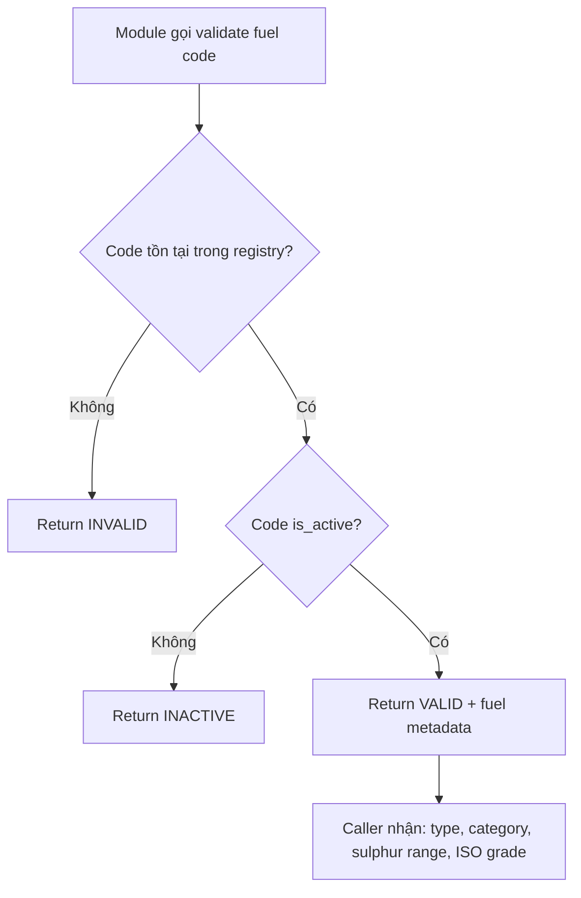
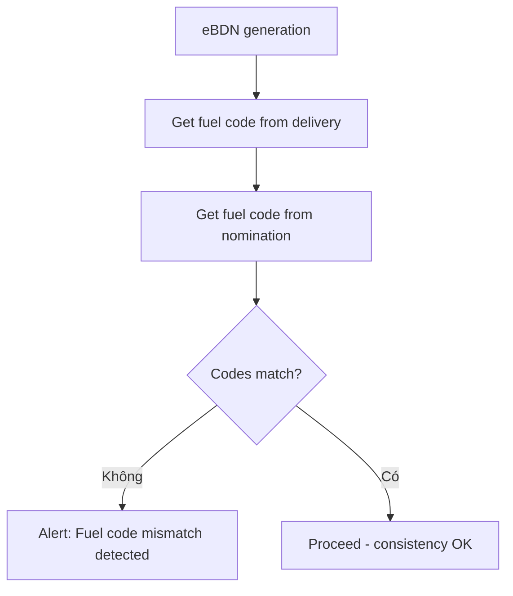

# FRD — Fuel Grade Management (SS 709)

## 1. Tổng quan chức năng

Module Fuel Grade Management quản lý registry mã nhiên liệu theo tiêu chuẩn Singapore Standard SS 709. Module cung cấp dịch vụ validation cho toàn hệ thống — đảm bảo fuel code consistency xuyên suốt nomination → delivery → eBDN. Hỗ trợ mapping đến ISO 8217 grades.

---

## 2. Chân dung người dùng (Personas)

| Persona | Vai trò | Mục tiêu chính |
|---------|---------|----------------|
| **Supplier Admin** | Cấu hình fuel code registry | Quản lý danh mục nhiên liệu cung cấp |
| **System (Validation)** | Validate fuel code cross-module | Đảm bảo consistency |

---

## 3. Danh sách tính năng

| ID | Tính năng | Mô tả | Độ ưu tiên |
|----|-----------|--------|-------------|
| F-FUEL-01 | View Fuel Code Registry | Xem danh sách fuel codes hiện có | Must |
| F-FUEL-02 | Add/Update Code | Thêm hoặc cập nhật fuel code | Must |
| F-FUEL-03 | Validate Fuel Code | API validate code cho nomination/delivery/eBDN | Must |
| F-FUEL-04 | Map to ISO 8217 | Mapping SS 709 code → ISO 8217 grade | Should |

---

## 4. Luồng nghiệp vụ (Workflow)

### 4.1 Validation Flow

### 4.2 Consistency Check Flow

---

## 5. Yêu cầu dữ liệu

### 5.1 Entity: FuelTypeCode

| Field | Type | Constraints | Mô tả |
|-------|------|-------------|--------|
| code | String(20) | PK | Mã nhiên liệu SS 709 (e.g., "RMG380", "BIO-FAME", "MM100") |
| name | String(255) | NOT NULL | Tên đầy đủ |
| type | Enum | NOT NULL | CONVENTIONAL, BIO, METHANOL, LNG, AMMONIA |
| category | Enum | NOT NULL | DISTILLATE, RESIDUAL, GAS, ALTERNATIVE |
| sulphur_min | Decimal(4,3) | nullable | Sulphur % tối thiểu |
| sulphur_max | Decimal(4,3) | nullable | Sulphur % tối đa |
| viscosity_min | Decimal(6,2) | nullable | Viscosity cSt min |
| viscosity_max | Decimal(6,2) | nullable | Viscosity cSt max |
| iso_grade | String(20) | nullable | ISO 8217 grade tương ứng |
| is_active | Boolean | NOT NULL, default true | Code đang active |
| created_at | DateTime | NOT NULL | Ngày tạo |
| updated_at | DateTime | NOT NULL | Ngày cập nhật |

---

## 6. Quy tắc nghiệp vụ

| ID | Quy tắc | Mô tả |
|----|---------|--------|
| BR-FUEL-001 | Only valid SS 709 codes | Chỉ mã SS 709 hợp lệ và active mới được chấp nhận trong nominations và eBDNs |
| BR-FUEL-002 | Fuel code consistency | Fuel code PHẢI match xuyên suốt: nomination → delivery → eBDN |
| BR-FUEL-003 | Biofuel/Methanol distinct | Codes BIO-* và MM* được xử lý như categories riêng biệt |
| BR-FUEL-004 | Metadata mapping | Mỗi code map đến: type, category, sulphur range, viscosity range, ISO 8217 grade |

---

## 7. Điểm tích hợp

| Module | Hướng | Mô tả |
|--------|-------|--------|
| **nomination** | Inbound call | Validate fuel code khi tạo nomination |
| **delivery-ops** | Inbound call | Xác định fuel family cho checklist template |
| **ebdn** | Inbound call | Validate fuel code + consistency check |

---

## 8. Tiêu chí chấp nhận

### F-FUEL-01: View Fuel Code Registry
- [ ] Hiển thị danh sách fuel codes có phân trang
- [ ] Hiển thị: code, name, type, category, sulphur range, ISO grade, active status
- [ ] Filter theo type, category, active status

### F-FUEL-02: Add/Update Code
- [ ] Supplier Admin thêm fuel code mới với tất cả metadata
- [ ] Update code hiện có (deactivate, sửa metadata)
- [ ] Không cho xóa code đã dùng trong nomination/eBDN — chỉ deactivate

### F-FUEL-03: Validate Fuel Code
- [ ] API trả về VALID/INVALID/INACTIVE
- [ ] Khi VALID, trả kèm metadata (type, category, sulphur, ISO grade)
- [ ] Response time < 100ms (cached)

### F-FUEL-04: Map to ISO 8217
- [ ] Mỗi SS 709 code có thể map đến ISO 8217 grade
- [ ] Mapping hiển thị trong registry view
- [ ] API trả ISO grade khi validate
