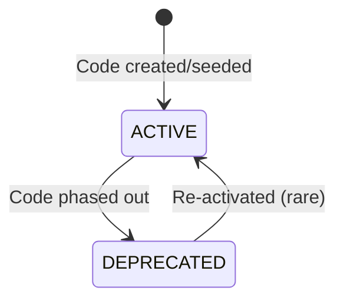

# SRS — Fuel Grades & Code Registry

**Version:** 1.0  
**Module:** fuel-grades  
**Ngày:** 2026-05-27

---

## §1 Mục đích & Phạm vi

### 1.1 Mục đích

Module Fuel Grades quản lý registry mã nhiên liệu theo chuẩn SS 709 (Singapore Standard) với mapping sang ISO 8217. Đảm bảo consistency fuel code xuyên suốt nomination → delivery → eBDN.

### 1.2 Phạm vi

- CRUD fuel type codes (SS 709 registry)
- Mapping SS 709 ↔ ISO 8217
- Validation endpoint cho các module khác
- Consistency check service (cross-module fuel code matching)
- Seed data quản lý (system fuel codes)

### 1.3 Actors

| Actor | Vai trò | Quyền |
|-------|---------|-------|
| Supplier Admin | Quản lý fuel codes, view registry | MANAGE fuel codes |
| System (other modules) | Validate fuel codes | VALIDATE (internal API) |

### 1.4 Dependencies

Module này là **dependency provider** — được gọi bởi:
- nomination (validate fuel code khi tạo)
- delivery-ops (determine fuel family for checklist)
- ebdn (validate consistency)
- b2g-compliance (emissions factor lookup)

---

## §2 Mô tả tổng thể

### 2.1 Architecture

Module này KHÔNG có complex state machine. Fuel codes có lifecycle đơn giản:



### 2.2 Fuel Code Categories

| Category | SS 709 Codes | ISO 8217 Mapping |
|----------|-------------|-----------------|
| Residual Fuels | HSFO380, VLSFO380, ULSFO | RMG 380, RMG 380 (≤0.5%S), RMG (≤0.1%S) |
| Distillate Fuels | MGO, LSMGO, MDO | DMA, DMA (≤0.1%S), DMB |
| LNG | LNG | — (not in ISO 8217) |
| Methanol | MMA, MMB, MMC | — |
| Biofuels | BIO-VLSFO380, BIO-MGO, HVO-30, HVO-100 | — |
| Ammonia | AMM-GREEN, AMM-BLUE | — |

---

## §3 Yêu cầu chức năng chi tiết

### FR-FUEL-001: Maintain SS 709 Fuel Code Registry

**Mô tả:** System duy trì registry đầy đủ SS 709 codes với ISO 8217 mapping.

**Seed Data (System Codes):**

| Code | Name | Category | ISO 8217 | Sulphur Limit | Status |
|------|------|----------|----------|---------------|--------|
| HSFO380 | High Sulphur Fuel Oil 380 | RESIDUAL | RMG 380 | ≤ 3.5% | ACTIVE |
| VLSFO380 | Very Low Sulphur Fuel Oil 380 | RESIDUAL | RMG 380 | ≤ 0.5% | ACTIVE |
| ULSFO | Ultra Low Sulphur Fuel Oil | RESIDUAL | RMG | ≤ 0.1% | ACTIVE |
| MGO | Marine Gas Oil | DISTILLATE | DMA | ≤ 0.5% | ACTIVE |
| LSMGO | Low Sulphur Marine Gas Oil | DISTILLATE | DMA | ≤ 0.1% | ACTIVE |
| MDO | Marine Diesel Oil | DISTILLATE | DMB | ≤ 0.5% | ACTIVE |
| LNG | Liquefied Natural Gas | LNG | — | N/A | ACTIVE |
| MMA | Methanol Grade A | METHANOL | — | N/A | ACTIVE |
| MMB | Methanol Grade B | METHANOL | — | N/A | ACTIVE |
| MMC | Methanol Grade C | METHANOL | — | N/A | ACTIVE |
| BIO-VLSFO380 | Biofuel Blend VLSFO 380 | BIOFUEL | — | ≤ 0.5% | ACTIVE |
| BIO-MGO | Biofuel Blend MGO | BIOFUEL | — | ≤ 0.1% | ACTIVE |
| HVO-30 | Hydrotreated Vegetable Oil 30% | BIOFUEL | — | ≤ 0.1% | ACTIVE |
| HVO-100 | Hydrotreated Vegetable Oil 100% | BIOFUEL | — | ≤ 0.1% | ACTIVE |
| AMM-GREEN | Green Ammonia | AMMONIA | — | N/A | ACTIVE |
| AMM-BLUE | Blue Ammonia | AMMONIA | — | N/A | ACTIVE |

---

### FR-FUEL-002: Validate Fuel Code Consistency

**Mô tả:** Cross-module consistency check: nomination.fuel_code = delivery.fuel_code = ebdn.fuel_code.

**Validation Service Logic:**
```
validateConsistency(nomination_id):
  nom_code = nomination.fuel_type_code
  del_code = delivery.fuel_type_code (if delivery exists)
  ebdn_code = ebdn.fuel_type_code (if eBDN exists)
  
  IF nom_code != del_code → INCONSISTENCY_ALERT
  IF del_code != ebdn_code → INCONSISTENCY_ALERT (CRITICAL)
  ELSE → CONSISTENT
```

---

### FR-FUEL-003: Support Biofuel & Alternative Fuel Codes

**Mô tả:** Registry supports biofuel (BIO-*), methanol (MM*), ammonia (AMM-*), LNG codes.

**Fuel Family Mapping (for checklist template selection):**

| Code Pattern | Fuel Family |
|-------------|-------------|
| HSFO*, VLSFO*, ULSFO*, MGO*, LSMGO*, MDO* | CONVENTIONAL |
| LNG* | LNG |
| MM* | METHANOL |
| AMM-* | AMMONIA |
| BIO-*, HVO-* | BIOFUEL |

---

## §4 Use Case Specifications

### UC-FUEL-01: Validate Fuel Code (Internal Service)

**Actor:** System (nomination module, delivery module)  
**Goal:** Xác nhận fuel code hợp lệ và active

**Main Success Scenario:**

1. Calling module sends fuel_type_code to validation endpoint
2. System looks up code in registry
3. Code found + status = ACTIVE → return valid + fuel details
4. Calling module proceeds

**Exception Flows:**

- **2a.** Code not found → return 404
- **3a.** Code found but DEPRECATED → return 422 FUEL_CODE_INACTIVE

---

## §5 Data Model

### 5.1 Entity: FuelTypeCode

```sql
CREATE TABLE fuel_type_codes (
    id              UUID PRIMARY KEY DEFAULT gen_random_uuid(),
    code            VARCHAR(20) NOT NULL UNIQUE,
    name            VARCHAR(255) NOT NULL,
    category        VARCHAR(20) NOT NULL,  -- RESIDUAL, DISTILLATE, LNG, METHANOL, BIOFUEL, AMMONIA
    fuel_family     VARCHAR(20) NOT NULL,  -- CONVENTIONAL, LNG, METHANOL, AMMONIA, BIOFUEL
    iso_8217_grade  VARCHAR(20),           -- ISO 8217 mapping (nullable for non-ISO fuels)
    sulphur_limit   DECIMAL(4,2),          -- % sulphur limit (nullable for non-applicable)
    emission_factor DECIMAL(6,4),          -- tonnes CO₂ per tonne fuel
    status          VARCHAR(20) NOT NULL DEFAULT 'ACTIVE',
    is_system       BOOLEAN NOT NULL DEFAULT FALSE,  -- System-seeded codes cannot be deleted
    description     TEXT,
    created_at      TIMESTAMPTZ NOT NULL DEFAULT NOW(),
    updated_at      TIMESTAMPTZ NOT NULL DEFAULT NOW(),

    CONSTRAINT chk_category CHECK (category IN ('RESIDUAL','DISTILLATE','LNG','METHANOL','BIOFUEL','AMMONIA')),
    CONSTRAINT chk_fuel_family CHECK (fuel_family IN ('CONVENTIONAL','LNG','METHANOL','AMMONIA','BIOFUEL')),
    CONSTRAINT chk_fuel_status CHECK (status IN ('ACTIVE','DEPRECATED'))
);
```

### 5.2 Entity: FuelCodeMapping

```sql
CREATE TABLE fuel_code_mappings (
    id              UUID PRIMARY KEY DEFAULT gen_random_uuid(),
    ss709_code      VARCHAR(20) NOT NULL REFERENCES fuel_type_codes(code),
    iso_8217_grade  VARCHAR(20) NOT NULL,
    mapping_notes   TEXT,
    effective_from  DATE NOT NULL,
    effective_to    DATE,  -- NULL = currently effective
    created_at      TIMESTAMPTZ NOT NULL DEFAULT NOW()
);
```

### 5.3 Indexes

```sql
CREATE UNIQUE INDEX idx_fuel_type_codes_code ON fuel_type_codes(code);
CREATE INDEX idx_fuel_type_codes_category ON fuel_type_codes(category, status);
CREATE INDEX idx_fuel_type_codes_family ON fuel_type_codes(fuel_family, status);
CREATE INDEX idx_fuel_code_mappings_ss709 ON fuel_code_mappings(ss709_code);
```

---

## §6 API Specifications

### 6.1 GET /api/v1/fuel-codes

**Mô tả:** List all fuel codes  
**Auth:** Bearer JWT  
**Query Params:** category, fuel_family, status, search (name/code partial match)

**Response (200):** `PaginatedResponse<FuelCodeDto>`

---

### 6.2 GET /api/v1/fuel-codes/{code}

**Mô tả:** Get fuel code detail by code  
**Auth:** Bearer JWT

**Response (200):**
```json
{
  "id": "...",
  "code": "VLSFO380",
  "name": "Very Low Sulphur Fuel Oil 380",
  "category": "RESIDUAL",
  "fuel_family": "CONVENTIONAL",
  "iso_8217_grade": "RMG 380",
  "sulphur_limit": 0.50,
  "emission_factor": 3.1140,
  "status": "ACTIVE",
  "is_system": true
}
```

---

### 6.3 GET /api/v1/fuel-codes/validate

**Mô tả:** Validate fuel code (used by other modules)  
**Auth:** Bearer JWT (hoặc internal service token)  
**Query Params:** `code` (required)

**Response (200 — Valid):**
```json
{
  "valid": true,
  "code": "VLSFO380",
  "fuel_family": "CONVENTIONAL",
  "status": "ACTIVE"
}
```

**Response (404 — Not Found):**
```json
{
  "code": "FUEL_CODE_NOT_FOUND",
  "message": "Fuel code 'INVALID123' not found in registry"
}
```

**Response (422 — Inactive):**
```json
{
  "code": "FUEL_CODE_INACTIVE",
  "message": "Fuel code 'HSFO380_OLD' is deprecated"
}
```

---

### 6.4 POST /api/v1/fuel-codes

**Mô tả:** Create custom fuel code  
**Auth:** Bearer JWT, role = SUPPLIER_ADMIN

**Request Body:**
```json
{
  "code": "BIO-VLSFO380-B30",
  "name": "Biofuel Blend VLSFO 380 (30%)",
  "category": "BIOFUEL",
  "fuel_family": "BIOFUEL",
  "iso_8217_grade": null,
  "sulphur_limit": 0.50,
  "emission_factor": 2.8000,
  "description": "Custom 30% biofuel blend"
}
```

**Error Cases:**
| HTTP | Code | Condition |
|------|------|-----------|
| 409 | DUPLICATE_CODE | Code already exists |
| 400 | VALIDATION_ERROR | Missing required fields |

---

### 6.5 GET /api/v1/fuel-codes/consistency-check

**Mô tả:** Check fuel code consistency across nomination → delivery → eBDN  
**Auth:** Bearer JWT  
**Query Params:** `nomination_id` (required)

**Response (200):**
```json
{
  "nomination_id": "...",
  "nomination_fuel_code": "VLSFO380",
  "delivery_fuel_code": "VLSFO380",
  "ebdn_fuel_code": "VLSFO380",
  "consistent": true,
  "mismatches": []
}
```

---

## §7 Yêu cầu phi chức năng

| ID | Category | Requirement |
|----|----------|-------------|
| NFR-FUEL-01 | Performance | Validate endpoint < 50ms (cached) |
| NFR-FUEL-02 | Availability | Registry available 99.99% (other modules depend on it) |
| NFR-FUEL-03 | Cache | Fuel codes cached 5 min TTL (invalidate on change) |
| NFR-FUEL-04 | Data Integrity | System codes cannot be deleted (is_system = true) |

---

## §8 Quy tắc nghiệp vụ

| ID | Quy tắc | Implementation Notes |
|----|---------|---------------------|
| BR-FUEL-001 | SS 709 codes authoritative | System-seeded codes match MPA SS 709 standard. Cannot modify system codes. |
| BR-FUEL-002 | Fuel family determines checklist | `fuel_family` field used by delivery-ops to select checklist template. |
| BR-FUEL-003 | Emission factor per code | Used by b2g-compliance: `CO₂ = quantity_mt × emission_factor`. |
| BR-FUEL-004 | Consistency enforcement | Async job or event listener: when eBDN created, verify fuel code matches nomination + delivery. Alert on mismatch. |
| BR-FUEL-005 | Custom codes allowed | Suppliers can add custom codes (is_system=false) for blends not yet in SS 709. Custom codes validated same as system codes. |
