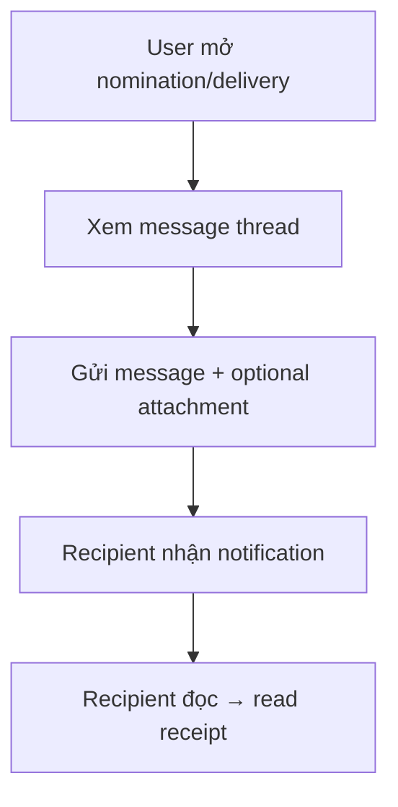

# FRD — Integrated Messaging

## 1. Tổng quan chức năng

Module Integrated Messaging cho phép các bên liên quan gửi tin nhắn gắn liền với context nghiệp vụ (nomination, delivery). Ưu tiên: Could — triển khai sau các module core.

---

## 2. Chân dung người dùng (Personas)

| Persona | Vai trò | Mục tiêu chính |
|---------|---------|----------------|
| **Tất cả users** | Giao tiếp trong context giao dịch | Trao đổi thông tin nhanh, có context |

---

## 3. Danh sách tính năng

| ID | Tính năng | Mô tả | Độ ưu tiên |
|----|-----------|--------|-------------|
| F-MSG-01 | Send Message | Gửi tin nhắn gắn với nomination/delivery | Could |
| F-MSG-02 | Read Receipts | Xác nhận đã đọc | Could |
| F-MSG-03 | File Attachments | Đính kèm file | Could |

---

## 4. Luồng nghiệp vụ (Workflow)

---

## 5. Yêu cầu dữ liệu

### Entity: Message

| Field | Type | Constraints | Mô tả |
|-------|------|-------------|--------|
| id | UUID | PK | Mã message |
| context_type | Enum | NOT NULL | NOMINATION, DELIVERY |
| context_id | UUID | NOT NULL | ID of nomination/delivery |
| sender_id | UUID | FK, NOT NULL | Người gửi |
| content | Text | NOT NULL | Nội dung |
| attachment_url | String(500) | nullable | URL file đính kèm |
| read_at | DateTime | nullable | Thời gian đọc |
| created_at | DateTime | NOT NULL | Thời gian gửi |

---

## 6. Quy tắc nghiệp vụ

| ID | Quy tắc | Mô tả |
|----|---------|--------|
| BR-MSG-001 | Context-bound | Message PHẢI gắn với 1 nomination hoặc delivery |
| BR-MSG-002 | Participants only | Chỉ participants của transaction mới xem/gửi được |

---

## 7. Điểm tích hợp

| Module | Hướng | Mô tả |
|--------|-------|--------|
| **nomination** | Context | Messages trong nomination context |
| **delivery-ops** | Context | Messages trong delivery context |

---

## 8. Tiêu chí chấp nhận

### F-MSG-01: Send Message
- [ ] User gửi message trong context nomination/delivery
- [ ] Message hiển thị cho tất cả participants

### F-MSG-02: Read Receipts
- [ ] Sender thấy khi recipient đã đọc

### F-MSG-03: File Attachments
- [ ] Upload file (max 10MB)
- [ ] Supported: PDF, JPG, PNG
- [ ] File accessible cho participants
