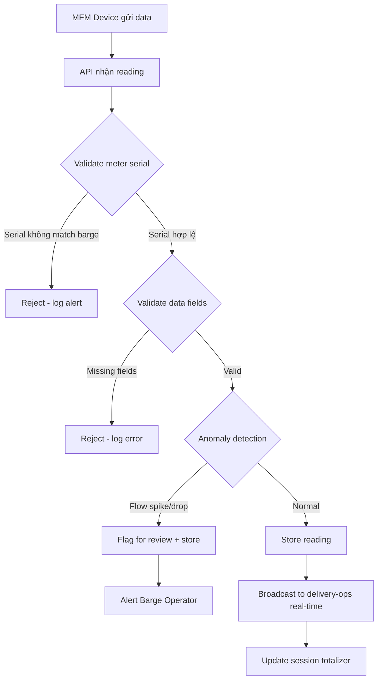
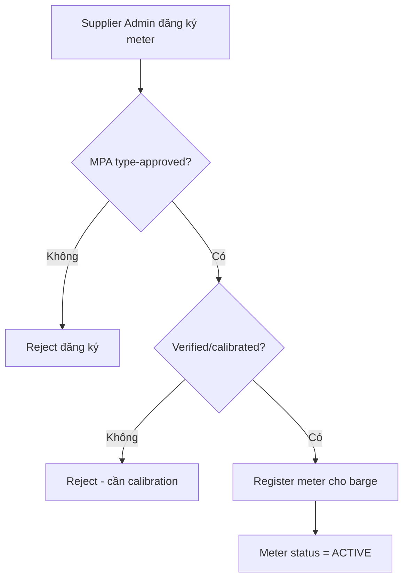

# FRD — MFM Data Integration

## 1. Tổng quan chức năng

Module MFM (Mass Flow Meter) Data Integration nhận, validate, lưu trữ dữ liệu từ thiết bị MFM trên barge. MFM là nguồn đo lường chính thức (authoritative) cho số lượng nhiên liệu giao — ship's figures chỉ để tham khảo. Module cung cấp dữ liệu real-time cho delivery-ops và final reading cho eBDN generation.

---

## 2. Chân dung người dùng (Personas)

| Persona | Vai trò | Mục tiêu chính |
|---------|---------|----------------|
| **System (MFM Device)** | Gửi dữ liệu đo lường tự động | Truyền data chính xác, liên tục |
| **Barge Operator** | Giám sát MFM readings | Đảm bảo MFM hoạt động đúng |
| **Supplier Admin** | Cấu hình/đăng ký MFM meter | Quản lý fleet MFM devices |

---

## 3. Danh sách tính năng

| ID | Tính năng | Mô tả | Độ ưu tiên |
|----|-----------|--------|-------------|
| F-MFM-01 | Register MFM Meter | Đăng ký meter mới vào hệ thống | Must |
| F-MFM-02 | Receive Data Stream | Nhận data từ MFM device real-time | Must |
| F-MFM-03 | Validate Readings | Validate data integrity + anomaly detection | Must |
| F-MFM-04 | Store Historical Data | Lưu trữ toàn bộ MFM readings | Must |
| F-MFM-05 | Provide Final Reading | Cung cấp final reading cho eBDN | Must |

---

## 4. Luồng nghiệp vụ (Workflow)

### 4.1 Luồng nhận và xử lý MFM data

### 4.2 Luồng đăng ký MFM Meter

---

## 5. Yêu cầu dữ liệu

### 5.1 Entity: MFMDevice

| Field | Type | Constraints | Mô tả |
|-------|------|-------------|--------|
| id | UUID | PK | Mã device |
| serial_number | String(50) | UNIQUE, NOT NULL | Serial number meter |
| barge_id | UUID | FK, NOT NULL | Barge gắn meter |
| manufacturer | String(100) | NOT NULL | Nhà sản xuất |
| model | String(100) | NOT NULL | Model meter |
| mpa_approval_number | String(50) | NOT NULL | Số phê duyệt MPA |
| last_calibration_date | Date | NOT NULL | Ngày calibrate gần nhất |
| next_calibration_due | Date | NOT NULL | Hạn calibrate tiếp |
| status | Enum | NOT NULL | ACTIVE, INACTIVE, CALIBRATION_DUE |
| registered_at | DateTime | NOT NULL | Ngày đăng ký |

### 5.2 Entity: MFMReading

| Field | Type | Constraints | Mô tả |
|-------|------|-------------|--------|
| id | UUID | PK | Mã reading |
| session_id | UUID | FK, NOT NULL | Phiên đo |
| meter_serial | String(50) | NOT NULL | Serial meter gửi data |
| timestamp | DateTime | NOT NULL | Thời gian đo |
| flow_rate | Decimal(10,4) | NOT NULL | Lưu lượng (m³/h) |
| totalizer | Decimal(12,3) | NOT NULL | Tổng tích lũy (MT) |
| temperature | Decimal(5,2) | NOT NULL | Nhiệt độ (°C) |
| density | Decimal(6,4) | NOT NULL | Tỷ trọng (kg/m³) |
| is_anomaly | Boolean | default false | Đánh dấu bất thường |
| anomaly_type | String(50) | nullable | Loại bất thường |

### 5.3 Entity: MFMSession

| Field | Type | Constraints | Mô tả |
|-------|------|-------------|--------|
| id | UUID | PK | Mã session |
| delivery_id | UUID | FK, NOT NULL | Liên kết delivery |
| meter_serial | String(50) | NOT NULL | Meter đang dùng |
| start_totalizer | Decimal(12,3) | NOT NULL | Totalizer bắt đầu |
| end_totalizer | Decimal(12,3) | nullable | Totalizer kết thúc |
| quantity_delivered | Decimal(10,3) | nullable | Tổng giao (end - start) |
| status | Enum | NOT NULL | ACTIVE, COMPLETED, ABORTED |
| started_at | DateTime | NOT NULL | Bắt đầu session |
| ended_at | DateTime | nullable | Kết thúc session |

---

## 6. Quy tắc nghiệp vụ

| ID | Quy tắc | Mô tả |
|----|---------|--------|
| BR-MFM-001 | MFM authoritative | MFM là đo lường chính thức — ship's figures chỉ để tham khảo, MFM governs BDN quantity |
| BR-MFM-002 | MPA type-approved | MFM PHẢI là loại được MPA phê duyệt (type-approved) và đã verified |
| BR-MFM-003 | Data fields bắt buộc | Mỗi reading PHẢI có: flow rate, totalizer, temperature, density, meter serial |
| BR-MFM-004 | Anomaly detection | Đột biến flow (spike/drop > threshold) PHẢI được flag để review |
| BR-MFM-005 | Serial match | MFM serial gửi data PHẢI match meter đã đăng ký cho barge assigned |

---

## 7. Điểm tích hợp

| Module | Hướng | Mô tả |
|--------|-------|--------|
| **delivery-ops** | Outbound stream | Cung cấp MFM data real-time cho monitoring screen |
| **ebdn** | Query | eBDN module query final reading khi generate BDN |

---

## 8. Tiêu chí chấp nhận

### F-MFM-01: Register MFM Meter
- [ ] Supplier Admin đăng ký meter với serial, MPA approval number
- [ ] Hệ thống validate MPA approval
- [ ] Meter gắn với barge cụ thể
- [ ] Cảnh báo khi calibration due date sắp đến

### F-MFM-02: Receive Data Stream
- [ ] API nhận readings từ MFM device liên tục
- [ ] Validate serial match barge đang active delivery
- [ ] Reject readings từ meter chưa đăng ký

### F-MFM-03: Validate Readings
- [ ] Check tất cả required fields (flow_rate, totalizer, temperature, density)
- [ ] Anomaly detection: flow spike > 50% hoặc drop > 50% so với reading trước
- [ ] Flag anomaly readings, alert Barge Operator

### F-MFM-04: Store Historical Data
- [ ] Lưu toàn bộ readings trong session
- [ ] Retention policy phù hợp quy định (tối thiểu 3 năm)

### F-MFM-05: Provide Final Reading
- [ ] Khi delivery complete, trả về session totalizer cuối cùng
- [ ] Final reading = end_totalizer - start_totalizer
- [ ] Data này được dùng trực tiếp cho eBDN quantity
