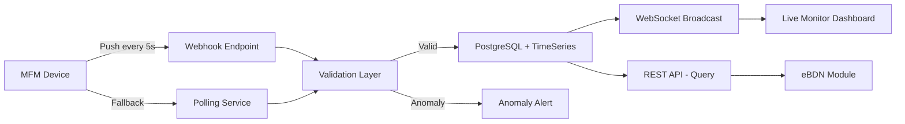

# SRS — MFM Integration (Mass Flow Meter)

**Version:** 1.0  
**Module:** mfm-integration  
**Ngày:** 2026-05-27

---

## §1 Mục đích & Phạm vi

### 1.1 Mục đích

Module MFM Integration tiếp nhận, validate, lưu trữ và phân phối dữ liệu đo lưu lượng nhiên liệu (Mass Flow Meter) theo chuẩn SS 648-2. MFM data là dữ liệu authoritative cho quantity trên eBDN — không cho phép override bằng nhập tay.

### 1.2 Phạm vi

- Tiếp nhận MFM data (webhook push + polling fallback)
- Validate meter serial, detect anomalies
- Lưu trữ readings (high-volume: mỗi 5 giây/delivery)
- Real-time WebSocket feed cho monitoring dashboard
- Session summary cho eBDN generation

### 1.3 Actors

| Actor | Vai trò |
|-------|---------|
| System (MFM Device) | Push metering data qua webhook |
| Barge Operator | Monitor live dashboard |
| Supplier Admin | View session summaries |

### 1.4 Dependencies

| Module | Quan hệ | Mô tả |
|--------|---------|--------|
| delivery-ops | Bidirectional | Delivery provides session context; MFM provides readings |
| ebdn | Outbound query | eBDN queries MFM session summary for final reading |

---

## §2 Mô tả tổng thể

### 2.1 Architecture Pattern

Module này KHÔNG có state machine nội bộ — nó là **data ingestion service** hoạt động theo event-driven pattern:

```
MFM Device → Webhook/Poll → Validate → Store → Broadcast (WebSocket)
                                                  ↓
                                           Session Summary → eBDN module query
```

### 2.2 Data Flow



### 2.3 Data Volume Considerations

| Metric | Value |
|--------|-------|
| Reading frequency | Every 5 seconds during active delivery |
| Average delivery duration | 4-8 hours |
| Readings per delivery | ~2,880 - 5,760 |
| Fields per reading | 8 |
| Concurrent deliveries (peak) | 100 |
| Daily readings (peak) | ~500,000 |

---

## §3 Yêu cầu chức năng chi tiết

### FR-MFM-001: Receive MFM Data Real-time

**Mô tả:** System nhận MFM data (flow rate, totalizer, temperature) real-time từ device.

**Data Interface — Primary: Webhook (Push)**

| Field | Type | Required | Description |
|-------|------|----------|-------------|
| meter_serial | String | Yes | MFM device serial number |
| session_id | String | Yes | Delivery session identifier |
| timestamp | OffsetDateTime | Yes | Reading timestamp (device clock) |
| flow_rate | Decimal | Yes | Current flow rate (m³/h) |
| totalizer | Decimal | Yes | Cumulative totalizer reading |
| temperature | Decimal | Yes | Fuel temperature (°C) |
| density | Decimal | No | Fuel density (kg/m³) |
| pressure | Decimal | No | Line pressure (bar) |

**Data Interface — Fallback: Polling**

Khi webhook unavailable, system polls MFM device endpoint mỗi 10 giây.

---

### FR-MFM-002: MFM Reading is Authoritative

**Mô tả:** MFM reading là dữ liệu chính thức — KHÔNG cho phép manual override.

**Implementation:**
- Không có endpoint để edit/update readings
- eBDN quantity MUST equal `session.end_totalizer - session.start_totalizer`
- Audit log nếu có attempt to override

---

### FR-MFM-003: Validate Meter Serial Match

**Mô tả:** System validate meter serial khớp với meter đã đăng ký cho barge.

**Validation Logic:**
```
IF reading.meter_serial != barge.registered_mfm_serial
  THEN reject reading + raise METER_MISMATCH alert
```

---

### FR-MFM-004: Anomaly Detection

**Mô tả:** Detect bất thường trong data stream.

**Anomaly Rules:**

| Rule | Condition | Action |
|------|-----------|--------|
| Flow rate spike | flow_rate > mean + 3σ (rolling 5-min window) | ANOMALY_ALERT + flag reading |
| Flow rate drop | flow_rate < mean - 3σ (sudden stop) | ANOMALY_ALERT |
| Totalizer rollback | current totalizer < previous totalizer | REJECT reading + CRITICAL alert |
| Temperature out of range | temperature < -165°C (LNG) or > 80°C | WARNING |
| Gap detection | No reading for > 30 seconds | CONNECTION_LOST alert |

---

## §4 Use Case Specifications

### UC-MFM-01: Live Monitoring During Delivery

**Actor:** Barge Operator  
**Goal:** Monitor real-time fuel flow during delivery

**Main Success Scenario:**

1. Delivery status = PUMPING
2. MFM device starts sending readings (every 5s)
3. Webhook endpoint receives + validates
4. Valid reading stored in database
5. WebSocket broadcasts to connected clients
6. Dashboard displays: flow rate gauge, totalizer progress, temperature
7. Dashboard auto-updates every 5 seconds
8. Delivery complete → final reading captured

**Exception Flows:**

- **3a.** Meter serial mismatch → Reading rejected, METER_MISMATCH alert
- **4a.** Anomaly detected → Reading flagged, alert to Supplier Admin
- **7a.** Connection lost (>30s gap) → Dashboard shows "Connection Lost" warning

---

## §5 Data Model

### 5.1 Entity: MFMDevice

```sql
CREATE TABLE mfm_devices (
    id              UUID PRIMARY KEY DEFAULT gen_random_uuid(),
    workspace_id    UUID NOT NULL REFERENCES workspaces(id),
    barge_id        UUID NOT NULL REFERENCES barges(id),
    meter_serial    VARCHAR(50) NOT NULL UNIQUE,
    manufacturer    VARCHAR(100),
    model           VARCHAR(100),
    calibration_date DATE,
    calibration_expiry DATE,
    webhook_secret  VARCHAR(255),  -- HMAC secret for webhook verification
    status          VARCHAR(20) NOT NULL DEFAULT 'ACTIVE',
    created_at      TIMESTAMPTZ NOT NULL DEFAULT NOW(),
    updated_at      TIMESTAMPTZ NOT NULL DEFAULT NOW()
);
```

### 5.2 Entity: MFMSession

```sql
CREATE TABLE mfm_sessions (
    id                  UUID PRIMARY KEY DEFAULT gen_random_uuid(),
    workspace_id        UUID NOT NULL REFERENCES workspaces(id),
    delivery_id         UUID NOT NULL REFERENCES deliveries(id),
    device_id           UUID NOT NULL REFERENCES mfm_devices(id),
    meter_serial        VARCHAR(50) NOT NULL,
    start_totalizer     DECIMAL(12,3),
    end_totalizer       DECIMAL(12,3),
    start_temperature   DECIMAL(5,2),
    end_temperature     DECIMAL(5,2),
    total_quantity_mt   DECIMAL(10,3),  -- Calculated: end - start
    reading_count       INTEGER NOT NULL DEFAULT 0,
    anomaly_count       INTEGER NOT NULL DEFAULT 0,
    status              VARCHAR(20) NOT NULL DEFAULT 'ACTIVE',  -- ACTIVE, COMPLETED, ERROR
    started_at          TIMESTAMPTZ,
    completed_at        TIMESTAMPTZ,
    created_at          TIMESTAMPTZ NOT NULL DEFAULT NOW()
);
```

### 5.3 Entity: MFMReading

```sql
CREATE TABLE mfm_readings (
    id              UUID PRIMARY KEY DEFAULT gen_random_uuid(),
    session_id      UUID NOT NULL REFERENCES mfm_sessions(id),
    meter_serial    VARCHAR(50) NOT NULL,
    timestamp       TIMESTAMPTZ NOT NULL,
    flow_rate       DECIMAL(8,3) NOT NULL,   -- m³/h
    totalizer       DECIMAL(12,3) NOT NULL,  -- cumulative
    temperature     DECIMAL(5,2) NOT NULL,   -- °C
    density         DECIMAL(7,3),            -- kg/m³
    pressure        DECIMAL(6,2),            -- bar
    is_anomaly      BOOLEAN NOT NULL DEFAULT FALSE,
    anomaly_type    VARCHAR(30),
    received_at     TIMESTAMPTZ NOT NULL DEFAULT NOW()
);
```

### 5.4 Indexes

```sql
CREATE INDEX idx_mfm_readings_session_ts ON mfm_readings(session_id, timestamp);
CREATE INDEX idx_mfm_readings_anomaly ON mfm_readings(session_id, is_anomaly) WHERE is_anomaly = TRUE;
CREATE INDEX idx_mfm_sessions_delivery ON mfm_sessions(delivery_id);
CREATE INDEX idx_mfm_devices_barge ON mfm_devices(barge_id);
CREATE INDEX idx_mfm_devices_serial ON mfm_devices(meter_serial);
```

### 5.5 Partitioning Strategy

```sql
-- MFM readings table partitioned by month for performance
CREATE TABLE mfm_readings (
    ...
) PARTITION BY RANGE (timestamp);

-- Create monthly partitions
CREATE TABLE mfm_readings_2026_06 PARTITION OF mfm_readings
    FOR VALUES FROM ('2026-06-01') TO ('2026-07-01');
```

---

## §6 API Specifications

### 6.1 POST /api/v1/mfm/readings (Inbound Webhook)

**Mô tả:** Nhận MFM reading từ device  
**Auth:** HMAC signature verification (header: `X-MFM-Signature`)

**Request Body:**
```json
{
  "meter_serial": "MFM-2024-SG-001",
  "session_id": "01902a3b-4c5d-7e8f-9a0b-delivery001",
  "timestamp": "2026-06-15T10:05:00+08:00",
  "flow_rate": 125.340,
  "totalizer": 14892.567,
  "temperature": 42.5,
  "density": 991.2,
  "pressure": 4.5
}
```

**Response (202 Accepted):**
```json
{
  "received": true,
  "reading_id": "...",
  "anomaly_detected": false
}
```

**Error Cases:**
| HTTP | Code | Condition |
|------|------|-----------|
| 401 | INVALID_SIGNATURE | HMAC verification failed |
| 404 | METER_NOT_FOUND | meter_serial not registered |
| 422 | METER_MISMATCH | Serial doesn't match active session's barge |
| 422 | SESSION_NOT_ACTIVE | No active session for this delivery |

---

### 6.2 GET /api/v1/mfm/sessions/{id}/readings

**Mô tả:** Query readings cho session  
**Auth:** Bearer JWT

**Query Parameters:**

| Param | Type | Required | Description |
|-------|------|----------|-------------|
| from | OffsetDateTime | No | Start of time range |
| to | OffsetDateTime | No | End of time range |
| anomaly_only | Boolean | No | Filter anomalies only |
| page | int | No | Page (default 0) |
| size | int | No | Size (default 100, max 1000) |

**Response (200):** `PaginatedResponse<MFMReadingDto>`

---

### 6.3 GET /api/v1/mfm/sessions/{id}/summary

**Mô tả:** Session summary (dùng bởi eBDN module cho final reading)  
**Auth:** Bearer JWT

**Response (200):**
```json
{
  "session_id": "...",
  "delivery_id": "...",
  "meter_serial": "MFM-2024-SG-001",
  "start_totalizer": 14500.000,
  "end_totalizer": 15000.000,
  "total_quantity_mt": 500.000,
  "start_temperature": 42.1,
  "end_temperature": 42.8,
  "avg_flow_rate": 125.5,
  "reading_count": 3456,
  "anomaly_count": 2,
  "duration_minutes": 288,
  "started_at": "2026-06-15T08:00:00+08:00",
  "completed_at": "2026-06-15T12:48:00+08:00",
  "status": "COMPLETED"
}
```

---

### 6.4 WebSocket: /ws/mfm/sessions/{session_id}/live

**Mô tả:** Real-time data feed cho monitoring dashboard  
**Auth:** JWT token in connection query param

**Outbound Message (server → client, every 5s):**
```json
{
  "type": "MFM_READING",
  "data": {
    "timestamp": "2026-06-15T10:05:00+08:00",
    "flow_rate": 125.340,
    "totalizer": 14892.567,
    "temperature": 42.5,
    "progress_percent": 78.5,
    "estimated_remaining_minutes": 62
  }
}
```

**Anomaly Message:**
```json
{
  "type": "ANOMALY_ALERT",
  "data": {
    "anomaly_type": "FLOW_RATE_SPIKE",
    "timestamp": "...",
    "value": 250.100,
    "threshold": 188.510,
    "message": "Flow rate exceeds 3σ threshold"
  }
}
```

---

## §7 Yêu cầu phi chức năng

| ID | Category | Requirement |
|----|----------|-------------|
| NFR-MFM-01 | Performance | Webhook ingestion < 50ms (P99) |
| NFR-MFM-02 | Throughput | Handle 100 concurrent sessions × 1 reading/5s = 20 readings/s sustained |
| NFR-MFM-03 | Storage | 6 months hot storage, archive to cold after |
| NFR-MFM-04 | Real-time | WebSocket latency < 500ms end-to-end |
| NFR-MFM-05 | Reliability | Zero data loss — readings buffered if DB temporarily unavailable |
| NFR-MFM-06 | Security | Webhook HMAC verification mandatory |
| NFR-MFM-07 | Data Integrity | Readings immutable — no UPDATE/DELETE on mfm_readings |

---

## §8 Quy tắc nghiệp vụ

| ID | Quy tắc | Implementation Notes |
|----|---------|---------------------|
| BR-MFM-001 | MFM reading authoritative | No manual override API exists. eBDN pulls from MFM session summary only. |
| BR-MFM-002 | Meter serial validation | On each reading: lookup `mfm_devices` by serial → verify `barge_id` matches active session's barge. |
| BR-MFM-003 | Anomaly detection (3σ) | Rolling window 5 minutes (60 readings). Calculate mean + stddev. Flag if outside 3σ. |
| BR-MFM-004 | Totalizer rollback rejection | Compare each reading's totalizer vs previous. If current < previous → REJECT + CRITICAL alert. |
| BR-MFM-005 | Connection gap detection | Background check: if last reading > 30s ago for active session → raise CONNECTION_LOST. |
| BR-MFM-006 | Session lifecycle | Session starts when first reading received for delivery. Ends when delivery-ops signals COMPLETE. |
