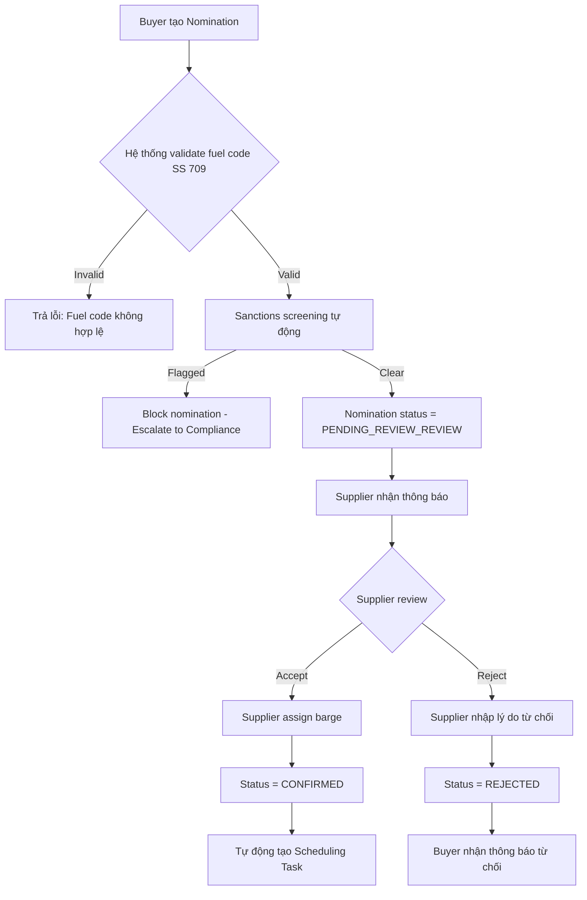
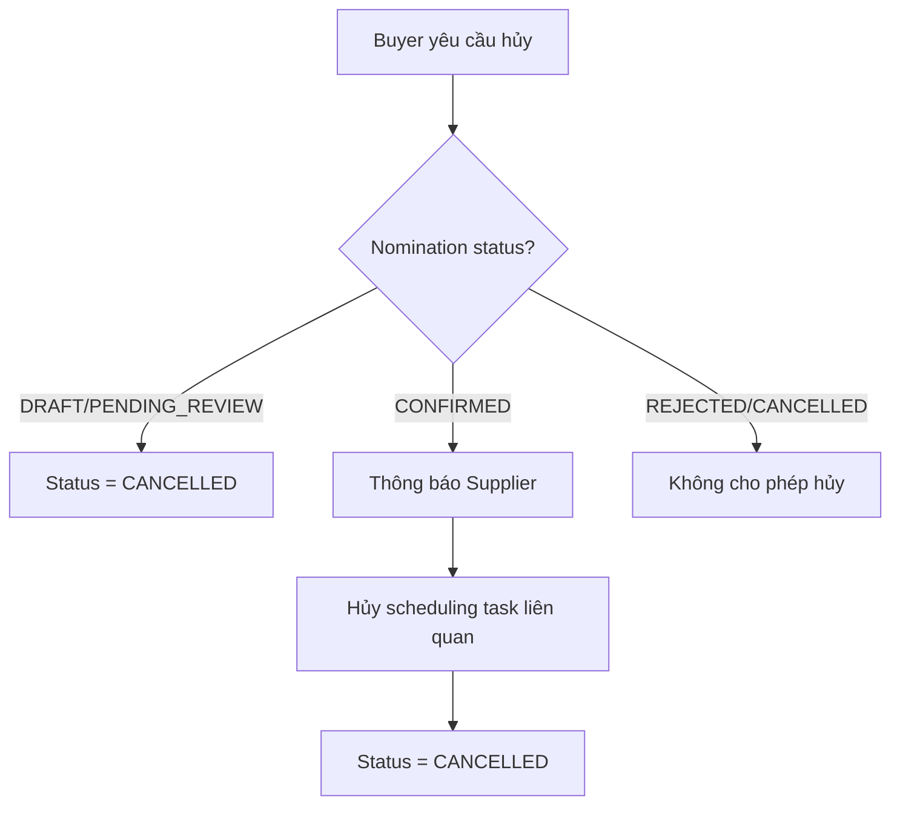
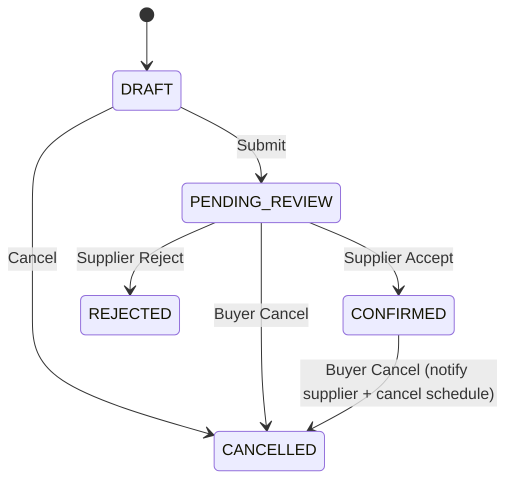

# FRD — Nomination & Order Management

## 1. Tổng quan chức năng

Module Nomination & Order Management quản lý toàn bộ quy trình đặt hàng nhiên liệu (bunkering nomination) giữa Buyer (Shipowner/Operator) và Supplier. Buyer tạo đơn đặt nhiên liệu với thông tin vessel, fuel type theo chuẩn SS 709, số lượng, cảng và khung thời gian giao hàng. Supplier nhận nomination, xác nhận hoặc từ chối, và phân bổ barge khi chấp nhận.

Module đóng vai trò là điểm khởi đầu của toàn bộ chuỗi nghiệp vụ bunkering — từ nomination → scheduling → delivery → eBDN.

---

## 2. Chân dung người dùng (Personas)

| Persona | Vai trò | Mục tiêu chính |
|---------|---------|----------------|
| **Shipowner/Operator (Buyer)** | Tạo và quản lý nomination | Đặt nhiên liệu đúng loại, đúng số lượng, đúng thời gian cho vessel |
| **Supplier Admin** | Xem xét, xác nhận/từ chối nomination | Phân bổ barge và xác nhận đơn hàng đúng năng lực cung cấp |

---

## 3. Danh sách tính năng

| ID | Tính năng | Mô tả | Độ ưu tiên |
|----|-----------|--------|-------------|
| F-NOM-01 | Create Nomination | Buyer tạo đơn đặt nhiên liệu mới | Must |
| F-NOM-02 | Confirm Nomination | Supplier xác nhận và assign barge | Must |
| F-NOM-03 | Reject Nomination | Supplier từ chối kèm lý do | Must |
| F-NOM-04 | Modify Nomination | Buyer chỉnh sửa nomination (khi ở trạng thái DRAFT/PENDING_REVIEW) | Should |
| F-NOM-05 | Cancel Nomination | Buyer hủy nomination | Must |
| F-NOM-06 | Nomination History | Xem lịch sử nomination với filter/search | Should |

---

## 4. Luồng nghiệp vụ (Workflow)

### 4.1 Luồng chính — Tạo và xử lý Nomination

### 4.2 Luồng hủy Nomination

---

## 5. Yêu cầu dữ liệu

### 5.1 Entity: Nomination

| Field | Type | Constraints | Mô tả |
|-------|------|-------------|--------|
| id | UUID | PK, auto-generated | Mã nomination |
| buyer_id | UUID | FK, NOT NULL | Mã buyer (user/org) |
| vessel_imo | String(7) | NOT NULL | IMO number của vessel |
| vessel_name | String(255) | NOT NULL | Tên vessel |
| fuel_type_code | String(20) | NOT NULL, FK to FuelTypeCode | Mã nhiên liệu theo SS 709 |
| quantity_mt | Decimal(10,3) | NOT NULL, > 0 | Số lượng (Metric Tonnes) |
| port | String(100) | NOT NULL | Cảng giao hàng |
| delivery_window_start | DateTime | NOT NULL | Bắt đầu khung giao hàng |
| delivery_window_end | DateTime | NOT NULL | Kết thúc khung giao hàng |
| status | Enum | NOT NULL | DRAFT, PENDING_REVIEW, CONFIRMED, REJECTED, CANCELLED |
| assigned_barge_id | UUID | FK, nullable | Barge được phân bổ (khi confirmed) |
| rejection_reason | Text | nullable | Lý do từ chối |
| notes | Text | nullable | Ghi chú bổ sung |
| created_at | DateTime | NOT NULL | Ngày tạo |
| updated_at | DateTime | NOT NULL | Ngày cập nhật cuối |

### 5.2 State Machine

---

## 6. Quy tắc nghiệp vụ

| ID | Quy tắc | Mô tả |
|----|---------|--------|
| BR-NOM-001 | Fuel type code hợp lệ | Fuel type code PHẢI là mã hợp lệ trong registry SS 709 |
| BR-NOM-002 | Số lượng dương | Quantity PHẢI > 0 MT |
| BR-NOM-003 | Delivery window tối thiểu 24h | Delivery window start PHẢI ít nhất 24 giờ kể từ thời điểm hiện tại |
| BR-NOM-004 | Sanctions screening bắt buộc | Sanctions screening tự động kích hoạt trước khi Supplier có thể confirm |
| BR-NOM-005 | Auto-create scheduling task | Khi nomination được confirmed, hệ thống TỰ ĐỘNG tạo scheduling task |

---

## 7. Điểm tích hợp

| Module | Hướng | Mô tả |
|--------|-------|--------|
| **fuel-grades** | Outbound call | Validate fuel_type_code khi tạo/sửa nomination |
| **sanctions-kyc** | Outbound call | Trigger sanctions screening cho vessel IMO + buyer |
| **scheduling** | Event publish | Khi status = CONFIRMED → publish event để tạo scheduling task |

---

## 8. Tiêu chí chấp nhận

### F-NOM-01: Create Nomination
- [ ] Buyer có thể tạo nomination với đầy đủ thông tin bắt buộc
- [ ] Fuel type code được validate qua fuel-grades module
- [ ] Hệ thống từ chối nomination nếu delivery window < 24h từ hiện tại
- [ ] Nomination tạo thành công ở trạng thái DRAFT hoặc PENDING
- [ ] Sanctions screening tự động trigger khi submit (DRAFT → PENDING_REVIEW)

### F-NOM-02: Confirm Nomination
- [ ] Supplier chỉ confirm được nomination có status = PENDING_REVIEW
- [ ] Supplier PHẢI assign barge khi confirm
- [ ] Status chuyển sang CONFIRMED
- [ ] Scheduling task tự động được tạo
- [ ] Buyer nhận thông báo nomination đã được confirm

### F-NOM-03: Reject Nomination
- [ ] Supplier chỉ reject được nomination có status = PENDING_REVIEW
- [ ] Supplier PHẢI nhập lý do từ chối
- [ ] Status chuyển sang REJECTED
- [ ] Buyer nhận thông báo kèm lý do

### F-NOM-04: Modify Nomination
- [ ] Buyer chỉ sửa được nomination có status = DRAFT hoặc PENDING
- [ ] Fuel code validation chạy lại sau khi sửa
- [ ] Nếu đang PENDING_REVIEW → re-trigger sanctions screening

### F-NOM-05: Cancel Nomination
- [ ] Buyer có thể cancel nomination ở trạng thái DRAFT, PENDING_REVIEW, CONFIRMED
- [ ] Nếu CONFIRMED → thông báo Supplier + hủy scheduling task liên quan
- [ ] Status chuyển sang CANCELLED

### F-NOM-06: Nomination History
- [ ] Hiển thị danh sách nomination với pagination
- [ ] Filter theo: status, date range, vessel, fuel type
- [ ] Sort theo created_at (mặc định DESC)
- [ ] Buyer thấy nomination của mình; Supplier thấy tất cả nomination gửi đến mình
