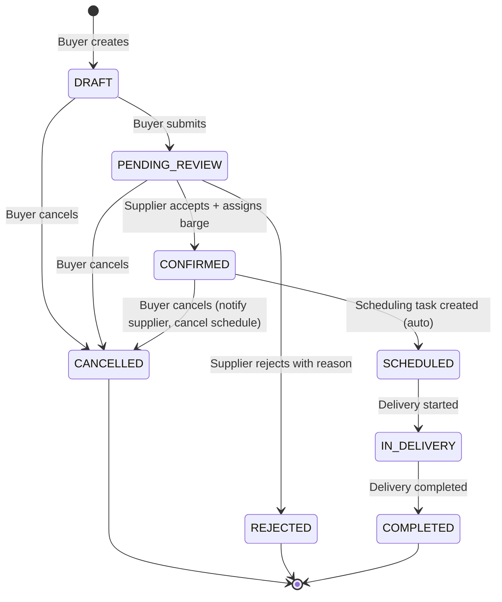

# SRS — Nomination & Order Management

**Version:** 1.0  
**Module:** nomination  
**Ngày:** 2026-05-27

---

## §1 Mục đích & Phạm vi

### 1.1 Mục đích

Module Nomination quản lý toàn bộ quy trình đặt hàng nhiên liệu (bunkering nomination) giữa Buyer (Shipowner/Operator) và Supplier. Đây là điểm khởi đầu của chuỗi nghiệp vụ bunkering: **nomination → scheduling → delivery → eBDN → B2G submission**.

### 1.2 Phạm vi

- Tạo, sửa, hủy đơn đặt nhiên liệu (nomination)
- Xem xét, xác nhận/từ chối nomination bởi Supplier
- Kích hoạt sanctions screening tự động
- Quản lý trạng thái và lịch sử nomination

### 1.3 Actors

| Actor | Vai trò | Quyền chính |
|-------|---------|-------------|
| Buyer (Shipowner/Operator) | Tạo, sửa, hủy nomination | CREATE, UPDATE, CANCEL own nominations |
| Supplier Admin | Xem xét, confirm/reject nomination | CONFIRM, REJECT all nominations in workspace |

### 1.4 Dependencies

| Module | Quan hệ | Mô tả |
|--------|---------|--------|
| fuel-grades | Sync call | Validate fuel_type_code khi tạo/sửa nomination |
| sanctions-kyc | Async event | Trigger sanctions screening khi nomination submitted |
| scheduling | Async event | Publish event NOMINATION_CONFIRMED → tạo scheduling task |

---

## §2 Mô tả tổng thể

### 2.1 State Machine



**Transition Rules:**

| From | To | Trigger | Guard |
|------|----|---------|-------|
| DRAFT | PENDING_REVIEW | Buyer submit | Fuel code valid, delivery window ≥ 24h from now |
| DRAFT | CANCELLED | Buyer cancel | — |
| PENDING_REVIEW | CONFIRMED | Supplier confirm | Sanctions check = CLEAR, barge assigned |
| PENDING_REVIEW | REJECTED | Supplier reject | Rejection reason provided |
| PENDING_REVIEW | CANCELLED | Buyer cancel | — |
| CONFIRMED | SCHEDULED | System auto | Schedule created successfully |
| CONFIRMED | CANCELLED | Buyer cancel | Notify supplier, cancel linked schedule |
| SCHEDULED | IN_DELIVERY | Delivery started | — |
| IN_DELIVERY | COMPLETED | Delivery completed | — |

### 2.2 Actors & Dependencies

Xem §1.3 và §1.4.

---

## §3 Yêu cầu chức năng chi tiết

### FR-NOM-001: Create Nomination

**Mô tả:** Buyer tạo nomination với fuel type (SS 709), quantity, port, delivery window.

**Preconditions:**
- Buyer đã authenticated và thuộc workspace hợp lệ
- Fuel-grades module available

**Postconditions:**
- Nomination record created với status = DRAFT hoặc PENDING_REVIEW
- NominationHistory record created (action = CREATED)
- Nếu submit luôn: sanctions screening event dispatched

**Input Specification:**

| Field | Type | Required | Validation | Description |
|-------|------|----------|------------|-------------|
| vessel_imo | String | Yes | Regex `^[0-9]{7}$` | IMO number 7 chữ số |
| vessel_name | String | Yes | max 255 chars, not blank | Tên vessel |
| fuel_type_code | String | Yes | Must exist in fuel-grades registry | Mã SS 709 |
| quantity_mt | Decimal | Yes | > 0, max 99999.999, scale 3 | Metric Tonnes |
| port | String | Yes | max 100 chars, not blank | Cảng giao hàng |
| delivery_window_start | OffsetDateTime | Yes | ≥ now + 24h | Bắt đầu khung giao |
| delivery_window_end | OffsetDateTime | Yes | > delivery_window_start | Kết thúc khung giao |
| notes | String | No | max 2000 chars | Ghi chú |
| submit_immediately | Boolean | No | default false | True → skip DRAFT, go to PENDING_REVIEW |

**Output:** `NominationDto` (xem §6)

**Validation Rules:**
- `delivery_window_end - delivery_window_start` ≥ 4 hours (minimum window)
- `delivery_window_start` ≥ current time + 24 hours
- `fuel_type_code` phải tồn tại và active trong fuel-grades registry
- `quantity_mt` > 0 và ≤ 99999.999

**Error Cases:**

| HTTP | Code | Condition |
|------|------|-----------|
| 400 | VALIDATION_ERROR | Input validation failed |
| 404 | FUEL_CODE_NOT_FOUND | fuel_type_code không tồn tại |
| 422 | DELIVERY_WINDOW_TOO_SHORT | Window < 4 hours |
| 422 | DELIVERY_WINDOW_TOO_SOON | Start < now + 24h |
| 422 | FUEL_CODE_INACTIVE | fuel_type_code exists nhưng inactive |

**Side Effect:** Nếu `submit_immediately = true`:
- Domain event `NominationSubmitted` dispatched
- Sanctions screening triggered via `sanctions-kyc` module

---

### FR-NOM-002: Confirm Nomination

**Mô tả:** Supplier xem xét, chấp nhận nomination và assign barge.

**Preconditions:**
- Supplier Admin authenticated trong workspace
- Nomination status = PENDING_REVIEW
- Sanctions check completed với result = CLEAR

**Postconditions:**
- Nomination status = CONFIRMED
- Barge assigned (assigned_barge_id populated)
- NominationHistory record (action = CONFIRMED)
- Domain event `NominationConfirmed` published → scheduling module

**Input Specification:**

| Field | Type | Required | Validation | Description |
|-------|------|----------|------------|-------------|
| assigned_barge_id | UUID | Yes | Must exist, active, certified for fuel type | Barge phân bổ |
| eta | OffsetDateTime | No | Must be within delivery window | ETA ước tính |
| supplier_notes | String | No | max 1000 chars | Ghi chú supplier |

**Validation Rules:**
- Nomination phải ở status `PENDING_REVIEW`
- Sanctions check result = `CLEAR` (không phải `POTENTIAL_MATCH` hoặc `CONFIRMED_MATCH`)
- Barge phải có certification cho fuel type code của nomination
- Barge phải available (không bị conflict schedule trong delivery window)

**Error Cases:**

| HTTP | Code | Condition |
|------|------|-----------|
| 404 | NOT_FOUND | Nomination không tồn tại hoặc không thuộc workspace |
| 409 | INVALID_STATE_TRANSITION | Status ≠ PENDING_REVIEW |
| 422 | SANCTIONS_NOT_CLEAR | Sanctions check chưa complete hoặc result ≠ CLEAR |
| 422 | BARGE_NOT_CERTIFIED | Barge không có certification cho fuel type |
| 422 | BARGE_UNAVAILABLE | Barge có conflict trong delivery window |

---

### FR-NOM-003: Reject Nomination

**Mô tả:** Supplier từ chối nomination kèm lý do.

**Preconditions:**
- Supplier Admin authenticated
- Nomination status = PENDING_REVIEW

**Postconditions:**
- Nomination status = REJECTED
- rejection_reason populated
- NominationHistory record (action = REJECTED)
- Notification sent to Buyer

**Input Specification:**

| Field | Type | Required | Validation | Description |
|-------|------|----------|------------|-------------|
| rejection_reason | String | Yes | min 10 chars, max 1000 chars | Lý do từ chối |

**Error Cases:**

| HTTP | Code | Condition |
|------|------|-----------|
| 404 | NOT_FOUND | Nomination không tồn tại |
| 409 | INVALID_STATE_TRANSITION | Status ≠ PENDING_REVIEW |
| 400 | VALIDATION_ERROR | rejection_reason blank hoặc quá ngắn |

---

## §4 Use Case Specifications

### UC-NOM-01: Create Nomination

**Actor:** Buyer (Shipowner/Operator)  
**Goal:** Tạo đơn đặt nhiên liệu mới  
**Trigger:** Buyer cần đặt nhiên liệu cho vessel

**Main Success Scenario:**

1. Buyer mở form tạo nomination
2. Buyer nhập vessel IMO → system auto-fill vessel name (nếu đã có trong KYC)
3. Buyer chọn fuel type code từ dropdown (SS 709 codes)
4. Buyer nhập quantity (MT)
5. Buyer chọn port
6. Buyer chọn delivery window (start + end)
7. Buyer nhập notes (optional)
8. Buyer nhấn "Submit"
9. System validate fuel code qua fuel-grades module
10. System validate delivery window (≥ 24h, ≥ 4h duration)
11. System tạo nomination record (status = PENDING_REVIEW)
12. System dispatch `NominationSubmitted` event
13. Sanctions-kyc module nhận event → trigger screening
14. Supplier nhận notification có nomination mới
15. System trả về NominationDto (HTTP 201)

**Alternative Flows:**

- **3a.** Fuel code dropdown trống → Buyer nhập mã thủ công → System validate
- **7a.** Buyer chọn "Save as Draft" → status = DRAFT, không trigger sanctions
- **9a.** Fuel code invalid → System trả lỗi 404 FUEL_CODE_NOT_FOUND, flow kết thúc

**Exception Flows:**

- **10a.** Delivery window < 24h → 422 DELIVERY_WINDOW_TOO_SOON
- **10b.** Delivery window duration < 4h → 422 DELIVERY_WINDOW_TOO_SHORT
- **13a.** Sanctions screening fails (timeout) → Nomination vẫn ở PENDING_REVIEW, retry background

---

### UC-NOM-02: Confirm Nomination

**Actor:** Supplier Admin  
**Goal:** Xác nhận nomination và phân bổ barge  
**Trigger:** Supplier nhận notification có nomination cần xem xét

**Main Success Scenario:**

1. Supplier Admin mở Nomination List (filter: PENDING_REVIEW)
2. Supplier Admin click vào nomination cần xử lý
3. System hiển thị chi tiết: vessel, fuel type, quantity, port, window, sanctions status
4. Supplier Admin verify sanctions status = CLEAR
5. Supplier Admin chọn barge từ available fleet (filtered by fuel certification)
6. Supplier Admin nhập ETA (optional) và notes (optional)
7. Supplier Admin nhấn "Confirm"
8. System validate barge certification + availability
9. System update nomination status → CONFIRMED
10. System tạo NominationHistory record
11. System publish `NominationConfirmed` domain event
12. Scheduling module nhận event → auto-create schedule
13. Buyer nhận notification nomination đã confirmed
14. System trả về updated NominationDto

**Alternative Flows:**

- **4a.** Sanctions status = POTENTIAL_MATCH → Supplier Admin escalate to Compliance Officer → UC-NOM-02 blocked
- **5a.** Không có barge available → Supplier Admin reject nomination (→ UC-NOM-03)
- **8a.** Barge conflict detected → System hiển thị conflict, Supplier Admin chọn barge khác

**Exception Flows:**

- **4b.** Sanctions check chưa complete → System hiện warning, Supplier Admin đợi (auto-refresh)
- **9a.** Concurrent modification (status đã thay đổi) → 409 INVALID_STATE_TRANSITION

---

### UC-NOM-03: Reject Nomination

**Actor:** Supplier Admin  
**Goal:** Từ chối nomination với lý do  
**Trigger:** Supplier quyết định không phục vụ nomination

**Main Success Scenario:**

1. Supplier Admin mở nomination detail (status = PENDING_REVIEW)
2. Supplier Admin nhấn "Reject"
3. System hiển thị form nhập rejection reason
4. Supplier Admin nhập lý do (min 10 chars)
5. Supplier Admin xác nhận reject
6. System validate reason length
7. System update status → REJECTED, ghi rejection_reason
8. System tạo NominationHistory record
9. Buyer nhận notification với lý do từ chối
10. System trả về updated NominationDto

**Alternative Flows:**

- **4a.** Supplier Admin nhập lý do < 10 chars → Inline validation error

---

## §5 Data Model

### 5.1 Entity: Nomination

```sql
CREATE TABLE nominations (
    id              UUID PRIMARY KEY DEFAULT gen_random_uuid(),  -- UUIDv7
    workspace_id    UUID NOT NULL REFERENCES workspaces(id),
    buyer_id        UUID NOT NULL REFERENCES users(id),
    vessel_imo      VARCHAR(7) NOT NULL,
    vessel_name     VARCHAR(255) NOT NULL,
    fuel_type_code  VARCHAR(20) NOT NULL,
    quantity_mt     DECIMAL(10,3) NOT NULL CHECK (quantity_mt > 0),
    port            VARCHAR(100) NOT NULL,
    delivery_window_start   TIMESTAMPTZ NOT NULL,
    delivery_window_end     TIMESTAMPTZ NOT NULL,
    status          VARCHAR(20) NOT NULL DEFAULT 'DRAFT',
    assigned_barge_id       UUID REFERENCES barges(id),
    rejection_reason        TEXT,
    notes           TEXT,
    supplier_notes  TEXT,
    sanctions_check_id      UUID,
    sanctions_status        VARCHAR(20),  -- PENDING, CLEAR, POTENTIAL_MATCH, CONFIRMED_MATCH
    created_at      TIMESTAMPTZ NOT NULL DEFAULT NOW(),
    updated_at      TIMESTAMPTZ NOT NULL DEFAULT NOW(),
    version         INTEGER NOT NULL DEFAULT 0,  -- Optimistic locking (PLAT-006)
    deleted_at      TIMESTAMPTZ,  -- Soft delete

    CONSTRAINT chk_delivery_window CHECK (delivery_window_end > delivery_window_start),
    CONSTRAINT chk_status CHECK (status IN ('DRAFT','PENDING_REVIEW','CONFIRMED','REJECTED','SCHEDULED','IN_DELIVERY','COMPLETED','CANCELLED'))
);
```

### 5.2 Entity: NominationHistory (Audit Trail)

```sql
CREATE TABLE nomination_history (
    id              UUID PRIMARY KEY DEFAULT gen_random_uuid(),
    nomination_id   UUID NOT NULL REFERENCES nominations(id),
    action          VARCHAR(30) NOT NULL,  -- CREATED, SUBMITTED, CONFIRMED, REJECTED, CANCELLED, MODIFIED
    performed_by    UUID NOT NULL REFERENCES users(id),
    performed_at    TIMESTAMPTZ NOT NULL DEFAULT NOW(),
    old_status      VARCHAR(20),
    new_status      VARCHAR(20),
    changes         JSONB,  -- JSON diff of changed fields
    notes           TEXT
);
```

### 5.3 Relationships

```
Nomination ──── 1:N ──── NominationHistory
Nomination ──── N:1 ──── User (buyer)
Nomination ──── N:1 ──── Workspace
Nomination ──── N:1 ──── Barge (assigned_barge_id, nullable)
Nomination ──── 1:1 ──── Schedule (downstream, created by scheduling module)
```

### 5.4 Indexes

```sql
CREATE INDEX idx_nominations_workspace_status ON nominations(workspace_id, status) WHERE deleted_at IS NULL;
CREATE INDEX idx_nominations_buyer ON nominations(buyer_id, created_at DESC) WHERE deleted_at IS NULL;
CREATE INDEX idx_nominations_vessel_imo ON nominations(vessel_imo) WHERE deleted_at IS NULL;
CREATE INDEX idx_nominations_delivery_window ON nominations(delivery_window_start, delivery_window_end) WHERE deleted_at IS NULL;
CREATE INDEX idx_nomination_history_nomination ON nomination_history(nomination_id, performed_at DESC);
```

---

## §6 API Specifications

### 6.1 POST /api/v1/nominations

**Mô tả:** Tạo nomination mới  
**Auth:** Bearer JWT, role = BUYER  
**Rate limit:** 20 requests/min per user

**Request Body:**
```json
{
  "vessel_imo": "9876543",
  "vessel_name": "MV Pacific Star",
  "fuel_type_code": "VLSFO380",
  "quantity_mt": 500.000,
  "port": "Singapore",
  "delivery_window_start": "2026-06-15T08:00:00+08:00",
  "delivery_window_end": "2026-06-16T18:00:00+08:00",
  "notes": "Preferred anchorage: Eastern Working Anchorage",
  "submit_immediately": true
}
```

**Response (201 Created):**
```json
{
  "id": "01902a3b-4c5d-7e8f-9a0b-1c2d3e4f5a6b",
  "workspace_id": "01902a3b-0000-7000-8000-000000000001",
  "buyer_id": "01902a3b-0000-7000-8000-000000000002",
  "vessel_imo": "9876543",
  "vessel_name": "MV Pacific Star",
  "fuel_type_code": "VLSFO380",
  "quantity_mt": 500.000,
  "port": "Singapore",
  "delivery_window_start": "2026-06-15T08:00:00+08:00",
  "delivery_window_end": "2026-06-16T18:00:00+08:00",
  "status": "PENDING_REVIEW",
  "assigned_barge_id": null,
  "rejection_reason": null,
  "sanctions_status": "PENDING",
  "notes": "Preferred anchorage: Eastern Working Anchorage",
  "created_at": "2026-05-27T10:30:00+08:00",
  "updated_at": "2026-05-27T10:30:00+08:00"
}
```

---

### 6.2 GET /api/v1/nominations

**Mô tả:** Danh sách nominations (scoped by role)  
**Auth:** Bearer JWT  
**Pagination:** offset-based (page, size, default size=20)

**Query Parameters:**

| Param | Type | Required | Description |
|-------|------|----------|-------------|
| page | int | No | Page number (0-based, default 0) |
| size | int | No | Page size (default 20, max 100) |
| status | String | No | Filter by status (comma-separated) |
| vessel_imo | String | No | Filter by vessel IMO |
| fuel_type_code | String | No | Filter by fuel type |
| port | String | No | Filter by port |
| from_date | OffsetDateTime | No | delivery_window_start >= from_date |
| to_date | OffsetDateTime | No | delivery_window_start <= to_date |
| sort | String | No | Sort field (default: created_at) |
| direction | String | No | ASC or DESC (default: DESC) |

**Response (200 OK):**
```json
{
  "content": [ /* NominationDto[] */ ],
  "page": 0,
  "size": 20,
  "total_elements": 47,
  "total_pages": 3
}
```

**Scoping Rules:**
- BUYER role: chỉ thấy nominations mà `buyer_id` = current user
- SUPPLIER_ADMIN role: thấy tất cả nominations trong workspace

---

### 6.3 GET /api/v1/nominations/{id}

**Mô tả:** Chi tiết nomination  
**Auth:** Bearer JWT  
**Path Params:** `id` (UUID) — nomination ID

**Response (200 OK):** `NominationDto` (full detail bao gồm history)

**Error Cases:**
| HTTP | Code | Condition |
|------|------|-----------|
| 404 | NOT_FOUND | ID không tồn tại hoặc không thuộc workspace |

---

### 6.4 PATCH /api/v1/nominations/{id}/confirm

**Mô tả:** Supplier confirm nomination  
**Auth:** Bearer JWT, role = SUPPLIER_ADMIN

**Request Body:**
```json
{
  "assigned_barge_id": "01902a3b-0000-7000-8000-barge0000001",
  "eta": "2026-06-15T10:00:00+08:00",
  "supplier_notes": "Barge MT Harmony assigned"
}
```

**Response (200 OK):** Updated `NominationDto` with status = CONFIRMED

**Error Cases:**
| HTTP | Code | Condition |
|------|------|-----------|
| 404 | NOT_FOUND | Nomination không tồn tại |
| 409 | INVALID_STATE_TRANSITION | Status ≠ PENDING_REVIEW |
| 422 | SANCTIONS_NOT_CLEAR | Sanctions check incomplete/failed |
| 422 | BARGE_NOT_CERTIFIED | Barge không đạt fuel certification |
| 422 | BARGE_UNAVAILABLE | Barge conflict |

---

### 6.5 PATCH /api/v1/nominations/{id}/reject

**Mô tả:** Supplier reject nomination  
**Auth:** Bearer JWT, role = SUPPLIER_ADMIN

**Request Body:**
```json
{
  "rejection_reason": "Không có barge available cho thời gian yêu cầu. Đề nghị dời sang tuần sau."
}
```

**Response (200 OK):** Updated `NominationDto` with status = REJECTED

**Error Cases:**
| HTTP | Code | Condition |
|------|------|-----------|
| 404 | NOT_FOUND | Nomination không tồn tại |
| 409 | INVALID_STATE_TRANSITION | Status ≠ PENDING_REVIEW |
| 400 | VALIDATION_ERROR | rejection_reason blank hoặc < 10 chars |

---

### 6.6 PATCH /api/v1/nominations/{id}/cancel

**Mô tả:** Buyer hủy nomination  
**Auth:** Bearer JWT, role = BUYER (owner only)

**Request Body:**
```json
{
  "cancellation_reason": "Vessel schedule thay đổi"
}
```

**Response (200 OK):** Updated `NominationDto` with status = CANCELLED

**Error Cases:**
| HTTP | Code | Condition |
|------|------|-----------|
| 404 | NOT_FOUND | Nomination không tồn tại |
| 403 | FORBIDDEN | User không phải owner của nomination |
| 409 | INVALID_STATE_TRANSITION | Status ∉ {DRAFT, PENDING_REVIEW, CONFIRMED} |

**Side Effects (khi cancel CONFIRMED nomination):**
- Notification dispatched to Supplier Admin
- Event `NominationCancelled` published → scheduling module cancels linked schedule

---

## §7 Yêu cầu phi chức năng

| ID | Category | Requirement | Metric |
|----|----------|-------------|--------|
| NFR-NOM-01 | Performance | Create nomination response < 500ms (P95) | Load test |
| NFR-NOM-02 | Performance | List nominations < 300ms (P95) với 10K records | Load test |
| NFR-NOM-03 | Security | Buyer chỉ thấy/sửa nominations của mình | Penetration test |
| NFR-NOM-04 | Security | Supplier Admin không thể tạo nomination thay Buyer | Role test |
| NFR-NOM-05 | Audit | Mọi state change phải có audit trail (NominationHistory) | Compliance audit |
| NFR-NOM-06 | Availability | Module phải available 99.9% | Monitoring |
| NFR-NOM-07 | Data Integrity | Concurrent confirm/reject cùng nomination → chỉ 1 thành công | Optimistic locking |
| NFR-NOM-08 | Consistency | Sanctions check phải hoàn tất trước khi allow confirm | Integration test |

---

## §8 Quy tắc nghiệp vụ

| ID | Quy tắc | Implementation Notes |
|----|---------|---------------------|
| BR-NOM-001 | Fuel type code phải hợp lệ trong SS 709 registry | Sync REST call to fuel-grades: `GET /api/v1/fuel-codes/validate?code={code}`. Cache fuel codes 5 min (TTL). |
| BR-NOM-002 | Quantity > 0 MT | DB CHECK constraint + application validation |
| BR-NOM-003 | Delivery window tối thiểu 24h từ hiện tại | Compare `delivery_window_start` vs `OffsetDateTime.now().plusHours(24)` |
| BR-NOM-004 | Sanctions screening bắt buộc trước confirm | Event-driven: `NominationSubmitted` → sanctions-kyc screen → result stored on nomination. Confirm endpoint checks `sanctions_status = CLEAR`. |
| BR-NOM-005 | Auto-create scheduling task khi confirmed | Domain event `NominationConfirmed` published to message queue → scheduling module consumes. |
| BR-NOM-006 | Optimistic locking cho state transitions | `version` column (hoặc `updated_at` compare). Concurrent writes → 409 CONFLICT. |
| BR-NOM-007 | Soft delete — nominations không bao giờ hard delete | `deleted_at` column. All queries append `WHERE deleted_at IS NULL`. |
| BR-NOM-008 | Notification dispatch | Async qua message queue. Buyer notify khi confirm/reject. Supplier notify khi new nomination/cancel. |
