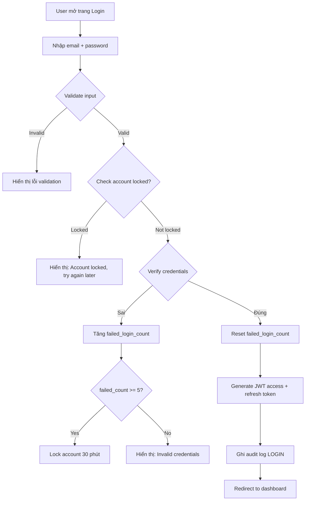
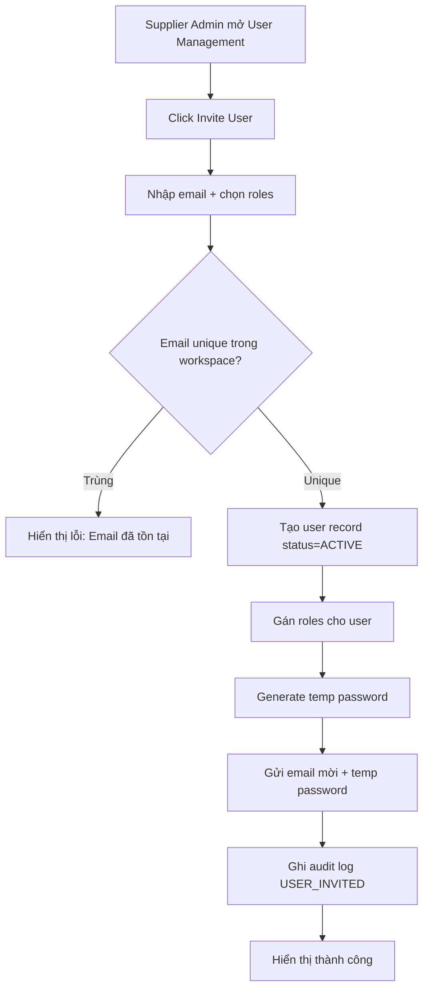
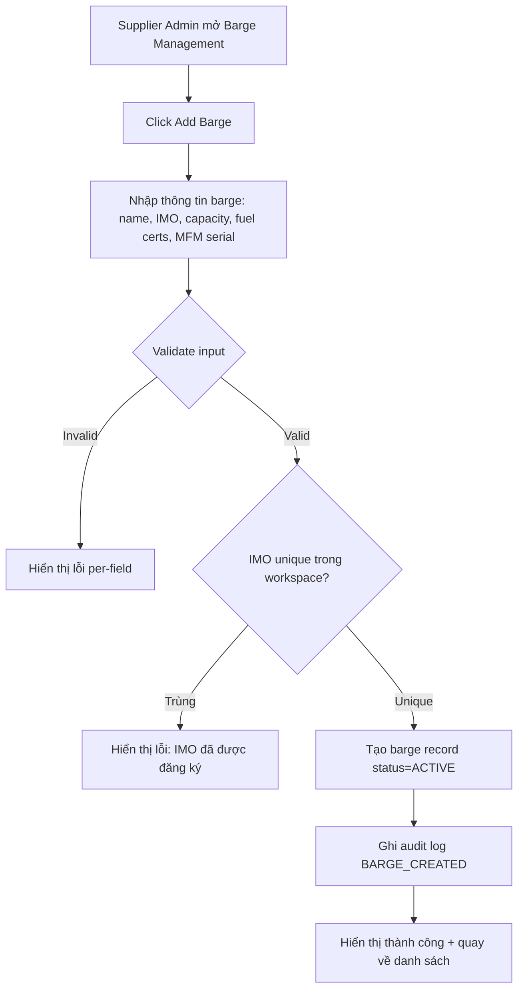

# FRD — Platform Core

## 1. Tổng quan chức năng

Module Platform Core quản lý hạ tầng nền tảng chung cho toàn hệ thống Digital Bunkering Platform: workspace (tenant), users, roles (RBAC), barges, vessels (KYC), authentication/authorization, notification infrastructure, và audit logging. Tất cả modules khác phụ thuộc vào platform-core để xác thực người dùng, phân quyền, và truy cập shared entities.

---

## 2. Chân dung người dùng (Personas)

| Persona | Vai trò | Mục tiêu chính |
|---------|---------|----------------|
| **System Admin** | Thiết lập workspace, cấu hình hệ thống | Đảm bảo workspace hoạt động đúng, cấu hình tenant phù hợp |
| **Supplier Admin** | Quản lý users, barges, vessels, workspace settings | Kiểm soát truy cập, duy trì dữ liệu chính xác về tài sản (fleet) |

---

## 3. Danh sách tính năng

| ID | Tính năng | Mô tả | Độ ưu tiên |
|----|-----------|--------|-------------|
| F-PLAT-01 | User Registration & Login | Đăng ký/đăng nhập bằng email + password, JWT token management | Must |
| F-PLAT-02 | User Management | Mời user mới, gán roles, vô hiệu hóa tài khoản | Must |
| F-PLAT-03 | Barge Registration & Management | Đăng ký mới, cập nhật, quản lý trạng thái barge | Must |
| F-PLAT-04 | Vessel Profile (KYC) Management | Quản lý hồ sơ vessel, thông tin KYC, kết quả screening | Must |
| F-PLAT-05 | Workspace Settings | Cấu hình workspace: currency, timezone, notification preferences | Should |
| F-PLAT-06 | Notification Center | Trung tâm thông báo: in-app, email, push notifications | Should |
| F-PLAT-07 | Audit Log Viewer | Xem lịch sử thao tác hệ thống cho compliance & dispute resolution | Must |

---

## 4. Luồng nghiệp vụ (Workflow)

### 4.1 User Login Flow

### 4.2 User Invitation Flow

### 4.3 Barge Registration Flow

---

## 5. Yêu cầu dữ liệu

### Entities chính

| Entity | Mô tả | Scope |
|--------|--------|-------|
| Workspace | Đơn vị tenant, cách ly dữ liệu | System-level |
| User | Người dùng + roles | Per workspace |
| Barge | Tàu barge cung cấp nhiên liệu | Per workspace |
| Vessel | Tàu nhận nhiên liệu (KYC profile) | Per workspace |
| Port | Dữ liệu cảng (reference) | System-level (shared) |
| Notification | Thông báo gửi đến user | Per workspace |
| AuditLog | Lịch sử thao tác | Per workspace |

### Relationships

- Workspace 1:N Users
- Workspace 1:N Barges
- Workspace 1:N Vessels
- User N:M Roles (qua bảng user_roles)
- User 1:N Notifications (recipient)
- User 1:N AuditLogs (actor)

---

## 6. Quy tắc nghiệp vụ

| ID | Quy tắc | Mô tả |
|----|---------|--------|
| BR-PLAT-001 | Email unique per workspace | Mỗi email chỉ được đăng ký 1 lần trong cùng workspace. Cho phép cùng email tồn tại ở workspace khác. |
| BR-PLAT-002 | Account lock sau 5 lần login sai | Sau 5 lần nhập sai password liên tiếp, tài khoản tự động khóa 30 phút. Admin có thể unlock thủ công. |
| BR-PLAT-003 | Barge IMO unique per workspace | Số IMO của barge phải duy nhất trong workspace. Không cho phép đăng ký trùng. |
| BR-PLAT-004 | Chỉ SUPPLIER_ADMIN gán roles | Chỉ user có role SUPPLIER_ADMIN mới có quyền gán/thay đổi roles cho user khác trong workspace. |
| BR-PLAT-005 | Password complexity | Mật khẩu tối thiểu 8 ký tự, phải chứa ít nhất: 1 chữ hoa, 1 số, 1 ký tự đặc biệt (!@#$%^&*). |
| BR-PLAT-006 | Audit log immutable | Audit logs không bao giờ bị sửa hoặc xóa (no edit, no delete). Retention tối thiểu 7 năm. |
| BR-PLAT-007 | Notification channels configurable | Workspace admin có thể bật/tắt notification channels (in-app, email, push) theo preference. |
| BR-PLAT-008 | Vessel screening required | Vessel phải được screening trước khi tạo nomination/delivery liên quan. |

---

## 7. Điểm tích hợp

| Module | Hướng | Mô tả |
|--------|-------|--------|
| **Tất cả modules** | Outbound (platform → module) | Cung cấp auth context (JWT), shared entities (User, Workspace, Barge, Vessel) |
| **nomination** | Consume | Dùng Vessel, Port, User entities |
| **scheduling** | Consume | Dùng Barge, Port, User entities |
| **delivery-ops** | Consume | Dùng Barge, Vessel, User entities |
| **ebdn** | Consume | Dùng User (signer), Barge, Vessel, AuditLog |
| **finance** | Consume | Dùng User, Workspace, Notification |
| **b2g-compliance** | Consume | Dùng Vessel, AuditLog |
| **mfm-integration** | Consume | Dùng Barge (MFM serial), Workspace |
| **sanctions-kyc** | Consume | Dùng Vessel (screening results) |
| **analytics** | Consume | Dùng User, Workspace (read-only aggregates) |
| **messaging** | Consume | Dùng User, Workspace, Notification |

---

## 8. Tiêu chí chấp nhận

### F-PLAT-01: User Registration & Login

- [ ] User đăng nhập bằng email + password, nhận JWT access token (15 min) + refresh token (7 ngày)
- [ ] Sai credentials → hiển thị "Invalid credentials" (không leak email existence)
- [ ] Sau 5 lần sai liên tiếp → account locked 30 phút
- [ ] Refresh token endpoint trả access token mới khi token cũ hết hạn
- [ ] Logout invalidate refresh token (blacklist)
- [ ] Password phải đáp ứng BR-PLAT-005 khi đăng ký/đổi mật khẩu

### F-PLAT-02: User Management

- [ ] Supplier Admin mời user mới bằng email + chọn roles
- [ ] Email mời chứa link + temporary password
- [ ] Hiển thị danh sách users: name, email, roles (badges), status, last login
- [ ] Supplier Admin có thể deactivate user (status → INACTIVE)
- [ ] Deactivated user không thể đăng nhập
- [ ] Chỉ SUPPLIER_ADMIN mới thấy nút invite/edit/deactivate (BR-PLAT-004)

### F-PLAT-03: Barge Registration & Management

- [ ] Supplier Admin thêm barge mới: name, IMO (7 digits), capacity (MT), fuel certifications, MFM serial
- [ ] IMO unique trong workspace (BR-PLAT-003) → lỗi 409 nếu trùng
- [ ] Hiển thị danh sách barges: name, IMO, capacity, fuel certs (badges), MFM serial, status
- [ ] Có thể chuyển trạng thái: ACTIVE ↔ MAINTENANCE → DECOMMISSIONED
- [ ] Barge MAINTENANCE/DECOMMISSIONED không thể dispatch cho delivery

### F-PLAT-04: Vessel Profile (KYC) Management

- [ ] Tạo vessel profile: IMO, name, flag state, vessel type, tonnage, beneficial owner, operator
- [ ] IMO unique trong workspace
- [ ] Hiển thị screening result: CLEAR (green), FLAGGED (yellow), SANCTIONED (red)
- [ ] Vessel SANCTIONED → block tạo nomination/delivery
- [ ] Cập nhật KYC data: edit form cho tất cả fields
- [ ] Last screened date + provider hiển thị trên profile

### F-PLAT-05: Workspace Settings

- [ ] Cấu hình: company name, supplier licence number, default currency, timezone
- [ ] Cấu hình notification preferences: bật/tắt channels per notification type
- [ ] Thay đổi settings ghi audit log
- [ ] Chỉ SUPPLIER_ADMIN truy cập workspace settings

### F-PLAT-06: Notification Center

- [ ] Bell icon hiển thị unread count (badge "99+" nếu >99)
- [ ] Click bell → dropdown/panel: danh sách notifications, unread trước
- [ ] Mỗi notification: title, message, timestamp (relative), reference link
- [ ] Click notification → mark read + navigate to referenced entity
- [ ] "Mark all as read" button
- [ ] Hỗ trợ channels: IN_APP (realtime), EMAIL (async), PUSH (optional)

### F-PLAT-07: Audit Log Viewer

- [ ] Hiển thị bảng: timestamp, actor name, action, entity type, entity ID, changes summary
- [ ] Filter: entity type, action, date range, actor
- [ ] Read-only: không có nút edit/delete
- [ ] Pagination: 20 items/page, sort by timestamp DESC
- [ ] Chỉ SUPPLIER_ADMIN + COMPLIANCE_OFFICER có quyền xem audit logs
- [ ] Retention: hiển thị tối thiểu 7 năm data (theo MPA regulation)
