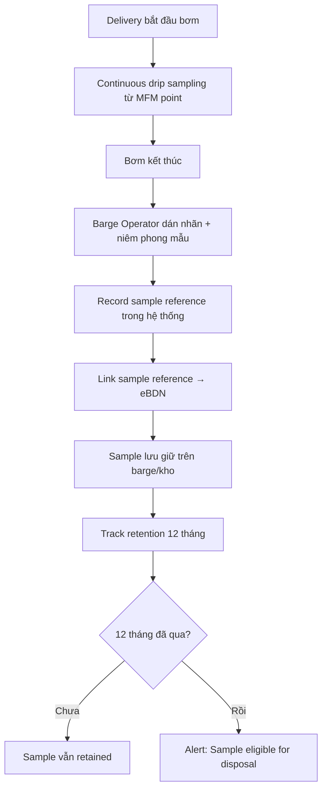

# FRD — Sampling & Quality (SS 524)

## 1. Tổng quan chức năng

Module Sampling & Quality quản lý quy trình lấy mẫu nhiên liệu theo tiêu chuẩn SS 524, liên kết mẫu với delivery, theo dõi thời gian lưu giữ (retention), và tracking kết quả phòng thí nghiệm. Mẫu nhiên liệu lấy liên tục (continuous drip) từ MFM sampling point trong suốt quá trình bơm.

---

## 2. Chân dung người dùng (Personas)

| Persona | Vai trò | Mục tiêu chính |
|---------|---------|----------------|
| **Barge Operator** | Lấy mẫu, dán nhãn, niêm phong | Hoàn tất sampling đúng quy trình |
| **Supplier Admin** | Giám sát retention, tracking lab results | Đảm bảo compliance SS 524 |

---

## 3. Danh sách tính năng

| ID | Tính năng | Mô tả | Độ ưu tiên |
|----|-----------|--------|-------------|
| F-SAM-01 | Record Sample | Ghi nhận mẫu nhiên liệu đã lấy | Must |
| F-SAM-02 | Link to Delivery | Liên kết sample với delivery/eBDN | Must |
| F-SAM-03 | Track Retention | Giám sát thời gian lưu giữ (12 tháng min) | Must |
| F-SAM-04 | Lab Result Tracking | Ghi nhận kết quả phân tích từ lab | Should |

---

## 4. Luồng nghiệp vụ (Workflow)

---

## 5. Yêu cầu dữ liệu

### 5.1 Entity: Sample

| Field | Type | Constraints | Mô tả |
|-------|------|-------------|--------|
| id | UUID | PK | Mã sample |
| sample_reference | String(50) | UNIQUE, NOT NULL | Mã tham chiếu mẫu (trên nhãn) |
| delivery_id | UUID | FK, NOT NULL | Liên kết delivery |
| ebdn_id | UUID | FK, nullable | Liên kết eBDN |
| fuel_type_code | String(20) | NOT NULL | Loại nhiên liệu |
| sampling_method | String(50) | NOT NULL | Phương pháp (continuous drip) |
| sealed_by | String(255) | NOT NULL | Người niêm phong |
| sealed_at | DateTime | NOT NULL | Thời gian niêm phong |
| storage_location | String(255) | NOT NULL | Nơi lưu giữ |
| retention_start | Date | NOT NULL | Ngày bắt đầu lưu |
| retention_end | Date | NOT NULL | Ngày hết hạn (start + 12 tháng) |
| lab_result_status | Enum | nullable | PENDING, RECEIVED, PASS, FAIL |
| lab_report_reference | String(100) | nullable | Mã báo cáo lab |

---

## 6. Quy tắc nghiệp vụ

| ID | Quy tắc | Mô tả |
|----|---------|--------|
| BR-SAM-001 | Continuous drip | Mẫu lấy bằng continuous drip từ MFM sampling point |
| BR-SAM-002 | Label + Seal | Mẫu PHẢI được dán nhãn và niêm phong ngay sau delivery |
| BR-SAM-003 | Retention 12 tháng | Mẫu lưu giữ TỐI THIỂU 12 tháng từ ngày delivery |
| BR-SAM-004 | eBDN reference | Sample reference PHẢI được ghi trong eBDN (BR-EBDN-007) |

---

## 7. Điểm tích hợp

| Module | Hướng | Mô tả |
|--------|-------|--------|
| **delivery-ops** | Inbound event | Nhận event delivery complete → prompt record sample |
| **ebdn** | Outbound query | Cung cấp sample reference cho eBDN generation |

---

## 8. Tiêu chí chấp nhận

### F-SAM-01: Record Sample
- [ ] Barge Operator ghi nhận sample reference, sealed by/at, storage location
- [ ] Sample reference unique

### F-SAM-02: Link to Delivery
- [ ] Sample linked đến delivery record
- [ ] Sample reference available cho eBDN generation

### F-SAM-03: Track Retention
- [ ] Hệ thống tính retention_end = sealed_at + 12 months
- [ ] Alert khi sample sắp hết hạn retention (30 ngày trước)
- [ ] Alert khi eligible for disposal

### F-SAM-04: Lab Result Tracking
- [ ] Ghi nhận lab report reference + result (PASS/FAIL)
- [ ] Alert Supplier Admin khi lab result = FAIL
