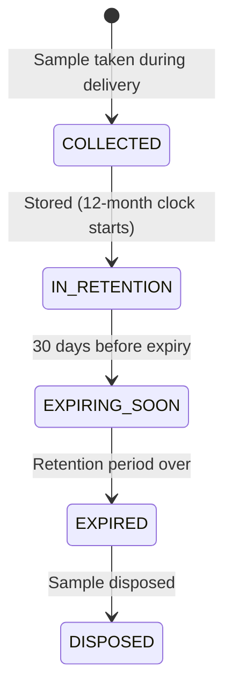

# SRS — Sampling & Quality Management

**Version:** 1.0  
**Module:** sampling-quality  
**Ngày:** 2026-05-27

---

## §1 Mục đích & Phạm vi

### 1.1 Mục đích

Module Sampling & Quality quản lý việc lấy mẫu nhiên liệu theo chuẩn MARPOL/SS 524, liên kết mẫu với delivery record, và theo dõi thời hạn lưu giữ mẫu (retention period).

### 1.2 Phạm vi

- Ghi nhận thông tin mẫu MARPOL khi lấy mẫu
- Liên kết mẫu với delivery record
- Theo dõi retention period (12 tháng tối thiểu)
- Cảnh báo trước khi hết hạn lưu giữ

### 1.3 Actors

| Actor | Vai trò | Quyền |
|-------|---------|-------|
| Barge Operator | Ghi nhận mẫu | CREATE sample records |
| Supplier Admin | Quản lý, view reports | MANAGE, VIEW |
| Compliance Officer | Monitor retention alerts | VIEW alerts |

### 1.4 Dependencies

| Module | Quan hệ | Mô tả |
|--------|---------|--------|
| delivery-ops | Inbound | Link sample to delivery |
| ebdn | Outbound query | eBDN queries sample_reference |

---

## §2 Mô tả tổng thể

### 2.1 Sample Lifecycle

Module này đơn giản — không có complex state machine:



### 2.2 SS 524 Compliance

- Sampling method: continuous drip from MFM sampling point
- Minimum sample volume: 750ml (per SS 524)
- Retention period: minimum 12 months by supplier
- Storage: sealed, labeled, stored at ambient temperature

---

## §3 Yêu cầu chức năng chi tiết

### FR-SAM-001: Record MARPOL Sample

**Mô tả:** Record sample reference linked to delivery.

**Input Specification:**

| Field | Type | Required | Validation | Description |
|-------|------|----------|------------|-------------|
| delivery_id | UUID | Yes | Must exist, status ≥ PUMPING | Delivery liên kết |
| sample_reference | String | Yes | Unique, max 50 chars | Mã mẫu |
| sampling_method | Enum | Yes | CONTINUOUS_DRIP, SPOT, MANUAL | Phương pháp lấy mẫu |
| sample_volume_ml | Integer | Yes | ≥ 750 | Thể tích mẫu (ml) |
| sample_point | String | Yes | max 100 chars | Vị trí lấy mẫu |
| collected_at | OffsetDateTime | Yes | ≤ now | Thời gian lấy mẫu |
| collected_by | String | Yes | max 255 | Người lấy mẫu |
| seal_number | String | No | max 50 | Số seal |
| notes | String | No | max 1000 | Ghi chú |

---

### FR-SAM-002: Track Retention Period

**Mô tả:** Monitor 12-month retention, alert 30 days before expiry.

**Scheduled Job:** Daily at 00:00 UTC
- Query samples WHERE `retention_expiry_date` - 30 days ≤ NOW()
- Create SampleRetentionAlert for approaching expiry

---

### FR-SAM-003: Record Sampling Method

**Mô tả:** Record sampling method (continuous drip from MFM point) per SS 524.

---

## §4 Use Case Specifications

### UC-SAM-01: Record Sample During Delivery

**Actor:** Barge Operator  
**Goal:** Ghi nhận mẫu MARPOL đã lấy

**Main Success Scenario:**

1. During delivery (status = PUMPING), operator takes sample
2. Operator opens sample form on mobile
3. Operator enters: sample reference, method, volume, seal number
4. System auto-fills: delivery_id, collected_at (now), sample_point (default)
5. System validates minimum volume (≥ 750ml)
6. System creates Sample record
7. System calculates retention_expiry_date = collected_at + 12 months
8. Sample reference available for eBDN generation

---

## §5 Data Model

### 5.1 Entity: Sample

```sql
CREATE TABLE samples (
    id                  UUID PRIMARY KEY DEFAULT gen_random_uuid(),
    workspace_id        UUID NOT NULL REFERENCES workspaces(id),
    delivery_id         UUID NOT NULL REFERENCES deliveries(id),
    sample_reference    VARCHAR(50) NOT NULL,
    sampling_method     VARCHAR(20) NOT NULL,
    sample_volume_ml    INTEGER NOT NULL CHECK (sample_volume_ml >= 750),
    sample_point        VARCHAR(100) NOT NULL,
    collected_at        TIMESTAMPTZ NOT NULL,
    collected_by        VARCHAR(255) NOT NULL,
    seal_number         VARCHAR(50),
    retention_expiry_date DATE NOT NULL,  -- collected_at + 12 months
    status              VARCHAR(20) NOT NULL DEFAULT 'IN_RETENTION',
    disposed_at         TIMESTAMPTZ,
    notes               TEXT,
    created_at          TIMESTAMPTZ NOT NULL DEFAULT NOW(),
    updated_at          TIMESTAMPTZ NOT NULL DEFAULT NOW(),

    CONSTRAINT chk_sampling_method CHECK (sampling_method IN ('CONTINUOUS_DRIP','SPOT','MANUAL')),
    CONSTRAINT chk_sample_status CHECK (status IN ('COLLECTED','IN_RETENTION','EXPIRING_SOON','EXPIRED','DISPOSED'))
);
```

### 5.2 Entity: SampleRetentionAlert

```sql
CREATE TABLE sample_retention_alerts (
    id              UUID PRIMARY KEY DEFAULT gen_random_uuid(),
    workspace_id    UUID NOT NULL REFERENCES workspaces(id),
    sample_id       UUID NOT NULL REFERENCES samples(id),
    alert_type      VARCHAR(20) NOT NULL,  -- EXPIRING_30D, EXPIRING_7D, EXPIRED
    expiry_date     DATE NOT NULL,
    acknowledged    BOOLEAN NOT NULL DEFAULT FALSE,
    acknowledged_by UUID REFERENCES users(id),
    created_at      TIMESTAMPTZ NOT NULL DEFAULT NOW()
);
```

### 5.3 Indexes

```sql
CREATE INDEX idx_samples_workspace ON samples(workspace_id, status);
CREATE INDEX idx_samples_delivery ON samples(delivery_id);
CREATE UNIQUE INDEX idx_samples_reference ON samples(workspace_id, sample_reference);
CREATE INDEX idx_samples_retention ON samples(retention_expiry_date, status) WHERE status IN ('IN_RETENTION','EXPIRING_SOON');
CREATE INDEX idx_sample_alerts_workspace ON sample_retention_alerts(workspace_id, acknowledged);
```

---

## §6 API Specifications

### 6.1 POST /api/v1/samples

**Mô tả:** Record new sample  
**Auth:** Bearer JWT, role = BARGE_OPERATOR | SUPPLIER_ADMIN

**Request Body:**
```json
{
  "delivery_id": "...",
  "sample_reference": "SAM-2026-06-0042",
  "sampling_method": "CONTINUOUS_DRIP",
  "sample_volume_ml": 1000,
  "sample_point": "MFM downstream sampling valve",
  "collected_at": "2026-06-15T11:30:00+08:00",
  "collected_by": "Chief Officer Lee",
  "seal_number": "SL-2026-1234"
}
```

**Response (201):** `SampleDto`

---

### 6.2 GET /api/v1/samples

**Mô tả:** List samples  
**Auth:** Bearer JWT  
**Query Params:** page, size, status, delivery_id, from_date, to_date

**Response (200):** `PaginatedResponse<SampleDto>`

---

### 6.3 GET /api/v1/samples/{id}

**Mô tả:** Get sample detail  
**Auth:** Bearer JWT

**Response (200):** `SampleDto`

---

### 6.4 GET /api/v1/samples/retention-report

**Mô tả:** Retention report (expiring soon + expired)  
**Auth:** Bearer JWT

**Response (200):**
```json
{
  "expiring_within_30_days": 5,
  "expiring_within_7_days": 2,
  "expired_undisposed": 1,
  "samples": [ /* SampleDto[] sorted by retention_expiry_date ASC */ ]
}
```

---

### 6.5 PATCH /api/v1/samples/{id}/dispose

**Mô tả:** Mark sample as disposed  
**Auth:** Bearer JWT, role = SUPPLIER_ADMIN

**Response (200):** Updated `SampleDto` with status = DISPOSED

---

## §7 Yêu cầu phi chức năng

| ID | Category | Requirement |
|----|----------|-------------|
| NFR-SAM-01 | Compliance | Sample retention tracking accurate to day |
| NFR-SAM-02 | Alerting | Expiry alerts generated 30 days and 7 days before |
| NFR-SAM-03 | Audit | Sample records immutable after creation (append-only corrections) |

---

## §8 Quy tắc nghiệp vụ

| ID | Quy tắc | Implementation Notes |
|----|---------|---------------------|
| BR-SAM-001 | Minimum volume 750ml | DB CHECK constraint + application validation per SS 524 |
| BR-SAM-002 | Retention 12 months | `retention_expiry_date = collected_at::date + INTERVAL '12 months'`. Supplier must retain sample. |
| BR-SAM-003 | Alert 30 days before expiry | Scheduled job (daily): query `WHERE retention_expiry_date - INTERVAL '30 days' <= CURRENT_DATE AND status = 'IN_RETENTION'`. Create alert. |
| BR-SAM-004 | Continuous drip preferred | SS 524 recommends CONTINUOUS_DRIP from MFM sampling point. UI shows as default option. |
| BR-SAM-005 | Link to eBDN | eBDN module queries: `SELECT sample_reference FROM samples WHERE delivery_id = ?`. Used in eBDN generation. |
