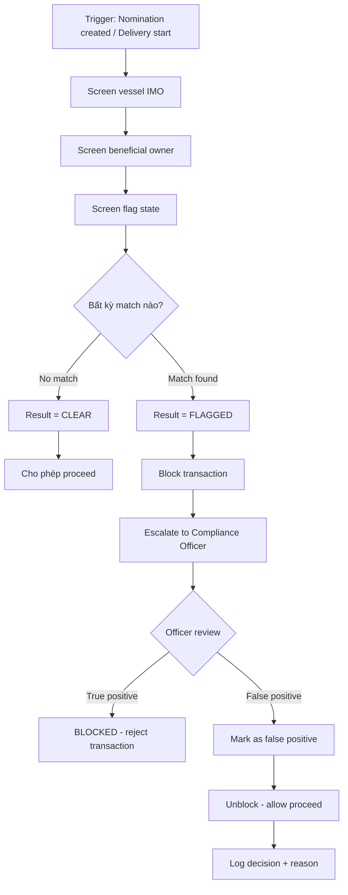
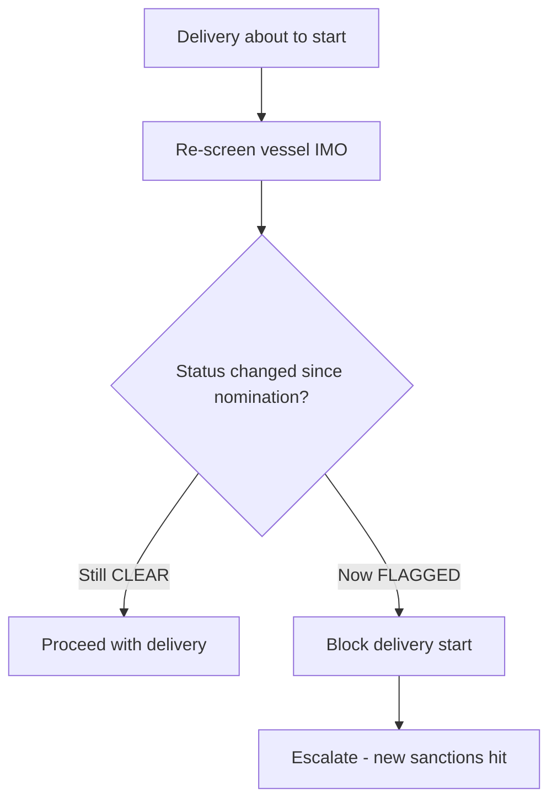

# FRD — Sanctions & KYC Screening

## 1. Tổng quan chức năng

Module Sanctions & KYC Screening kiểm tra vessel, beneficial owner, và flag state đối chiếu với danh sách trừng phạt quốc tế (OFAC, EU, UN, UK OFSI). Screening tự động kích hoạt khi tạo nomination và khi bắt đầu delivery. Module quản lý vessel profiles và hỗ trợ false positive workflow.

---

## 2. Chân dung người dùng (Personas)

| Persona | Vai trò | Mục tiêu chính |
|---------|---------|----------------|
| **System** | Auto-screen tại các checkpoint | Compliance enforcement |
| **Compliance Officer** | Review matches, resolve false positives | Đảm bảo đúng quyết định screen |
| **Supplier Admin** | Xem screening status, manage vessel profiles | Visibility vào compliance |

---

## 3. Danh sách tính năng

| ID | Tính năng | Mô tả | Độ ưu tiên |
|----|-----------|--------|-------------|
| F-SAN-01 | Screen Vessel IMO | Kiểm tra vessel đối chiếu sanctions lists | Must |
| F-SAN-02 | Screen Beneficial Owner | Kiểm tra chủ sở hữu hưởng lợi | Must |
| F-SAN-03 | Screen Flag State | Kiểm tra quốc gia đăng ký tàu | Must |
| F-SAN-04 | Re-screen at Delivery | Kiểm tra lại khi bắt đầu delivery | Must |
| F-SAN-05 | Maintain Vessel Profiles | Quản lý hồ sơ vessel + screening history | Should |
| F-SAN-06 | False Positive Workflow | Quy trình xử lý kết quả dương tính giả | Should |

---

## 4. Luồng nghiệp vụ (Workflow)

### 4.1 Screening Flow

### 4.2 Re-screening Flow

---

## 5. Yêu cầu dữ liệu

### 5.1 Entity: ScreeningResult

| Field | Type | Constraints | Mô tả |
|-------|------|-------------|--------|
| id | UUID | PK | Mã screening |
| trigger_type | Enum | NOT NULL | NOMINATION, DELIVERY |
| trigger_id | UUID | NOT NULL | ID of nomination/delivery |
| vessel_imo | String(7) | NOT NULL | IMO screened |
| result | Enum | NOT NULL | CLEAR, FLAGGED, PENDING |
| matched_lists | JSON Array | nullable | Danh sách match (OFAC, EU, UN, OFSI) |
| reviewed_by | UUID | FK, nullable | Compliance Officer |
| review_decision | Enum | nullable | TRUE_POSITIVE, FALSE_POSITIVE |
| review_notes | Text | nullable | Ghi chú review |
| screened_at | DateTime | NOT NULL | Thời gian screen |
| reviewed_at | DateTime | nullable | Thời gian review |

### 5.2 Entity: VesselProfile

| Field | Type | Constraints | Mô tả |
|-------|------|-------------|--------|
| id | UUID | PK | Mã profile |
| vessel_imo | String(7) | UNIQUE, NOT NULL | IMO |
| vessel_name | String(255) | NOT NULL | Tên vessel |
| flag_state | String(3) | NOT NULL | Mã quốc gia |
| beneficial_owner | String(255) | nullable | Chủ sở hữu hưởng lợi |
| last_screening_result | Enum | nullable | CLEAR, FLAGGED |
| last_screened_at | DateTime | nullable | Lần screen cuối |
| false_positive_count | Integer | default 0 | Số lần false positive |

---

## 6. Quy tắc nghiệp vụ

| ID | Quy tắc | Mô tả |
|----|---------|--------|
| BR-SAN-001 | Multi-list screening | Screen đối chiếu: OFAC, EU, UN, UK OFSI |
| BR-SAN-002 | Auto on nomination | Tự động screen khi nomination được tạo (submit) |
| BR-SAN-003 | Re-screen at delivery | Screening lại khi bắt đầu delivery (status có thể thay đổi) |
| BR-SAN-004 | Match = Block + Escalate | Khi có match → block giao dịch + escalate to Compliance Officer |
| BR-SAN-005 | False positive workflow | Compliance Officer có thể mark false positive + unblock với documented reason |

---

## 7. Điểm tích hợp

| Module | Hướng | Mô tả |
|--------|-------|--------|
| **nomination** | Inbound event | Nomination submitted → trigger screening |
| **delivery-ops** | Inbound event | Delivery about to start → trigger re-screening |
| **External sanctions APIs** | Outbound call | Query OFAC, EU, UN, OFSI lists |

---

## 8. Tiêu chí chấp nhận

### F-SAN-01: Screen Vessel IMO
- [ ] Kiểm tra vessel IMO đối chiếu 4 sanctions lists
- [ ] Return CLEAR hoặc FLAGGED với matched lists

### F-SAN-02: Screen Beneficial Owner
- [ ] Kiểm tra tên beneficial owner đối chiếu sanctions lists
- [ ] Fuzzy matching cho tên (aliases, transliterations)

### F-SAN-03: Screen Flag State
- [ ] Kiểm tra flag state country code
- [ ] Block nếu flag state nằm trong sanctioned countries

### F-SAN-04: Re-screen at Delivery
- [ ] Auto trigger khi delivery about to start
- [ ] Block delivery nếu status thay đổi từ CLEAR → FLAGGED

### F-SAN-05: Maintain Vessel Profiles
- [ ] Lưu thông tin vessel kèm screening history
- [ ] Hiển thị last screening result + date

### F-SAN-06: False Positive Workflow
- [ ] Compliance Officer review FLAGGED result
- [ ] Mark FALSE_POSITIVE với documented reason
- [ ] Unblock transaction sau review
- [ ] Audit trail cho mọi decisions
