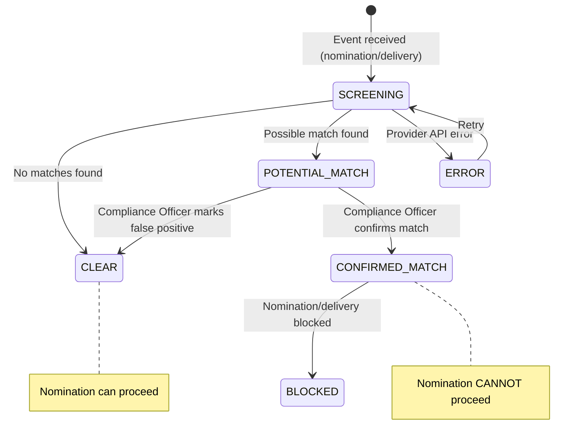

# SRS — Sanctions Screening & KYC

**Version:** 1.0  
**Module:** sanctions-kyc  
**Ngày:** 2026-05-27

---

## §1 Mục đích & Phạm vi

### 1.1 Mục đích

Module Sanctions & KYC thực hiện screening vessel/owner/flag state against danh sách trừng phạt quốc tế (OFAC, EU, UN), duy trì vessel KYC profile, và quản lý workflow xử lý kết quả screening (clear, potential match, confirmed match).

### 1.2 Phạm vi

- Sanctions screening tự động khi nomination submitted
- Re-screening tự động khi delivery started
- Vessel KYC profile management
- Match handling workflow (false positive resolution)
- Integration abstraction cho sanctions list providers

### 1.3 Actors

| Actor | Vai trò | Quyền |
|-------|---------|-------|
| System | Auto-trigger screening | SCREEN |
| Compliance Officer | Review matches, resolve alerts | MANAGE alerts, RESOLVE |
| Supplier Admin | View screening results | VIEW |

### 1.4 Dependencies

| Module | Quan hệ | Mô tả |
|--------|---------|--------|
| nomination | Inbound event | `NominationSubmitted` → trigger screening |
| delivery-ops | Inbound event | `DeliveryStarted` → trigger re-screening |
| External | Outbound | Sanctions list provider API (abstract interface) |

---

## §2 Mô tả tổng thể

### 2.1 Screening Workflow



### 2.2 Screening Triggers

| Event | Trigger | Scope |
|-------|---------|-------|
| `NominationSubmitted` | Pre-confirmation screening | Vessel IMO, vessel owner, flag state |
| `DeliveryStarted` | Re-screening (sanctions change constantly) | Same as above |

### 2.3 External Provider Abstraction

```
Interface: SanctionsListProvider
  - screen(entity: ScreeningRequest): ScreeningResult
  - getListVersion(): String
  
Implementations:
  - OFACProvider (US Treasury SDN list)
  - EUSanctionsProvider (EU consolidated list)
  - UNSanctionsProvider (UN Security Council)
  - CompositeProvider (aggregates all above)
```

---

## §3 Yêu cầu chức năng chi tiết

### FR-SAN-001: Screen Vessel Against Sanctions Lists

**Mô tả:** Screen vessel IMO, beneficial owner, flag state against OFAC, EU, UN lists.

**Screening Fields:**

| Field | Source | Check Against |
|-------|--------|---------------|
| vessel_imo | nomination.vessel_imo | IMO blacklists |
| vessel_name | nomination.vessel_name | Name matching (fuzzy) |
| vessel_owner | vessel_profile.beneficial_owner | SDN, entity lists |
| flag_state | vessel_profile.flag_state | Sanctioned countries |
| operator | vessel_profile.operator | Entity lists |

**Match Types:**

| Type | Confidence | Action |
|------|-----------|--------|
| EXACT_MATCH | High | Auto-block, alert Compliance |
| FUZZY_MATCH | Medium | Mark POTENTIAL_MATCH, require Compliance review |
| NO_MATCH | — | CLEAR, nomination can proceed |

---

### FR-SAN-002: Screen Beneficial Owner + Flag State

**Mô tả:** Screen entity ownership chain and flag state.

**Owner Screening:**
- Direct owner company name
- Beneficial owner (ultimate beneficiary)
- Country of incorporation

**Flag State Screening:**
- Check vessel registration country against sanctioned nations list

---

### FR-SAN-003: Re-screen at Delivery Start

**Mô tả:** Sanctions lists change frequently. Re-screen when delivery actually starts.

**Logic:**
```
ON DeliveryStarted event:
  1. Get vessel_imo from delivery
  2. Get vessel profile (owner, flag)
  3. Run full screening
  4. IF result != CLEAR:
     - Alert Compliance Officer immediately
     - DO NOT auto-block delivery (already in progress)
     - Flag for manual review
```

---

## §4 Use Case Specifications

### UC-SAN-01: Automatic Pre-nomination Screening

**Actor:** System  
**Goal:** Screen vessel before supplier can confirm nomination

**Main Success Scenario:**

1. Buyer submits nomination
2. System receives `NominationSubmitted` event
3. System loads vessel profile (or creates minimal profile from nomination data)
4. System calls sanctions providers (OFAC, EU, UN)
5. All providers return no matches
6. System stores SanctionsCheck (result = CLEAR)
7. Nomination.sanctions_status updated to CLEAR
8. Supplier can now confirm nomination

**Exception Flows:**

- **4a.** Provider API timeout → retry 3x with exponential backoff
- **5a.** Fuzzy match found → result = POTENTIAL_MATCH, alert Compliance Officer
- **5b.** Exact match found → result = CONFIRMED_MATCH, nomination auto-blocked

---

### UC-SAN-02: Resolve Potential Match (False Positive)

**Actor:** Compliance Officer  
**Goal:** Review and resolve potential sanctions match

**Main Success Scenario:**

1. Compliance Officer receives alert (POTENTIAL_MATCH)
2. Officer opens alert detail (shows match details, confidence score, source list)
3. Officer reviews vessel profile, owner info, match context
4. Officer determines: false positive
5. Officer marks as FALSE_POSITIVE with reason
6. System updates SanctionsCheck → CLEAR
7. Nomination can proceed

**Alternative:**

- **4a.** Officer determines: true match → marks CONFIRMED_MATCH
- **5a.** System blocks nomination permanently
- **6a.** Supplier Admin notified of blocked nomination

---

## §5 Data Model

### 5.1 Entity: SanctionsCheck

```sql
CREATE TABLE sanctions_checks (
    id              UUID PRIMARY KEY DEFAULT gen_random_uuid(),
    workspace_id    UUID NOT NULL REFERENCES workspaces(id),
    reference_type  VARCHAR(20) NOT NULL,  -- NOMINATION, DELIVERY
    reference_id    UUID NOT NULL,         -- nomination_id or delivery_id
    vessel_imo      VARCHAR(7) NOT NULL,
    vessel_name     VARCHAR(255),
    screening_scope VARCHAR(30) NOT NULL,  -- PRE_NOMINATION, DELIVERY_START
    result          VARCHAR(20) NOT NULL DEFAULT 'PENDING',  -- PENDING, CLEAR, POTENTIAL_MATCH, CONFIRMED_MATCH, ERROR
    match_details   JSONB,  -- Array of {list_name, entity_name, match_score, match_type}
    provider_response JSONB,  -- Raw provider response for audit
    screened_at     TIMESTAMPTZ,
    resolved_by     UUID REFERENCES users(id),
    resolved_at     TIMESTAMPTZ,
    resolution      VARCHAR(20),  -- FALSE_POSITIVE, CONFIRMED_MATCH
    resolution_reason TEXT,
    created_at      TIMESTAMPTZ NOT NULL DEFAULT NOW(),
    updated_at      TIMESTAMPTZ NOT NULL DEFAULT NOW(),

    CONSTRAINT chk_sanctions_result CHECK (result IN ('PENDING','SCREENING','CLEAR','POTENTIAL_MATCH','CONFIRMED_MATCH','ERROR'))
);
```

### 5.2 Entity: VesselProfile

```sql
CREATE TABLE vessel_profiles (
    id                  UUID PRIMARY KEY DEFAULT gen_random_uuid(),
    workspace_id        UUID NOT NULL REFERENCES workspaces(id),
    vessel_imo          VARCHAR(7) NOT NULL,
    vessel_name         VARCHAR(255) NOT NULL,
    flag_state          VARCHAR(3),  -- ISO 3166-1 alpha-3
    vessel_type         VARCHAR(50),
    gross_tonnage       DECIMAL(10,2),
    beneficial_owner    VARCHAR(255),
    operator            VARCHAR(255),
    manager             VARCHAR(255),
    country_of_registration VARCHAR(3),
    classification_society VARCHAR(100),
    last_screened_at    TIMESTAMPTZ,
    last_screening_result VARCHAR(20),
    risk_score          INTEGER,  -- 0-100
    notes               TEXT,
    created_at          TIMESTAMPTZ NOT NULL DEFAULT NOW(),
    updated_at          TIMESTAMPTZ NOT NULL DEFAULT NOW(),

    CONSTRAINT uq_vessel_profile_imo UNIQUE (workspace_id, vessel_imo)
);
```

### 5.3 Entity: SanctionsAlert

```sql
CREATE TABLE sanctions_alerts (
    id              UUID PRIMARY KEY DEFAULT gen_random_uuid(),
    workspace_id    UUID NOT NULL REFERENCES workspaces(id),
    sanctions_check_id UUID NOT NULL REFERENCES sanctions_checks(id),
    vessel_imo      VARCHAR(7) NOT NULL,
    alert_type      VARCHAR(20) NOT NULL,  -- POTENTIAL_MATCH, CONFIRMED_MATCH, RE_SCREEN_ALERT
    severity        VARCHAR(10) NOT NULL,  -- WARNING, CRITICAL
    title           VARCHAR(255) NOT NULL,
    details         TEXT NOT NULL,
    status          VARCHAR(20) NOT NULL DEFAULT 'OPEN',  -- OPEN, REVIEWING, RESOLVED
    resolved_by     UUID REFERENCES users(id),
    resolved_at     TIMESTAMPTZ,
    resolution_notes TEXT,
    created_at      TIMESTAMPTZ NOT NULL DEFAULT NOW()
);
```

### 5.4 Indexes

```sql
CREATE INDEX idx_sanctions_checks_reference ON sanctions_checks(reference_type, reference_id);
CREATE INDEX idx_sanctions_checks_vessel ON sanctions_checks(vessel_imo, created_at DESC);
CREATE INDEX idx_sanctions_checks_result ON sanctions_checks(workspace_id, result) WHERE result IN ('POTENTIAL_MATCH','CONFIRMED_MATCH');
CREATE INDEX idx_vessel_profiles_imo ON vessel_profiles(workspace_id, vessel_imo);
CREATE INDEX idx_sanctions_alerts_workspace ON sanctions_alerts(workspace_id, status, created_at DESC);
```

---

## §6 API Specifications

### 6.1 POST /api/v1/sanctions/screen

**Mô tả:** Trigger manual screening  
**Auth:** Bearer JWT, role = COMPLIANCE_OFFICER | SUPPLIER_ADMIN

**Request Body:**
```json
{
  "vessel_imo": "9876543",
  "vessel_name": "MV Pacific Star",
  "reference_type": "NOMINATION",
  "reference_id": "..."
}
```

**Response (202 Accepted):**
```json
{
  "check_id": "...",
  "status": "SCREENING",
  "message": "Screening initiated. Results will be available shortly."
}
```

---

### 6.2 GET /api/v1/sanctions/checks/{id}

**Mô tả:** Get screening result  
**Auth:** Bearer JWT

**Response (200):** `SanctionsCheckDto` (includes match details if any)

---

### 6.3 GET /api/v1/vessel-profiles/{imo}

**Mô tả:** Get vessel KYC profile  
**Auth:** Bearer JWT

**Response (200):** `VesselProfileDto`

---

### 6.4 PUT /api/v1/vessel-profiles/{imo}

**Mô tả:** Update vessel profile (KYC data)  
**Auth:** Bearer JWT, role = COMPLIANCE_OFFICER

**Request Body:**
```json
{
  "vessel_name": "MV Pacific Star",
  "flag_state": "SGP",
  "beneficial_owner": "Pacific Shipping Pte Ltd",
  "operator": "Pacific Marine Operations",
  "country_of_registration": "SGP"
}
```

---

### 6.5 GET /api/v1/sanctions/alerts

**Mô tả:** List sanctions alerts  
**Auth:** Bearer JWT  
**Query Params:** page, size, status, severity

**Response (200):** `PaginatedResponse<SanctionsAlertDto>`

---

### 6.6 POST /api/v1/sanctions/alerts/{id}/resolve

**Mô tả:** Resolve alert (false positive or confirmed)  
**Auth:** Bearer JWT, role = COMPLIANCE_OFFICER

**Request Body:**
```json
{
  "resolution": "FALSE_POSITIVE",
  "reason": "Vessel name similar but different IMO. Verified with beneficial owner documentation."
}
```

**Response (200):** Updated `SanctionsAlertDto`

---

## §7 Yêu cầu phi chức năng

| ID | Category | Requirement |
|----|----------|-------------|
| NFR-SAN-01 | Performance | Screening complete < 10 seconds (external API dependency) |
| NFR-SAN-02 | Reliability | Retry on provider failure (3x exponential backoff) |
| NFR-SAN-03 | Security | Provider credentials encrypted, no PII in logs |
| NFR-SAN-04 | Audit | All screening results + resolutions logged permanently |
| NFR-SAN-05 | Compliance | Re-screening mandatory at delivery start per regulations |

---

## §8 Quy tắc nghiệp vụ

| ID | Quy tắc | Implementation Notes |
|----|---------|---------------------|
| BR-SAN-001 | Pre-nomination screening | Event consumer: `NominationSubmitted` → invoke CompositeProvider.screen(). Store result on nomination. |
| BR-SAN-002 | Re-screen at delivery | Event consumer: `DeliveryStarted` → same screening. Alert (don't block) if match found during active delivery. |
| BR-SAN-003 | CLEAR required for confirm | nomination.confirm endpoint checks `sanctions_status = CLEAR`. If not → 422. |
| BR-SAN-004 | False positive workflow | Compliance Officer resolves → update SanctionsCheck.result = CLEAR → unblock nomination. Audit trail preserved. |
| BR-SAN-005 | Provider abstraction | Interface-based. Add new provider without changing business logic. Config-driven: enable/disable providers per workspace. |
| BR-SAN-006 | Fuzzy matching threshold | Match score > 80% → POTENTIAL_MATCH. Match score > 95% → auto CONFIRMED_MATCH. Thresholds configurable. |
