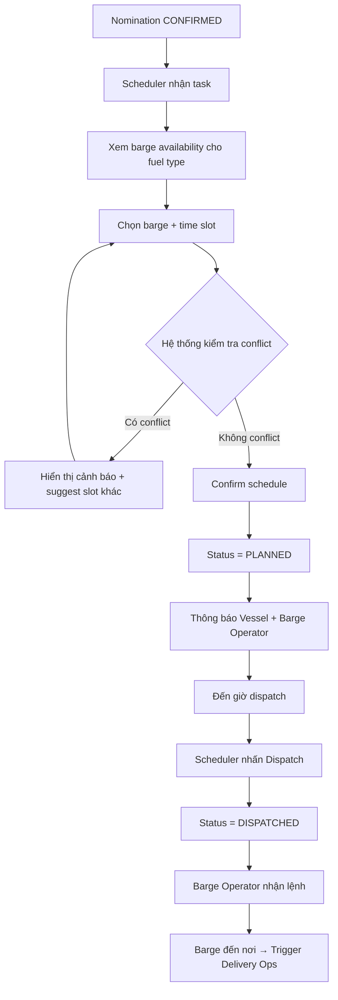
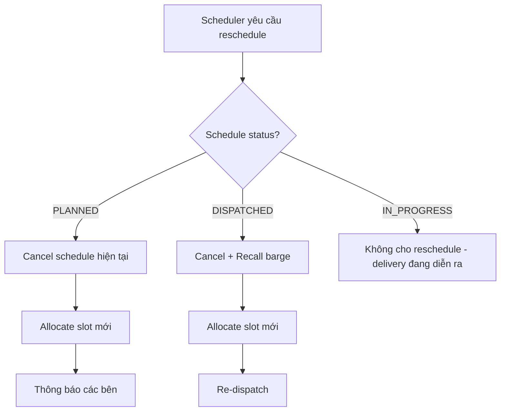
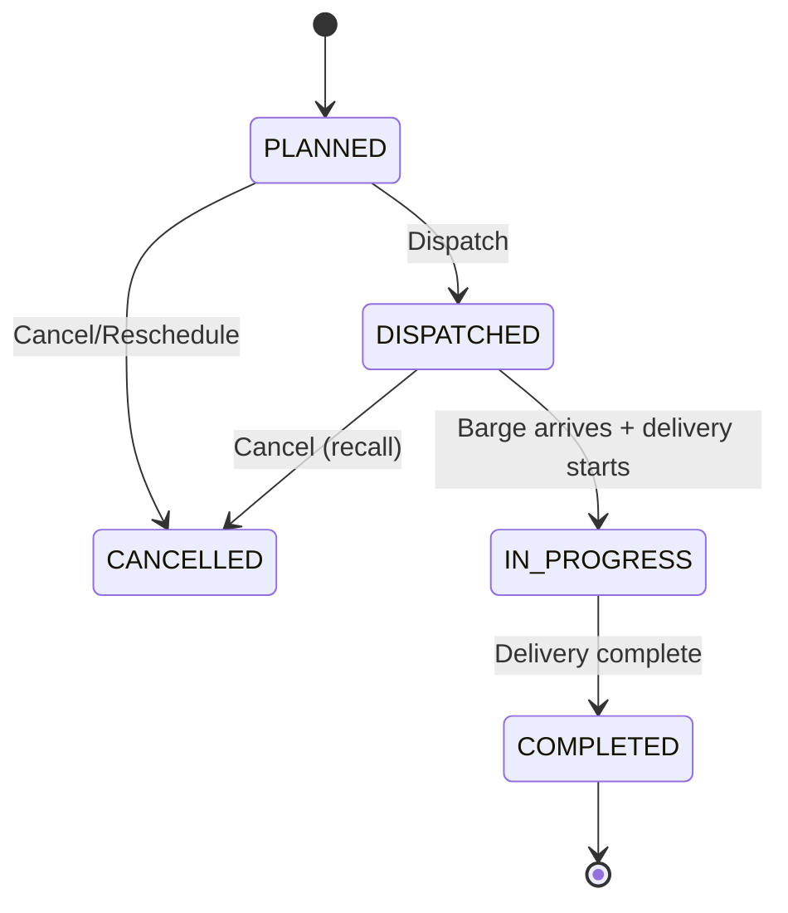

# FRD — Scheduling & Dispatch

## 1. Tổng quan chức năng

Module Scheduling & Dispatch quản lý việc phân bổ thời gian (time slot) cho barge fleet, phát hiện xung đột lịch, điều phối (dispatch) barge đến vessel, và thông báo các bên liên quan. Module kích hoạt tự động khi nomination được confirmed và kết nối với delivery-ops khi barge đến nơi.

---

## 2. Chân dung người dùng (Personas)

| Persona | Vai trò | Mục tiêu chính |
|---------|---------|----------------|
| **Supplier Admin (Scheduler)** | Phân bổ lịch, quản lý fleet availability | Tối ưu hóa sử dụng barge fleet, tránh xung đột |
| **Barge Operator** | Nhận dispatch, thực hiện giao hàng | Biết lịch trình rõ ràng, đến đúng giờ |

---

## 3. Danh sách tính năng

| ID | Tính năng | Mô tả | Độ ưu tiên |
|----|-----------|--------|-------------|
| F-SCH-01 | View Barge Availability | Xem lịch trống/bận của từng barge | Must |
| F-SCH-02 | Allocate Time Slot | Phân bổ slot cho nomination | Must |
| F-SCH-03 | Conflict Detection | Phát hiện xung đột lịch tự động | Must |
| F-SCH-04 | Dispatch Barge | Xác nhận dispatch barge đi giao hàng | Must |
| F-SCH-05 | Notify Parties | Thông báo vessel và barge operator | Should |
| F-SCH-06 | Reschedule | Dời lịch (cancel + re-allocate) | Should |

---

## 4. Luồng nghiệp vụ (Workflow)

### 4.1 Luồng chính — Phân bổ và Dispatch

### 4.2 Luồng Reschedule

---

## 5. Yêu cầu dữ liệu

### 5.1 Entity: Schedule

| Field | Type | Constraints | Mô tả |
|-------|------|-------------|--------|
| id | UUID | PK | Mã schedule |
| nomination_id | UUID | FK, NOT NULL | Liên kết nomination |
| barge_id | UUID | FK, NOT NULL | Barge được phân bổ |
| slot_start | DateTime | NOT NULL | Bắt đầu time slot |
| slot_end | DateTime | NOT NULL | Kết thúc time slot |
| status | Enum | NOT NULL | PLANNED, DISPATCHED, IN_PROGRESS, COMPLETED, CANCELLED |
| eta | DateTime | nullable | ETA đến vessel |
| dispatcher_id | UUID | FK | Người dispatch |
| notes | Text | nullable | Ghi chú |
| created_at | DateTime | NOT NULL | Ngày tạo |
| updated_at | DateTime | NOT NULL | Ngày cập nhật |

### 5.2 State Machine

---

## 6. Quy tắc nghiệp vụ

| ID | Quy tắc | Mô tả |
|----|---------|--------|
| BR-SCH-001 | Không chồng chéo | Một barge KHÔNG THỂ có overlapping deliveries (slot_start/end không được giao nhau) |
| BR-SCH-002 | Turnaround time | Khoảng cách tối thiểu giữa 2 deliveries liên tiếp của cùng barge = 2 giờ (configurable) |
| BR-SCH-003 | Fuel type certification | Barge PHẢI có chứng nhận vận chuyển loại nhiên liệu đang giao |
| BR-SCH-004 | Reschedule = Cancel + Re-allocate | Thay đổi schedule sau dispatch đồng nghĩa hủy schedule cũ + tạo mới |

---

## 7. Điểm tích hợp

| Module | Hướng | Mô tả |
|--------|-------|--------|
| **nomination** | Inbound event | Nhận event NOMINATION_CONFIRMED → tạo scheduling task |
| **delivery-ops** | Outbound event | Khi barge arrives → trigger start delivery |

---

## 8. Tiêu chí chấp nhận

### F-SCH-01: View Barge Availability
- [ ] Scheduler xem được calendar/timeline của từng barge
- [ ] Hiển thị rõ slot đã book, slot trống, turnaround gaps
- [ ] Filter barge theo fuel type certification

### F-SCH-02: Allocate Time Slot
- [ ] Scheduler chọn barge + slot cho nomination
- [ ] Slot phải nằm trong delivery window của nomination
- [ ] Hệ thống tự động check conflict trước khi confirm

### F-SCH-03: Conflict Detection
- [ ] Phát hiện overlapping slots cho cùng barge
- [ ] Phát hiện vi phạm turnaround time (< 2h giữa 2 deliveries)
- [ ] Suggest alternative slots khi có conflict

### F-SCH-04: Dispatch Barge
- [ ] Scheduler dispatch barge khi đến giờ
- [ ] Status chuyển PLANNED → DISPATCHED
- [ ] Barge Operator nhận lệnh dispatch

### F-SCH-05: Notify Parties
- [ ] Vessel nhận thông báo khi schedule confirmed + khi barge dispatched
- [ ] Barge Operator nhận thông báo khi dispatch + khi reschedule

### F-SCH-06: Reschedule
- [ ] Scheduler có thể reschedule khi status = PLANNED hoặc DISPATCHED
- [ ] Không cho reschedule khi IN_PROGRESS
- [ ] Reschedule tạo record mới, record cũ status = CANCELLED
