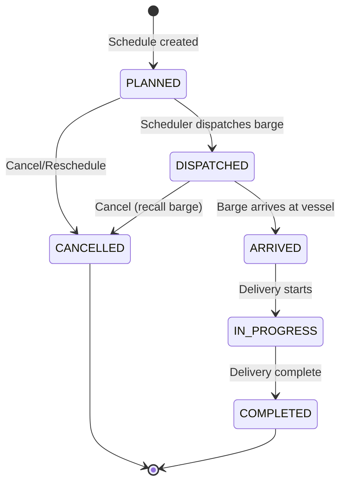

# SRS — Scheduling & Dispatch

**Version:** 1.0  
**Module:** scheduling  
**Ngày:** 2026-05-27

---

## §1 Mục đích & Phạm vi

### 1.1 Mục đích

Module Scheduling & Dispatch quản lý việc phân bổ thời gian (time slot) cho barge fleet, phát hiện xung đột lịch, điều phối (dispatch) barge đến vessel, và thông báo các bên liên quan.

### 1.2 Phạm vi

- Quản lý barge availability calendar
- Phân bổ time slot cho nomination đã confirmed
- Phát hiện và xử lý conflict (overlap, turnaround violation)
- Dispatch barge và track status
- Calendar view cho scheduler

### 1.3 Actors

| Actor | Vai trò | Quyền chính |
|-------|---------|-------------|
| Supplier Admin (Scheduler) | Phân bổ lịch, dispatch | MANAGE schedules |
| Barge Operator | Nhận lệnh dispatch | VIEW own schedule |

### 1.4 Dependencies

| Module | Quan hệ | Mô tả |
|--------|---------|--------|
| nomination | Inbound event | `NominationConfirmed` → tạo scheduling task |
| delivery-ops | Outbound event | `BargeArrived` → trigger start delivery |

---

## §2 Mô tả tổng thể

### 2.1 State Machine



**Transition Rules:**

| From | To | Trigger | Guard |
|------|----|---------|-------|
| PLANNED | DISPATCHED | Scheduler clicks Dispatch | Current time ≈ slot_start (± configurable buffer) |
| PLANNED | CANCELLED | Scheduler cancels | — |
| DISPATCHED | ARRIVED | Barge operator confirms arrival | — |
| DISPATCHED | CANCELLED | Scheduler recalls | — |
| ARRIVED | IN_PROGRESS | Delivery session started | delivery-ops module confirms |
| IN_PROGRESS | COMPLETED | Delivery completed | delivery-ops module confirms |

### 2.2 Actors & Dependencies

Xem §1.3 và §1.4.

---

## §3 Yêu cầu chức năng chi tiết

### FR-SCH-001: Allocate Barge + Time Slot

**Mô tả:** Scheduler phân bổ barge và time slot cho nomination đã confirmed.

**Preconditions:**
- Nomination status = CONFIRMED
- Scheduler authenticated với role SUPPLIER_ADMIN

**Postconditions:**
- Schedule record created (status = PLANNED)
- BargeAvailability updated (slot marked)
- Notification sent to vessel + barge operator

**Input Specification:**

| Field | Type | Required | Validation | Description |
|-------|------|----------|------------|-------------|
| nomination_id | UUID | Yes | Must exist, status=CONFIRMED | Nomination liên kết |
| barge_id | UUID | Yes | Must exist, active, certified | Barge phân bổ |
| slot_start | OffsetDateTime | Yes | Within nomination delivery window | Bắt đầu slot |
| slot_end | OffsetDateTime | Yes | > slot_start, within window | Kết thúc slot |
| eta | OffsetDateTime | No | ≥ slot_start | ETA ước tính |
| notes | String | No | max 1000 chars | Ghi chú |

**Validation Rules:**
- `slot_start` và `slot_end` phải nằm trong `nomination.delivery_window`
- Không overlap với bất kỳ existing schedule nào của cùng barge (status ∉ CANCELLED)
- Minimum turnaround: ≥ 2h gap giữa slot_end của schedule trước và slot_start hiện tại
- Barge phải có fuel type certification cho nomination.fuel_type_code

**Error Cases:**

| HTTP | Code | Condition |
|------|------|-----------|
| 404 | NOT_FOUND | Nomination hoặc barge không tồn tại |
| 409 | SCHEDULE_CONFLICT | Overlap detected |
| 422 | TURNAROUND_VIOLATION | Gap < minimum turnaround time |
| 422 | BARGE_NOT_CERTIFIED | Barge không đạt fuel type certification |
| 422 | SLOT_OUTSIDE_WINDOW | Slot ngoài delivery window |

---

### FR-SCH-002: Notify Parties

**Mô tả:** Hệ thống thông báo vessel và barge operator khi schedule confirmed/dispatched.

**Preconditions:**
- Schedule status changed (PLANNED, DISPATCHED)

**Postconditions:**
- Notification records created
- Push notification / email sent to relevant parties

**Notification Events:**

| Event | Recipients | Channel |
|-------|-----------|---------|
| Schedule created (PLANNED) | Vessel, Barge Operator | In-app, Email |
| Barge dispatched | Vessel, Barge Operator | In-app, Push |
| Schedule cancelled | Vessel, Barge Operator | In-app, Email |
| Schedule rescheduled | Vessel, Barge Operator | In-app, Email |

---

### FR-SCH-003: Scheduling Conflict Detection

**Mô tả:** System phát hiện và báo xung đột lịch.

**Conflict Types:**

| Type | Condition | Severity |
|------|-----------|----------|
| OVERLAP | Slot A overlaps Slot B cho cùng barge | BLOCKING |
| TURNAROUND_VIOLATION | Gap giữa 2 consecutive slots < 2h | WARNING (configurable) |
| FUEL_TYPE_MISMATCH | Barge không certified cho fuel type | BLOCKING |

**Overlap Detection Algorithm:**
```
CONFLICT exists IF:
  schedule.barge_id = new_schedule.barge_id
  AND schedule.status NOT IN ('CANCELLED', 'COMPLETED')
  AND schedule.slot_start < new_schedule.slot_end
  AND schedule.slot_end > new_schedule.slot_start
```

**Turnaround Check:**
```
VIOLATION exists IF:
  (nearest_previous.slot_end + turnaround_time) > new_schedule.slot_start
  OR
  new_schedule.slot_end + turnaround_time > nearest_next.slot_start
```

---

## §4 Use Case Specifications

### UC-SCH-01: Allocate Time Slot

**Actor:** Supplier Admin (Scheduler)  
**Goal:** Phân bổ barge + time slot cho nomination

**Main Success Scenario:**

1. Scheduler mở Scheduling Calendar view
2. System hiển thị barge fleet availability (timeline view)
3. Scheduler click vào nomination task cần schedule
4. Scheduler chọn barge (filtered by fuel type certification)
5. Scheduler drag hoặc nhập slot_start, slot_end
6. System real-time check conflicts
7. Nếu không conflict → Scheduler confirm
8. System tạo Schedule record (PLANNED)
9. System thông báo vessel + barge operator
10. Calendar view update hiển thị slot mới

**Alternative Flows:**

- **6a.** Conflict detected → System highlight conflict, suggest next available slot
- **4a.** No barge available → System show warning, Scheduler adjust window

---

### UC-SCH-02: Dispatch Barge

**Actor:** Supplier Admin (Scheduler)  
**Goal:** Xác nhận dispatch barge đi giao hàng

**Main Success Scenario:**

1. Scheduler mở schedule list (filter: PLANNED, near dispatch time)
2. Scheduler chọn schedule cần dispatch
3. System hiển thị schedule detail + barge info
4. Scheduler nhấn "Dispatch"
5. System update status → DISPATCHED
6. System send push notification to Barge Operator
7. Barge Operator nhận lệnh + ETA

**Exception Flows:**

- **4a.** Schedule đã bị cancel → 409 INVALID_STATE_TRANSITION

---

### UC-SCH-03: View Calendar

**Actor:** Supplier Admin (Scheduler)  
**Goal:** Xem lịch tổng quan fleet

**Main Success Scenario:**

1. Scheduler mở Calendar view
2. System load schedules trong date range (default: current week)
3. System hiển thị timeline per barge (horizontal Gantt-style)
4. Scheduler có thể filter by barge, fuel type, status
5. Scheduler có thể zoom (day/week/month)

---

## §5 Data Model

### 5.1 Entity: Schedule

```sql
CREATE TABLE schedules (
    id              UUID PRIMARY KEY DEFAULT gen_random_uuid(),
    workspace_id    UUID NOT NULL REFERENCES workspaces(id),
    nomination_id   UUID NOT NULL REFERENCES nominations(id),
    barge_id        UUID NOT NULL REFERENCES barges(id),
    slot_start      TIMESTAMPTZ NOT NULL,
    slot_end        TIMESTAMPTZ NOT NULL,
    status          VARCHAR(20) NOT NULL DEFAULT 'PLANNED',
    eta             TIMESTAMPTZ,
    dispatcher_id   UUID REFERENCES users(id),
    dispatched_at   TIMESTAMPTZ,
    arrived_at      TIMESTAMPTZ,
    notes           TEXT,
    created_at      TIMESTAMPTZ NOT NULL DEFAULT NOW(),
    updated_at      TIMESTAMPTZ NOT NULL DEFAULT NOW(),
    deleted_at      TIMESTAMPTZ,

    CONSTRAINT chk_slot CHECK (slot_end > slot_start),
    CONSTRAINT chk_status CHECK (status IN ('PLANNED','DISPATCHED','ARRIVED','IN_PROGRESS','COMPLETED','CANCELLED'))
);
```

### 5.2 Entity: BargeAvailability

```sql
CREATE TABLE barge_availability (
    id              UUID PRIMARY KEY DEFAULT gen_random_uuid(),
    barge_id        UUID NOT NULL REFERENCES barges(id),
    available_from  TIMESTAMPTZ NOT NULL,
    available_to    TIMESTAMPTZ,  -- NULL = indefinitely available
    fuel_certifications VARCHAR[] NOT NULL,  -- Array of certified fuel type codes
    home_port       VARCHAR(100),
    status          VARCHAR(20) NOT NULL DEFAULT 'AVAILABLE',  -- AVAILABLE, MAINTENANCE, DECOMMISSIONED
    notes           TEXT,
    created_at      TIMESTAMPTZ NOT NULL DEFAULT NOW(),
    updated_at      TIMESTAMPTZ NOT NULL DEFAULT NOW()
);
```

### 5.3 Entity: ScheduleConflict

```sql
CREATE TABLE schedule_conflicts (
    id                  UUID PRIMARY KEY DEFAULT gen_random_uuid(),
    schedule_id         UUID NOT NULL REFERENCES schedules(id),
    conflicting_schedule_id UUID NOT NULL REFERENCES schedules(id),
    conflict_type       VARCHAR(30) NOT NULL,  -- OVERLAP, TURNAROUND_VIOLATION
    severity            VARCHAR(10) NOT NULL,  -- BLOCKING, WARNING
    description         TEXT NOT NULL,
    resolved            BOOLEAN NOT NULL DEFAULT FALSE,
    resolved_by         UUID REFERENCES users(id),
    resolved_at         TIMESTAMPTZ,
    created_at          TIMESTAMPTZ NOT NULL DEFAULT NOW()
);
```

### 5.4 Indexes

```sql
CREATE INDEX idx_schedules_workspace_status ON schedules(workspace_id, status) WHERE deleted_at IS NULL;
CREATE INDEX idx_schedules_barge_slot ON schedules(barge_id, slot_start, slot_end) WHERE deleted_at IS NULL AND status != 'CANCELLED';
CREATE INDEX idx_schedules_nomination ON schedules(nomination_id) WHERE deleted_at IS NULL;
CREATE INDEX idx_barge_availability_barge ON barge_availability(barge_id, available_from);
CREATE INDEX idx_schedule_conflicts_schedule ON schedule_conflicts(schedule_id, resolved);
```

---

## §6 API Specifications

### 6.1 POST /api/v1/schedules

**Mô tả:** Tạo schedule (allocate slot)  
**Auth:** Bearer JWT, role = SUPPLIER_ADMIN

**Request Body:**
```json
{
  "nomination_id": "01902a3b-4c5d-7e8f-9a0b-1c2d3e4f5a6b",
  "barge_id": "01902a3b-0000-7000-8000-barge0000001",
  "slot_start": "2026-06-15T08:00:00+08:00",
  "slot_end": "2026-06-15T16:00:00+08:00",
  "eta": "2026-06-15T09:30:00+08:00",
  "notes": "Eastern Anchorage"
}
```

**Response (201 Created):** `ScheduleDto`

---

### 6.2 GET /api/v1/schedules

**Mô tả:** Danh sách schedules  
**Auth:** Bearer JWT  
**Query Params:** page, size, status, barge_id, from_date, to_date

**Response (200):** `PaginatedResponse<ScheduleDto>`

---

### 6.3 GET /api/v1/schedules/{id}

**Mô tả:** Chi tiết schedule  
**Auth:** Bearer JWT

**Response (200):** `ScheduleDto`

---

### 6.4 GET /api/v1/schedules/calendar

**Mô tả:** Calendar view data cho fleet  
**Auth:** Bearer JWT, role = SUPPLIER_ADMIN

**Query Parameters:**

| Param | Type | Required | Description |
|-------|------|----------|-------------|
| from | OffsetDateTime | Yes | Calendar range start |
| to | OffsetDateTime | Yes | Calendar range end |
| barge_id | UUID | No | Filter specific barge |
| fuel_type | String | No | Filter by fuel certification |

**Response (200):**
```json
{
  "from": "2026-06-01T00:00:00+08:00",
  "to": "2026-06-30T23:59:59+08:00",
  "barges": [
    {
      "barge_id": "...",
      "barge_name": "MT Harmony",
      "fuel_certifications": ["VLSFO380", "MGO", "LSMGO"],
      "schedules": [
        {
          "id": "...",
          "nomination_id": "...",
          "slot_start": "2026-06-15T08:00:00+08:00",
          "slot_end": "2026-06-15T16:00:00+08:00",
          "status": "PLANNED",
          "vessel_name": "MV Pacific Star",
          "fuel_type_code": "VLSFO380"
        }
      ]
    }
  ]
}
```

---

### 6.5 POST /api/v1/schedules/{id}/dispatch

**Mô tả:** Dispatch barge  
**Auth:** Bearer JWT, role = SUPPLIER_ADMIN

**Response (200):** Updated `ScheduleDto` with status = DISPATCHED

**Error Cases:**
| HTTP | Code | Condition |
|------|------|-----------|
| 409 | INVALID_STATE_TRANSITION | Status ≠ PLANNED |

---

### 6.6 POST /api/v1/schedules/{id}/cancel

**Mô tả:** Cancel schedule  
**Auth:** Bearer JWT, role = SUPPLIER_ADMIN

**Request Body:**
```json
{
  "reason": "Barge maintenance required"
}
```

**Response (200):** Updated `ScheduleDto` with status = CANCELLED

**Error Cases:**
| HTTP | Code | Condition |
|------|------|-----------|
| 409 | INVALID_STATE_TRANSITION | Status ∉ {PLANNED, DISPATCHED} |

---

### 6.7 POST /api/v1/schedules/check-conflicts

**Mô tả:** Check conflicts trước khi allocate (dry-run)  
**Auth:** Bearer JWT, role = SUPPLIER_ADMIN

**Request Body:**
```json
{
  "barge_id": "...",
  "slot_start": "2026-06-15T08:00:00+08:00",
  "slot_end": "2026-06-15T16:00:00+08:00"
}
```

**Response (200):**
```json
{
  "has_conflicts": true,
  "conflicts": [
    {
      "type": "TURNAROUND_VIOLATION",
      "severity": "WARNING",
      "conflicting_schedule_id": "...",
      "description": "Gap only 1h30m (minimum 2h required)",
      "suggestion": "Move slot_start to 2026-06-15T09:00:00+08:00"
    }
  ]
}
```

---

## §7 Yêu cầu phi chức năng

| ID | Category | Requirement |
|----|----------|-------------|
| NFR-SCH-01 | Performance | Calendar view load < 1s with 50 barges × 30 days |
| NFR-SCH-02 | Performance | Conflict check < 200ms |
| NFR-SCH-03 | Concurrency | Double-booking prevention via DB-level constraint |
| NFR-SCH-04 | Reliability | Dispatch notification delivery guarantee (retry 3x) |
| NFR-SCH-05 | Audit | All schedule changes tracked with before/after |

---

## §8 Quy tắc nghiệp vụ

| ID | Quy tắc | Implementation Notes |
|----|---------|---------------------|
| BR-SCH-001 | Không chồng chéo | DB exclusion constraint: `EXCLUDE USING gist (barge_id WITH =, tstzrange(slot_start, slot_end) WITH &&) WHERE (status != 'CANCELLED' AND deleted_at IS NULL)` |
| BR-SCH-002 | Minimum turnaround 2h | Configurable per workspace. Default 2h. Check in application layer trước khi insert. |
| BR-SCH-003 | Barge fuel certification | Join `barge_availability.fuel_certifications` contains `nomination.fuel_type_code`. Reject if not certified. |
| BR-SCH-004 | Reschedule = Cancel + Create | Atomic operation: cancel old + create new trong 1 transaction. Old record giữ status CANCELLED. |
| BR-SCH-005 | Auto-create from nomination | Consumer nhận `NominationConfirmed` event → auto-create schedule suggestion (status PLANNED) nếu barge đã assign. |
